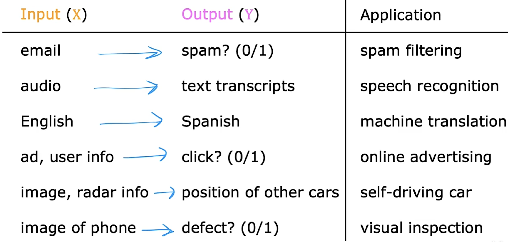
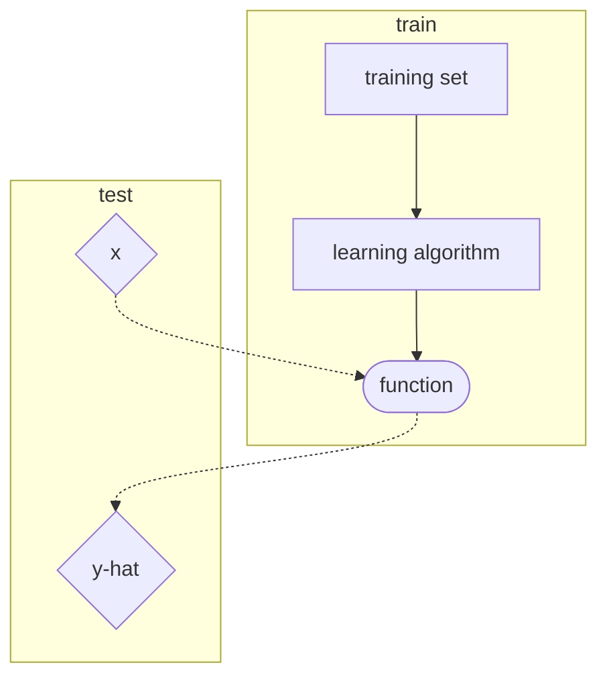
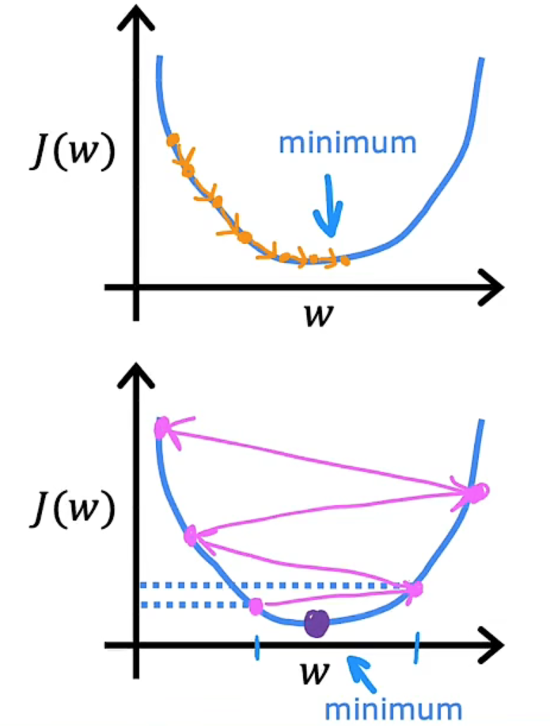

## 什么是机器学习

在进行特定编程的情况下，给予计算机学习能力的领域。 —— Arthur Samual

主要两种类型的机器学习算法
- supervised learning
- unsupervised learning 

## 监督学习 supervised learning

X --> Y mappings
input --> output label

learns from being given "right answers"

我们数据集中的每个样本都有相应的“正确答案”，再根据这些样本作出预测

### Regression 回归 

- predict a number 
- infinitely many possible numbers

### Classification 分类

- predict categories
- small number of possible outputs

*术语class/category都表示类别*

## 无监督学习 unsupervised learning

Given data is not associated with any output labels $Y$

That means, data only comes with inputs $x$, but not output labels $y$.

无监督学习中没有任何的标签

我们已知数据集，却不知如何处理，也未告知每个数据点是什么

Our job is to find some structure or some pattern or just find some interesting in the unlabeled data.

### Clustering 聚类算法 

grouping similar data points together

针对数据集，无监督学习就能判断出数据有多个不同的聚集簇。这是一个，那是另一个，二者不同。无监督学习算法可能会把这些数据分成多个不同的簇，可以对这些簇进行后续的工作。所以叫做聚类算法。

### Anomaly detection 异常检测

find unusual data points

### Dimensionality reduction 降维

take a big dataset and almost magically compress it to a much smaller dataset while losing as little as possible

## Linear Regression Model 线性回归模型

1. linear regression with one variable

*Machine Learning Terminology 机器学习术语*

| 中文术语  | 英文表达  |  英文释义 |
|:---:|:---:|:---:|
|训练集|$training\ set$| Data used to train the model|
|输入变量|$x$|input variable / input feature / feature|
|输出变量|$y$|output variable / target variable|
|估计值|$\hat{y}$|the estimate or the prediction for $y$|
|训练样本总数or训练集实例数量|$m$|number of training examples|
|训练集中的单个实例|$(x,y)$|single training example|
|训练集的第$i$个实例|$(x^{(i)},y^{(i)})$|$i^{\text{th}}$ training example|

In supervised learning, recall the training set includes the **input features** and the **output targets** (the output targets are the right answers to the model we will learn from).

这里function也叫做**假设**(hypothesis)

function的工作是获取一个新的输入以及输出并进行估计或预测

function $f$ is called the **model**

y-hat or $\hat{y}$, is called the estimate or the prediction for $y$

x is called the input or the input feature

*注意：$y$是指target，这是训练集中的实际真实值；而y-hat或者说$\hat{y}$是指估计值，它可能是也可能不是实际的真实值*

The key question: 
How to represent the function $f$ ? or in other words, what is the math formula we are going to use to compute $f$ ?

*example:*
*For Linear Regression with one variable (or you are allowed to call it the Univariate Linear Regression), the function $f$ can be written as*
$$f_{w,b}(x) = w*x+b$$
where $w$ and $b$ are numbers, and the values chosen for $w$ and $b$ will determine the prediction $\hat{y}$ based on the input feature $x$.

## Cost function 代价函数

The cost function will tell us how well the model is doing so that we can try to get it to do better.

模型参数 parameters: the variables you can adjust during training in order to improve the model

**参数**(parameters)有时也会称为**系数**(coefficients)或者**权重**(weights)

*对于之前的线性回归，$w$为斜率，$b$为截距，要做的事就是要找到合适的$w$和$b$，使得
$$\hat{y}^{(i)} = f_{w,b}(x^{(i)}) = w * x^{(i)} + b$$
is close to $y^{(i)}$ for all $(x^{(i)}, y^{(i)})$*

**How to measure how well a line fits the training data? Cost function!!!**

建模误差 error $(\hat{y} - y)$

Cost function 的一个选择为
$$J(w,b) = \frac{1}{2m}\sum_{i=1}^{m}(\hat{y}^{(i)} - y^{(i)})^2 = \frac{1}{2m}\sum_{i=1}^{m}(f_{w,b}(x^{(i)}) - y^{(i)})^2$$

*remember $m$ is the number of training examples.*

上面选择的代价函数也被称为**平方误差函数**或者**平方误差代价函数**，对于大多数问题，特别是回归问题，都是一个合理的选择。还有其他的代价函数也能很好地发挥作用，但是平方误差代价函数可能是解决回归问题最常用的手段了

最后求解Cost function的最小值，对应的参数值就是我们要找的合适的参数值

总结（以Linear Regression为例）：
|  | |
|:---:|:---:|
|model|$f_{w,b}(x) = w*x+b$|
|parameters|$w$,$b$|
|cost function|$J(w,b) = \frac{1}{2m}\sum_{i=1}^{m}(f_{w,b}(x^{(i)}) - y^{(i)})^2$|
|goal|$\min\limits_{w,b} J(w,b)$|

Cost function的可视化

高维图（如$J(w,b)-w-b$组成的3D图）、等高线图

## Gradient Descent 梯度下降

Gradient Descent is an algorithm that you can use to try to **minimize any function**.

Outline:
1. Start with some $w$, $b$.
2. Keep on changing the parameters $w$ and $b$ to reduce $J(w, b)$
3. Until we settle at or near a minimum

Gradient Descent只能找到局部最小值，而无法找到全局最小值

### Gradient Descent Algorithm

Repeat until convergence (which means you reach the minimum)
$$
\begin{align*}
w &= w-\alpha*\frac{\partial}{\partial w}J(w,b) \\
b &= b-\alpha*\frac{\partial}{\partial b}J(w,b)
\end{align*}
$$

Here $\alpha$ is called the **Learning Rate**. $\alpha$ is always set between $0$ and $1$. $\alpha$ basically controls how big of a step you take downhill.

For linear regression, we always choose
$$
J(w,b) =  \frac{1}{2m}\sum_{i=1}^{m}(f_{w,b}(x^{(i)}) - y^{(i)})^2
$$
and then $\frac{\partial J(w,b)}{\partial w}$ and $\frac{\partial J(w,b)}{\partial b}$ give
$$
\begin{align*}
\frac{\partial J(w,b)}{\partial w} &= \frac{1}{m}\sum_{i=1}^{m}(f_{w,b}(x^{(i)})-y^{(i)})x^{(i)} \\
\frac{\partial J(w,b)}{\partial b} &= \frac{1}{m}\sum_{i=1}^{m}(f_{w,b}(x^{(i)})-y^{(i)})
\end{align*}
$$

You should **simultaneously** update $w$ and $b$, so correct the algorithm:
$$
\begin{align*}
tmp\_w &= w-\alpha*\frac{\partial}{\partial w}J(w,b) \\
tmp\_b &= b-\alpha*\frac{\partial}{\partial b}J(w,b) \\
w &= tmp\_w \\
b &= tmp\_b
\end{align*}
$$

- If $\alpha$ is too small, gradient descent may be slow.
- If $\alpha$ is too large, gradient descent may 
	- overshoot, never reach minimum
	- fail to converge, diverge

Near a local minimum:
- Derivative becomes smaller     
- Update steps become smaller

Can reach minimum without decreasing learning rate

**"Batch" Gradient Descent**

"Batch": Each step of gradient descent uses all the training examples instead of just a subset of the training data.

