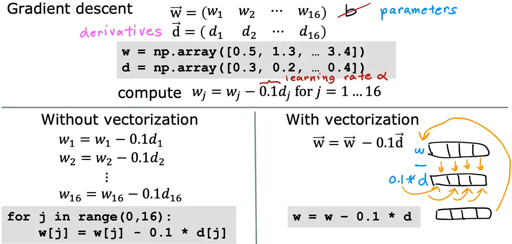
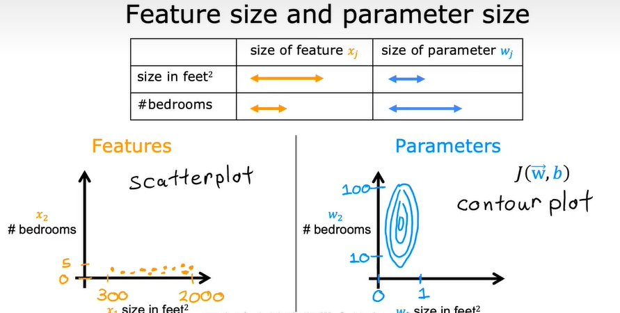
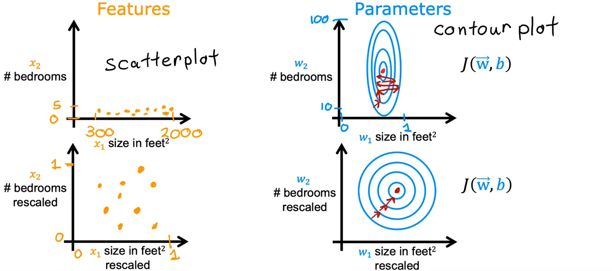
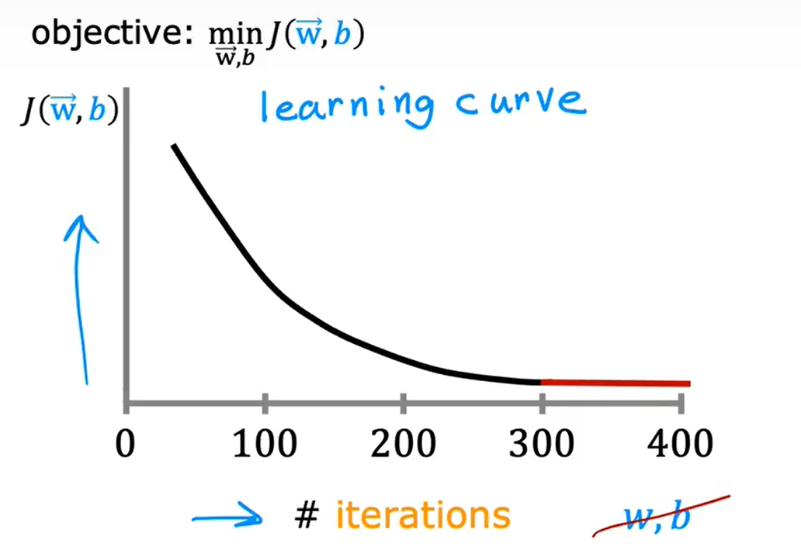

## Multiple features (variables)

$x_j$ 表示第$j$个特征/变量

$n$ 表示特征/变量的总数（注意与$m$区分，$m$表示单变量中的样本总数，如房子大小共有多少个数据，而$n$指的是例如房子大小、卧室个数、房子使用时间等等变量共有多少个）

$\vec{x}^{(i)}$ 表示第$i$个训练样本的所有变量组成的向量列表，*注意这是一个行向量*

$\vec{x}^{(i)}_j$ 表示第$i$个训练样本的第$j$个变量的值

例如：

|Size in feet^2|Number of bedrooms|Number of floors|Age of home in years|Price($) in $1000's|
|:---:|:---:|:---:|:---:|:---:|
|2104|5|1|45|460|
|1416|3|2|40|232|
|1534|3|2|30|315|
|852|2|1|36|178|
|2023|4|3|38|390|

则
$n=4$，$m=5$，前四列分别为$x_0$、$x_1$、$x_2$、$x_3$，$\vec{x}^{(1)} = [1416,3,2,40]$，$\vec{x}^{(1)}_2 = 2$

Model:
- previously: $f_{w,b}(x) = w * x + b$
- now: $f_{\vec{w},b}(\vec{x}) = w_1 * x_1 + w_2 * x_2 + \cdots + w_n * x_n + b = \vec{w} \cdot \vec{x} + b$，其中$\vec{w} = [w_1, w_2, \cdots, w_n]$，$\vec{x} = [x_1, x_2, \cdots, x_n]$

**Multiple Linear Regression!!!**

### A very useful idea: **Vectorization**

*注意：*
- *linear algebra: count from 1: $x_1$, $x_2$, $x_3$ ...*
- *Python code: count from 0 (offset): `x[0]`, `x[1]`, `x[2]`*

```Python
w = np.array([1.0, 2.5, -3.3])
b = 4
x = np.array([10, 20, 30])
```

Without vectorization: $f_{w,b}(x) = (\sum\limits_{i=1}\limits^{n} w_i * x_i) + b$
```Python
f = 0
for j in range(0, n):
	f = f + w[j] * x[j]
f = f + b
```

With vectorization: $f_{\vec{w},b}(\vec{x}) = \vec{w} \cdot \vec{x} + b$
```Python
f = np.dot(w, x) + b
```



Vectorization will make a huge difference in the running time of your learning algorithm.

## Gradient Descent for Multiple Regression

- previous notation: simultaneously update
$$
\begin{align*}
w_1 &= w_1 - \alpha * \frac{\partial}{\partial w_1} J(w_1, w_2, \cdots w_n, b) \\
w_2 &= w_2 - \alpha * \frac{\partial}{\partial w_2} J(w_1, w_2, \cdots w_n, b) \\
w_3 &= w_3 - \alpha * \frac{\partial}{\partial w_3} J(w_1, w_2, \cdots w_n, b) \\
& \cdots \\
w_n &= w_n - \alpha * \frac{\partial}{\partial w_n} J(w_1, w_2, \cdots w_n, b) \\
b &= b - \alpha * \frac{\partial}{\partial b} J(w_1, w_2, \cdots w_n, b)
\end{align*}
$$
- vector notation: simultaneously update
$$
\begin{align*}
w_1 &= w_1 - \alpha * \frac{\partial}{\partial w_1} J(\vec{w}, b) = w_1 - \alpha * \frac{1}{m} \sum_{i=1}^{m}(f_{\vec{w},b}(\vec{x}^{(i)})-y^{(i)})x_1^{(i)} \\
w_2 &= w_2 - \alpha * \frac{\partial}{\partial w_2} J(\vec{w}, b) = w_2 - \alpha * \frac{1}{m} \sum_{i=1}^{m}(f_{\vec{w},b}(\vec{x}^{(i)})-y^{(i)})x_2^{(i)}\\
w_3 &= w_3 - \alpha * \frac{\partial}{\partial w_3} J(\vec{w}, b) = w_3 - \alpha * \frac{1}{m} \sum_{i=1}^{m}(f_{\vec{w},b}(\vec{x}^{(i)})-y^{(i)})x_3^{(i)}\\
& \cdots \\
w_n &= w_n - \alpha * \frac{\partial}{\partial w_n} J(\vec{w}, b) = w_n - \alpha * \frac{1}{m} \sum_{i=1}^{m}(f_{\vec{w},b}(\vec{x}^{(i)})-y^{(i)})x_n^{(i)}\\
b &= b - \alpha * \frac{\partial}{\partial b} J(\vec{w}, b) = b - \alpha * \frac{1}{m} \sum_{i=1}^{m}(f_{\vec{w},b}(\vec{x}^{(i)})-y^{(i)})
\end{align*}
$$

### An alternative to gradient descent -- Normal equation method 正规方程

- only for linear regression
- solve for $w$, $b$ without iterations through gradient descent
- may be used in machine learning libraries that implement linear regression

Normal equation methods also have some disadvantages:
- doesn't generalize to other learning algorithms
- slow when number of features is large ($> 10,000$)

## Feature Scaling 特征缩放

enable gradient descent to run much faster

当第$i$个特征/变量$x_i$的可能值变化范围很大时，一个好的模型更有可能选择一个相对较小的参数$w_i$。较小时则相反。



对于一组很扁的椭圆组成的等高线，其梯度方向大概率不是指向中心即代价函数的最小值点，而是会多次横跳向极值点跃进，导致梯度下降的速度变慢。

Feature Scaling 的关键在于重新标度特征$x_1, x_2, \cdots, x_n$，使其都被归一化（或者不一定归一化，而是只要取值范围的数量级大致相同即可）



### 如何实现 feature scaling

1. 对于 $x_{min} \leq x \leq x_{max}$ 的 $x_i$， 取
$$x_{i, rescaled} = \frac{x}{x_{max}} \in [\frac{x_{min}}{x_{max}}, 1]$$
2. Mean normalization
	- find the mean of $x_i$ on the training set: $\mu_i = \frac{1}{m}\sum\limits_{j=1}\limits^{m}x_i^{(j)}$ *注：其中$x_i^{(j)}$表示第$j$个样本的第$i$个变量的值*
	- $x_i = (x_i - \mu_i) / (x_{max}-x_{min})$
	- Mean normalization 在 $0$ 周围分布，有正有负

3. Z-score normalization
	- calculate the mean of each feature $x_i$: $\mu_i$ for $i$ from $1$ to $n$
	- calculate the standard deviation of each feature $x_i$: $\sigma_i$ for $i$ from $1$ to $n$
	- $x_i = (x_i - \mu_i) / \sigma_i$

## Learning Curve 学习曲线

Checking gradient descent for convergence !!!

$J(\vec{w}, b)$ - iterations



每一次迭代意味着**同时**更新了一遍参数$\vec{w}$、$b$的值

If gradient descent is working properly, the cost function $J(\vec{w}, b)$ should **decrease** after every iteration.

**Automatic convergence test**:

Let $\epsilon$ be a very small number. if $J(\vec{w}, b)$ decreases by $\leq \epsilon$ in one iteration, then you can declare convergence and stop the gradient descent.

## Feature Engineering

选择合适的机器学习算法，如合适的拟合函数、合适的参数等等

Using intuition to design **new features**, by transforming or combining original features

## Polynomial regression

在某些情况下，采用多项式回归是一个更好的选择

注意：每一项的变化范围会随着幂次的增大而迅速变化，此时要记得使用 feature scaling