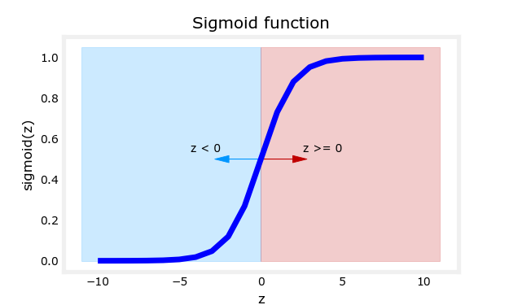
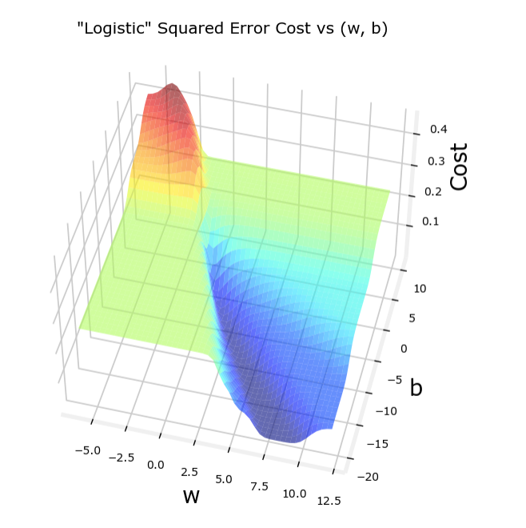
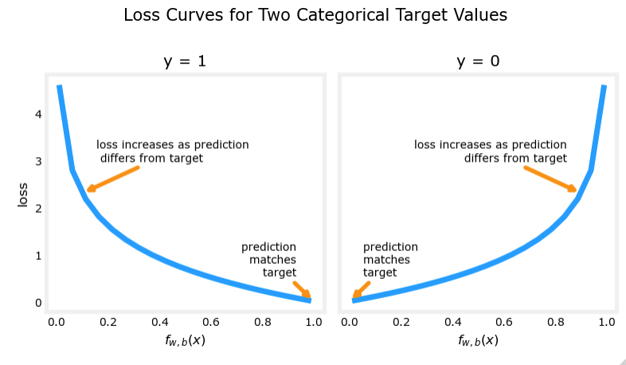
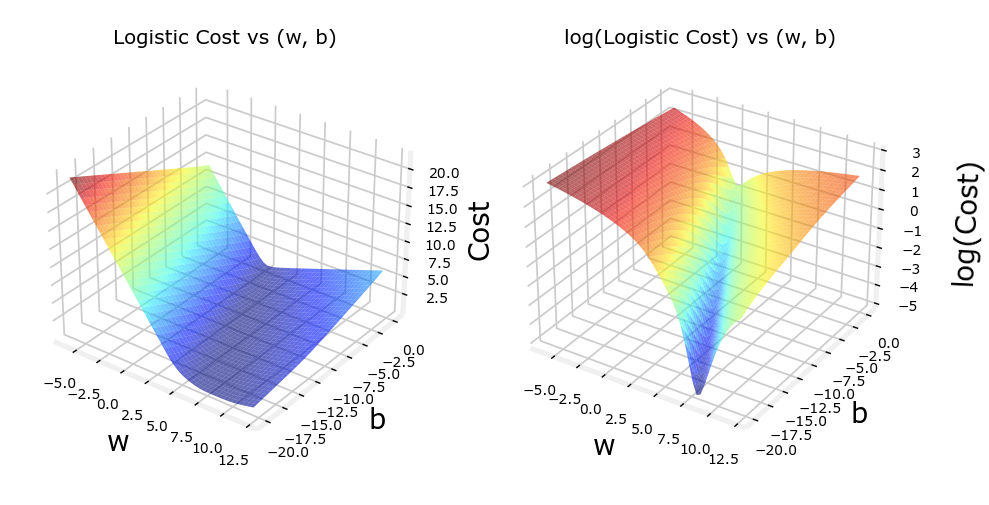
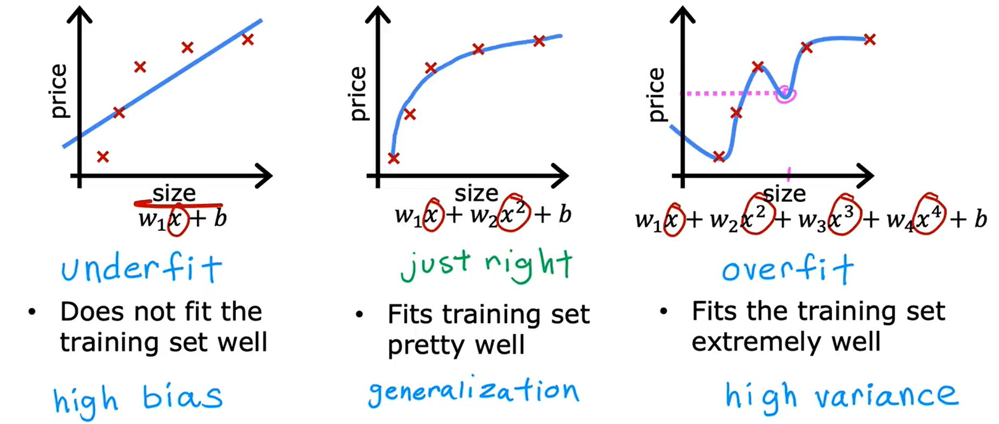

输出变量$y$只能取一小部分可能值中的一个，而非像Regression中无限范围的数字

Linear Regression 不是一个解决 Classification 问题的好方法，我们需要用到 逻辑回归（Logistic Regression）。

"binary classification" 二元分类：$y$ can only be one of the **two** values

the two classes:
- false, $0$, "negative class"
- true, $1$, "positive class"

## Logistic Regression 逻辑回归

### sigmoid function 

the sigmoid function algorithm (or the logistic function) is
$$g(z) = \frac{1}{1 + e^{-z}}$$

the outputs are between 0 and 1 ($0 < g(z) < 1$)

用sigmoid function实现逻辑回归需要两步：
1. $z = f_{\vec{w}, b}(\vec{x}) = \vec{w} \cdot \vec{x} + b$
2. $g(z) = 1 / (1 + e^{-z})$ （这里第二步变为非线性回归）

所以整个逻辑回归的模型$f$为
$$f_{\vec{w},b}(\vec{x}) = g(\vec{w}\cdot\vec{x} + b) = \frac{1}{1 + e^{-(\vec{w}\cdot\vec{x} + b)}}$$

What the logistic regression model does is it inputs features or set of features $X$ and outputs a number between $0$ and $1$.

可以认为逻辑回归模型输出的是概率 the "probability" that class is $1$, given input $\vec{x}$, parameters $\vec{w}$, $b$
$$f_{\vec{w},b}(\vec{x}) = \mathcal{P}(y = 1|\vec{x};\vec{w},b)$$

Set $0.5$ as the **threshold**. Is $f_{\vec{w},b}(\vec{x}) \geq 0.5$ (or $z = \vec{w}\cdot\vec{x} + b \geq 0$) ?
- Yes: $\hat{y} = 1$
- No: $\hat{y} = 0$

### Decision boundary 决策边界

Decision boundary 定义为 $z = \vec{w} \cdot \vec{x} + b = 0$

## Cost function for Logistic Regression

recall the cost function for linear regression:
$$J(\vec{w},b) = \frac{1}{2m}\sum_{i=1}^{m}(f_{\vec{w},b}(\vec{x}^{(i)})-y^{(i)})^2$$
but choose the logistic regression model $f = 1 / [1 + e^{-(\vec{w}\cdot\vec{x} + b)}]$, the cost function will be non-convex(非凸的), and there are lots of local minima that you cannot use gradient descent (fig as follow).

重新选择Cost function如下:

首先对单个样本定义**损失函数**(Loss function)：$\mathcal{L}(f_{\vec{w},b}(\vec{x}^{(i)}),y^{(i)})$ for the $i^{\text{th}}$ example.

Define the loss on single training set $\mathcal{L}(f_{\vec{w},b}(\vec{x}^{(i)}),y^{(i)})$

Choose the form of the **loss function** as
$$
\mathcal{L}(f_{\vec{w},b}(\vec{x}^{(i)}),y^{(i)})=
\left
\{
\begin{aligned} 
& -\log(f_{\vec{w},b}(\vec{x}^{(i)})) & \text{if}\ \ y^{(i)} = 1 \\ 
& -\log(1 - f_{\vec{w},b}(\vec{x}^{(i)})) & \text{if}\ \ y^{(i)} = 0
\end{aligned} 
\right.
$$

因为 $0 < f_{\vec{w},b}(\vec{x}) = \frac{1}{1 + e^{-(\vec{w}\cdot\vec{x} + b)}} < 1$，所以 $0 < -\log(f) < +\infty$；
- 当 $y^{(i)} = 1$ 时，由 $y=-\log(x)$ 的函数图像：
	- 在 $f_{\vec{w},b}(\vec{x}^{(i)})$ 很接近$1$时，$L = -\log(f_{\vec{w},b}(\vec{x}^{(i)}))$ 损失大于$0$而很接近$0$
	- 在 $f_{\vec{w},b}(\vec{x}^{(i)})$ 等于$0.5$时，$L = -\log(f_{\vec{w},b}(\vec{x}^{(i)}))$ 损失变大但没那么大
	- 在 $f_{\vec{w},b}(\vec{x}^{(i)})$ 趋于$0$时，$L = -\log(f_{\vec{w},b}(\vec{x}^{(i)}))$ 趋于$+\infty$，变得非常大
	- 即 Loss is lowest when $f_{\vec{w},b}(\vec{x}^{(i)})$ predicts close to true label $y^{(i)}$; and the further prediction $f_{\vec{w},b}(\vec{x}^{(i)})$ is from target $y^{(i)}$, the higher the loss.
- 当 $y^{(i)} = 0$ 时，由 $y=-\log(1-x)$ 的函数图像，同理可得：
	- 在 $f_{\vec{w},b}(\vec{x}^{(i)})$ 很接近$0$时，$L = -\log(f_{\vec{w},b}(\vec{x}^{(i)}))$ 损失大于$0$而很接近$0$
	- 在 $f_{\vec{w},b}(\vec{x}^{(i)})$ 等于$0.5$时，$L = -\log(f_{\vec{w},b}(\vec{x}^{(i)}))$ 损失变大但没那么大
	- 在 $f_{\vec{w},b}(\vec{x}^{(i)})$ 趋于$1$时，$L = -\log(f_{\vec{w},b}(\vec{x}^{(i)}))$ 趋于$+\infty$，变得非常大
	- 即 Loss is lowest when $f_{\vec{w},b}(\vec{x}^{(i)})$ predicts close to true label $y^{(i)}$; and the further prediction $f_{\vec{w},b}(\vec{x}^{(i)})$ is from target $y^{(i)}$, the higher the loss.

When the true label is $1$, the algorithm is strongly incentivized not to predict something too close to $0$.

在选取合适的Loss function后，定义整体的Cost function如下：
$$J(\vec{w},b) = \frac{1}{m} \sum_{i=1}^{m}\mathcal{L}(f_{\vec{w},b}(\vec{x}^{(i)}),y^{(i)})$$

此时新的Cost function就变为一个平滑的凸函数，易于进行gradient descent

（*注：其中左边是新的Cost function，可以看到非常平滑；右边是由之前的平方误差函数做出的Cost function，波动大，到处是局部最小值，不利于梯度下降*）

### Simplified Cost Function

因为$y^{(i)}$不是$1$就是$0$的二元输出，可以重新简化Loss function。
the Simplified Cost Function is
$$\mathcal{L}(f_{\vec{w},b}(\vec{x}^{(i)}),y^{(i)})=
-y^{(i)} * \log(f_{\vec{w},b}(\vec{x}^{(i)})) -(1-y^{(i)}) * \log(1 - f_{\vec{w},b}(\vec{x}^{(i)}))$$

则整体的Simplified Cost Function可以写为
$$
\begin{align*}
J(\vec{w},b) & = \frac{1}{m} \sum_{i=1}^{m}\mathcal{L}(f_{\vec{w},b}(\vec{x}^{(i)}),y^{(i)})  \\
& = -\frac{1}{m} \sum_{i=1}^{m}[y^{(i)} * \log(f_{\vec{w},b}(\vec{x}^{(i)})) + (1-y^{(i)}) * \log(1 - f_{\vec{w},b}(\vec{x}^{(i)}))]
\end{align*}
$$

## Gradient Descent Implementation

回忆梯度下降法的算法为
$$
\begin{align*}
w_1 &= w_1 - \alpha * \frac{\partial}{\partial w_1} J(w_1, w_2, \cdots w_n, b) \\
w_2 &= w_2 - \alpha * \frac{\partial}{\partial w_2} J(w_1, w_2, \cdots w_n, b) \\
w_3 &= w_3 - \alpha * \frac{\partial}{\partial w_3} J(w_1, w_2, \cdots w_n, b) \\
& \cdots \\
w_n &= w_n - \alpha * \frac{\partial}{\partial w_n} J(w_1, w_2, \cdots w_n, b) \\
b &= b - \alpha * \frac{\partial}{\partial b} J(w_1, w_2, \cdots w_n, b)
\end{align*}
$$
带入Cost function的形式
$$J(\vec{w},b) = -\frac{1}{m} \sum_{i=1}^{m}[y^{(i)} * \log(f_{\vec{w},b}(\vec{x}^{(i)})) + (1-y^{(i)}) * \log(1 - f_{\vec{w},b}(\vec{x}^{(i)}))]$$

这里我们可以计算出
$$
\begin{align*}
w_j &= w_j - \alpha * \frac{\partial}{\partial w_j} J(\vec{w}, b) = w_n - \alpha * \frac{1}{m} \sum_{i=1}^{m}(f_{\vec{w},b}(\vec{x}^{(i)})-y^{(i)})x_j^{(i)}\\
b &= b - \alpha * \frac{\partial}{\partial b} J(\vec{w}, b) = b - \alpha * \frac{1}{m} \sum_{i=1}^{m}(f_{\vec{w},b}(\vec{x}^{(i)})-y^{(i)})
\end{align*}
$$
*注意：这个迭代形式上与线性回归完全相同，只是选用的模型$f_{\vec{w},b}(\vec{x})$不同*

Same concepts of the logistic regression as the linear regression:
- Monitor gradient descent (learning curve)
- Vectorized implementation
- Feature scaling

## The Problem of Overfitting

overfitting(过拟合) and underfitting(欠拟合)

- underfitting -- "high bias"
- overfitting -- "high variance"

When you think overfitting has occurred, what can you do to address it? 
all features + insufficient data = Overfitting !!!
1. Collect more training examples
2. Select features to include/exclude (also called "**feature selection**")
3. Regularization 正则化 (reduce size of parameters) —— encourage the learning algorithm to shrink the values of the parameters without necessarily demanding that the parameter is set to exactly $0$. 与第二步不同，第二步相当于直接将某个参数设置为$0$，而正则化使一些参数减小以优化拟合函数，但是不要求直接减小到$0$。*注意：一般正则化只要求对$w_j$参数的大小进行减小，而不改变参数$b$的大小*

## Regularization 正则化

Regularization to reduce overfitting 

For example

考虑一组数据，将使用Linear Regression。使用$f_{\vec{w},b}(x) = w_1 x+w_2 x^2 + b$二次函数拟合正好，此时如果使用$f_{\vec{w},b}(x) = w_1 x + w_2 x^2 + w_3 x^3 + w_4 x^4 + b$四次函数拟合就会出现过拟合状态。

此时我们要 make $w_3$, $w_4$ really small ($\approx 0$)

我们只要在 Cost function 后增加两项，引入奖励/惩罚机制
$$\min_{\vec{w},b}\ J(\vec{w}, b) = \min_{\vec{w},b}\ \frac{1}{2m} \sum_{i=1}^{m}(f_{\vec{w},b}(\vec{x}^{(i)}) - y^{(i)})^2 + \boldsymbol{1000 w_3^2 + 1000 w_4^2}$$

为了达到最小值，函数在调节参数的值时会尽量取$w_3、w_4\approx 0$，则此时函数就更接近于二次函数。

The idea of Regularization is that if there are smaller values for the parameters, then that is a bit like having a simpler model, maybe one with fewer features, which is therefore less prone to overfitting.

这个例子中，我们惩罚(penalize)了参数$w_3$和$w_4$，但是实际情况中我们并不知道要简化掉哪些特征更有利。
因此，通常实现Regularization的方式是**先惩罚所有特征**。

在 Cost function $J(\vec{w},b)$ 的后面添加一个新项
$$\frac{\lambda}{2m}\sum_{j=1}^{n}w_j^2$$

此时适用于 Linear Regression 的 Cost function 变为
$$J(\vec{w},b) = \frac{1}{2m}\sum_{i=1}^{m}(f_{\vec{w},b}(\vec{x}^{(i)})-y^{(i)})^2 + \frac{\lambda}{2m}\sum_{j=1}^{n}w_j^2$$

$\lambda$ is also called the **regularization parameter**（正则化参数）

$\lambda$ balances the both goals that fitting data and keeping $w_j$ small.

### Regularized Linear Regression

for Linear Regression:
$$J(\vec{w},b) = \frac{1}{2m}\sum_{i=1}^{m}(f_{\vec{w},b}(\vec{x}^{(i)})-y^{(i)})^2 + \frac{\lambda}{2m}\sum_{j=1}^{n}w_j^2$$

带入梯度下降法
$$
\begin{align*}
w_1 &= w_1 - \alpha * \frac{\partial}{\partial w_1} J(w_1, w_2, \cdots w_n, b) \\
w_2 &= w_2 - \alpha * \frac{\partial}{\partial w_2} J(w_1, w_2, \cdots w_n, b) \\
w_3 &= w_3 - \alpha * \frac{\partial}{\partial w_3} J(w_1, w_2, \cdots w_n, b) \\
& \cdots \\
w_n &= w_n - \alpha * \frac{\partial}{\partial w_n} J(w_1, w_2, \cdots w_n, b) \\
b &= b - \alpha * \frac{\partial}{\partial b} J(w_1, w_2, \cdots w_n, b)
\end{align*}
$$

可得
$$
\begin{align*}
w_j & = w_j - \alpha * [\frac{1}{m} \sum_{i=1}^{m}(f_{\vec{w},b}(\vec{x}^{(i)})-y^{(i)})x_j^{(i)} + \frac{\lambda}{m}w_j] \\
b & = b - \alpha * [\frac{1}{m} \sum_{i=1}^{m}(f_{\vec{w},b}(\vec{x}^{(i)})-y^{(i)})]
\end{align*}
$$

其中第一个式子也可以写为
$$w_j = (1 - \alpha \frac{\lambda}{m})w_j - \alpha * \frac{1}{m} \sum_{i=1}^{m}(f_{\vec{w},b}(\vec{x}^{(i)})-y^{(i)})x_j^{(i)}$$

这里$\alpha$是一个非常小的数，$\lambda$通常也是一个很小的数，$m$是样本数量通常很大；
最终$(1-\alpha \frac{\lambda}{m})$是一个小于$1$但是非常接近$1$的数 (shrink $w_j$ just a little bit on every iteration)。

### Regularized Logistic Regression

由 Logistic Regression 的 Cost function:
$$J(\vec{w},b) = -\frac{1}{m} \sum_{i=1}^{m}[y^{(i)} * \log(f_{\vec{w},b}(\vec{x}^{(i)})) + (1-y^{(i)}) * \log(1 - f_{\vec{w},b}(\vec{x}^{(i)}))]$$

正则化就是在后面再增加一项：
$$J(\vec{w},b) = -\frac{1}{m} \sum_{i=1}^{m}[y^{(i)} * \log(f_{\vec{w},b}(\vec{x}^{(i)})) + (1-y^{(i)}) * \log(1 - f_{\vec{w},b}(\vec{x}^{(i)}))] + \frac{\lambda}{2m}\sum_{j=1}^{n}w_j^2$$

带入梯度下降法
$$
\begin{align*}
w_1 &= w_1 - \alpha * \frac{\partial}{\partial w_1} J(w_1, w_2, \cdots w_n, b) \\
w_2 &= w_2 - \alpha * \frac{\partial}{\partial w_2} J(w_1, w_2, \cdots w_n, b) \\
w_3 &= w_3 - \alpha * \frac{\partial}{\partial w_3} J(w_1, w_2, \cdots w_n, b) \\
& \cdots \\
w_n &= w_n - \alpha * \frac{\partial}{\partial w_n} J(w_1, w_2, \cdots w_n, b) \\
b &= b - \alpha * \frac{\partial}{\partial b} J(w_1, w_2, \cdots w_n, b)
\end{align*}
$$

可得
$$
\begin{align*}
w_j & = w_j - \alpha * [\frac{1}{m} \sum_{i=1}^{m}(f_{\vec{w},b}(\vec{x}^{(i)})-y^{(i)})x_j^{(i)} + \frac{\lambda}{m}w_j] \\
b & = b - \alpha * [\frac{1}{m} \sum_{i=1}^{m}(f_{\vec{w},b}(\vec{x}^{(i)})-y^{(i)})]
\end{align*}
$$

和 Linear Regression 看起来完全一致，除了 $f_{\vec{w},b}$ 与 Linear regression 的不同。