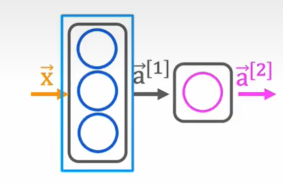
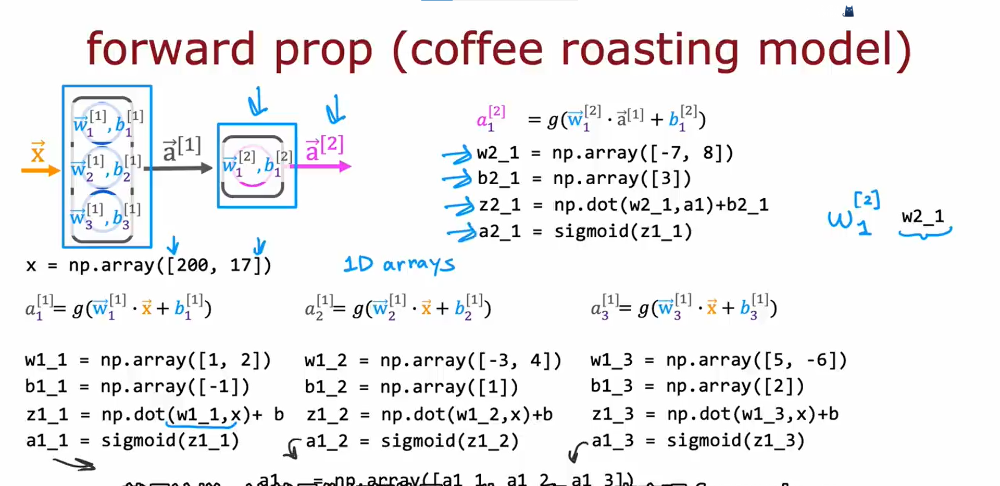
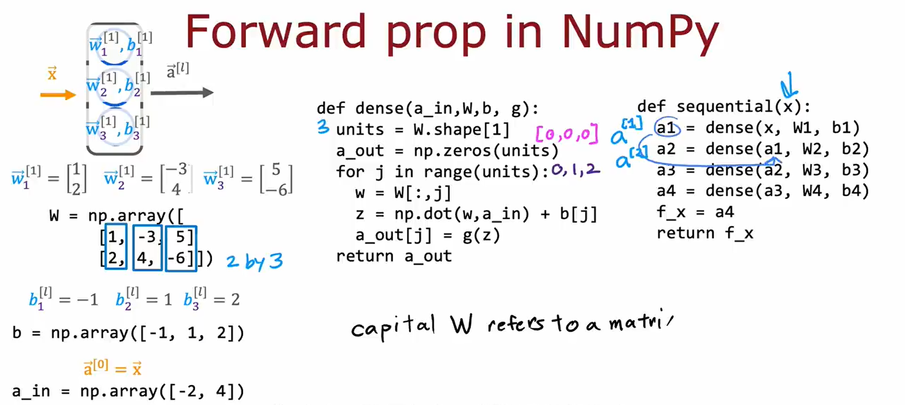
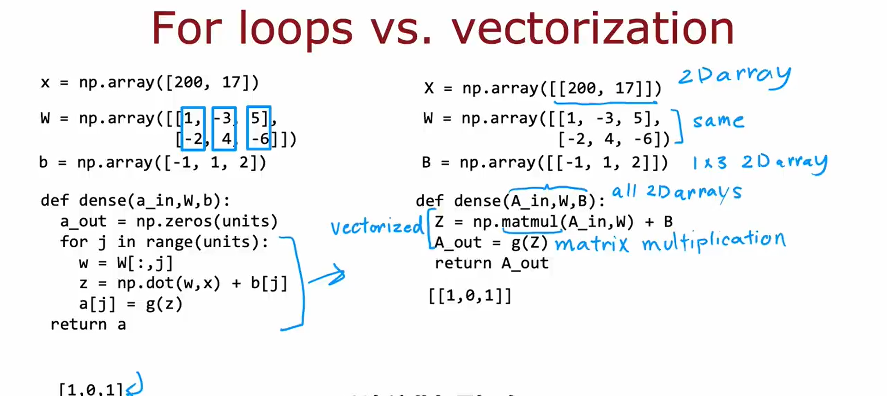

Neural networks algorithms originally try to mimic the brain.

A **layer** is a grouping of neurons which takes us input the same or similar features and that in turn outputs a few numbers together.

A layer can have multiple neurons or a single neuron.

- 第一个输入样本值的层称为**输入层**。
- 中间层也称为**隐藏层**（中间层可以有很多层）。
- 最后一个神经网络层也叫**输出层**。

每一层的输出值也叫**激活值**(activation values)。

神经网络中每一层的每个神经元可以访问上一层传递给该层的所有参数/变量的值

每一层的输入、输出的一个或者多个参数可以并在一起以**向量化**的形式表示。

“多层感知机”

神经网络的例子：

- Face recognition


- Car classification


## Neural Network Layer

在神经网络的每一层中，有一个或多个神经元，每一个神经元实现一个小的逻辑回归单元。
每一个神经元有参数$\vec{w}_i$和$b_i$，它的作用是输出一些激活值 $a_i = g(\vec{w}_i \cdot \vec{x} + b_i)$，该层的神经元的激活值 $a_1, a_2, \dots, a_k$（$k$为该层神经元的个数）组成输出值向量，传入下一层。

*以后统一用上标 (^\[n]) 表示第几层。输入层为第0层，中间的隐藏层从第1层开始进行标注。
例如，对于隐藏层第1层的第2个神经元，其参数为$\vec{w}_2^{[1]}$和$b_2^{[1]}$，其输出的激活值为 $a_2^{[1]} = g(\vec{w}_2^{[1]} \cdot \vec{a}^{[0]} + b_2^{[1]})$*

*注：对于隐藏层第1层，其输入值就是输入层的值，也就是样本的值$\vec{x}$，我们以后用$\vec{a}^{[0]}$表示$\vec{x}$*。

第$l$层的输入为第$l-1$层的输出$\vec{a}^{[l-1]}$，则第$l$层的第$j$个神经元的激活值为
$$a_j^{[l]} = g(\vec{w}_j^{[l]} \cdot \vec{a}^{[l-1]} + b_j^{[l]})$$

这里 $g()$ 是Sigmoid函数，$g(z) = 1 / (1 + e^{-z})$，深度学习中有时也称为**激活函数**(activation function)。


*我们说这个神经网络有四层。在计算神经网络的层数时，不算入输入层，只计算隐藏层和输出层。*

**激活函数**：输出激活值的函数。*目前为止只见到了Sigmoid函数*

## Inference: making predictions (forward propagation 前向传播)

```
layer 1 --> layer 2 --> layer 3 --> ......
```

以 手写数字识别 为例（暂时只识别0和1）


$a_\text{output} = f(\vec{x}_\text{input})$，用 $f$ 来表示线性回归或逻辑回归的输出。

## Code (tensorflow):

如果要构建下图所示的神经网络：


```Python
import numpy as np
import tensorflow as tf
from tensorflow.keras.layers import Dense


x = np.array([[200.0, 17.0]]) # layer 0 : input

layer_1 = Dense(units=3, activation='sigmoid') # layer 1
a_1 = layer_1(x)

layer_2 = Dense(units=1, activation='sigmoid') # layer 2
a_2 = layer_2(a_1)

if a_2 >= 0.5:
	yhat = 1
else:
	yhat = 0
```

### Data in Tensorflow

```Python
x = np.array([[200.0, 17.0]])
```

为什么有双重中括号？
为了创建一个$1\times2$的矩阵

```shell
>>> x = np.array([[200.0, 17.0]])
>>> print("x.shape = ", x.shape)
x.shape = (1, 2)
>>> x1 = np.array([200.0, 17.0])
>>> print("x1.shape = ", x1.shape)
x1.shape = (2,)
```

可以看到，x是一个$1\times2$的矩阵，而x1则是一个长度为2的没有行或列的数组

在Linear Regression和Logistic Regression中，我们用1维数组来表示数据；但是在Tensorflow中，惯例是使用矩阵来表示数据。

然后来看激活值a_1和a_2的数据形式。
```shell
>>> x = np.array([[200.0, 17.0]]) # layer 0 : input
>>> layer_1 = Dense(units=3, activation='sigmoid') # layer 1
>>> a_1 = layer_1(x)
>>> a_1
<tf.Tensor: shape=(1, 3), dtype=float32, numpy=array([[1.0000000e+00, 2.9153221e-38, 1.0000000e+00]], dtype=float32)>
>>> a_1.numpy()
array([[1.0000000e+00, 2.9153221e-38, 1.0000000e+00]], dtype=float32)
>>> layer_2 = Dense(units=1, activation='sigmoid') # layer 2
>>> a_2 = layer_2(a_1)
>>> a_2
<tf.Tensor: shape=(1, 1), dtype=float32, numpy=array([[0.62423503]], dtype=float32)>
>>> a_2.numpy()
array([[0.62423503]], dtype=float32)
```

这里a_1是一个$1 \times 3$的矩阵，在Tensorflow中以张量形式表示。张量是Tensorflow创建的一种数据类型，用于有效地存储和执行矩阵计算。a_2是一个$1 \times 1$的矩阵。

### Building a neural network

之前是一层一层构建神经网络层，下面介绍另一种构建神经网络的方法。

```Python
import numpy as np
import tensorflow as tf
from tensorflow.keras.layers import Dense
from tensorflow.keras import Sequential

layer_1 = Dense(units=3, activation='sigmoid') # layer 1
layer_2 = Dense(units=1, activation='sigmoid') # layer 2
model = Sequential([layer_1, layer_2])
```

这里将layer_1和layer_2按照顺序串在一起形成一个神经网络。

整个tensorflow构建神经网络的流程可以写为
```Python
x = np.array([200.0, 17.0],
			 [120.0, 5.0],
			 [425.0, 20.0],
			 [212.0, 18.0]) # inputs
y = np.array([1, 0, 0, 1]) # targets

layer_1 = Dense(units=3, activation='sigmoid') # layer 1
layer_2 = Dense(units=1, activation='sigmoid') # layer 2
model = Sequential([layer_1, layer_2])

# train the neural network
model.compile(...) # compile this model
model.fit(x, y) # fit the data x and y

# input a new x and predict through the neural network
model.predict(x_new)
```

或者可以写得更加紧凑一点
```Python
model = Sequential([
	Dense(units=3, activation='sigmoid') # layer 1
	Dense(units=1, activation='sigmoid') # layer 2
])
```

### Forward prop in a single layer



### General implementation of forward propagation



### Neural networks can be vectorized



