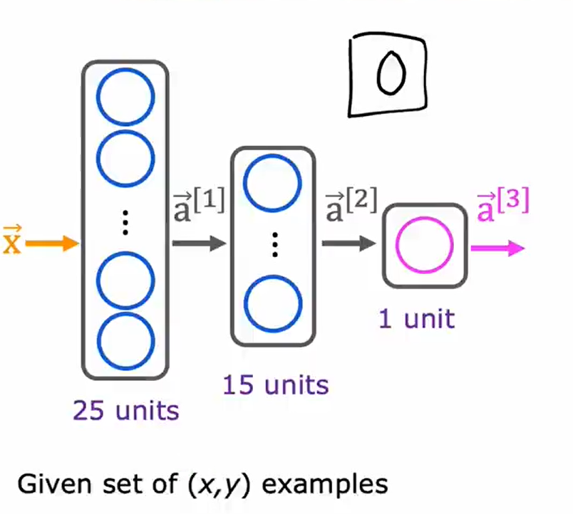
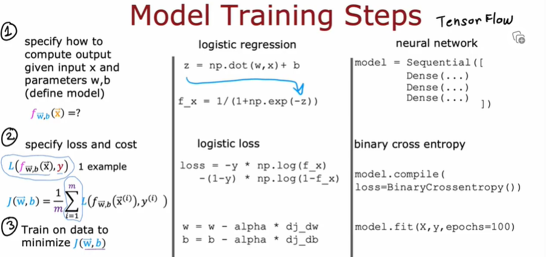
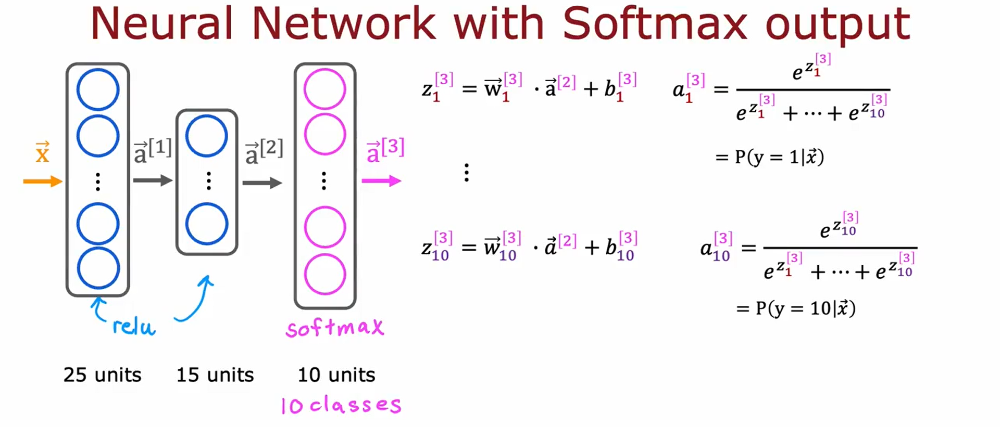
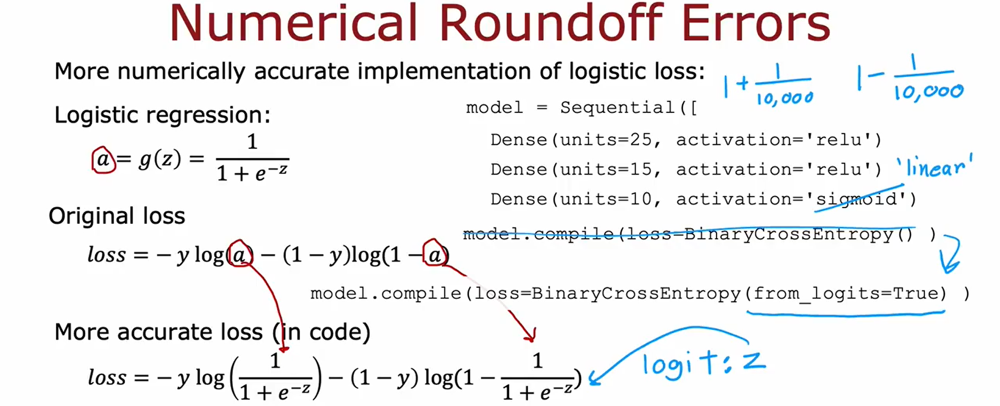
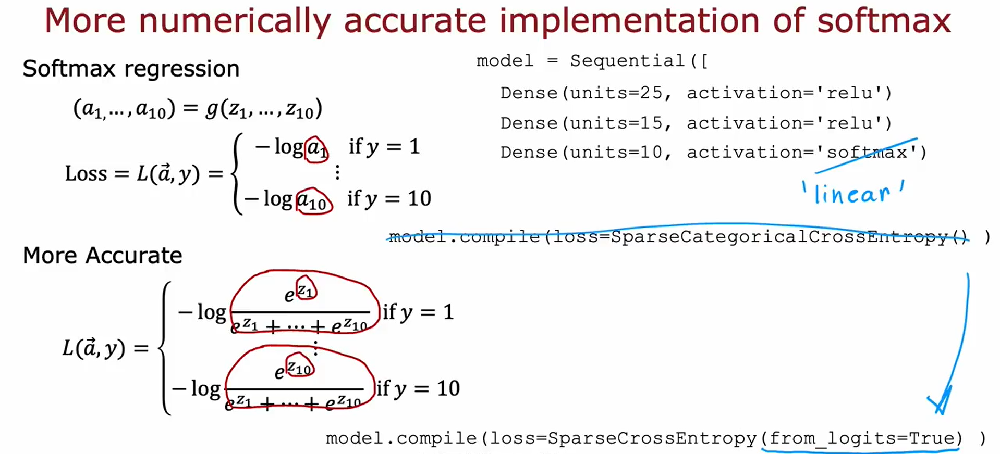
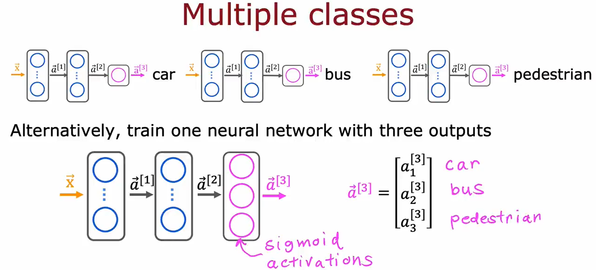
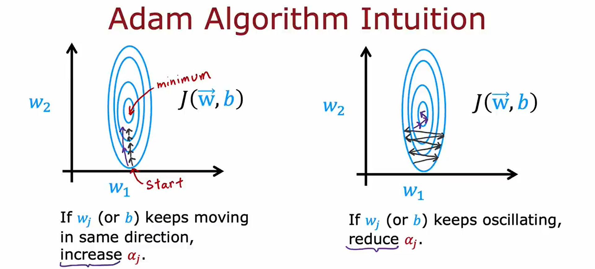
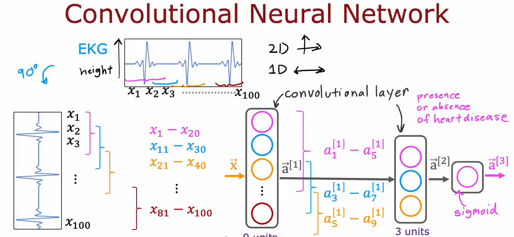
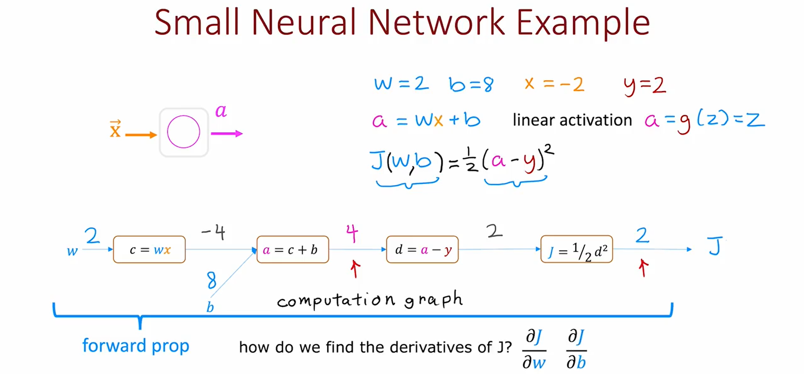
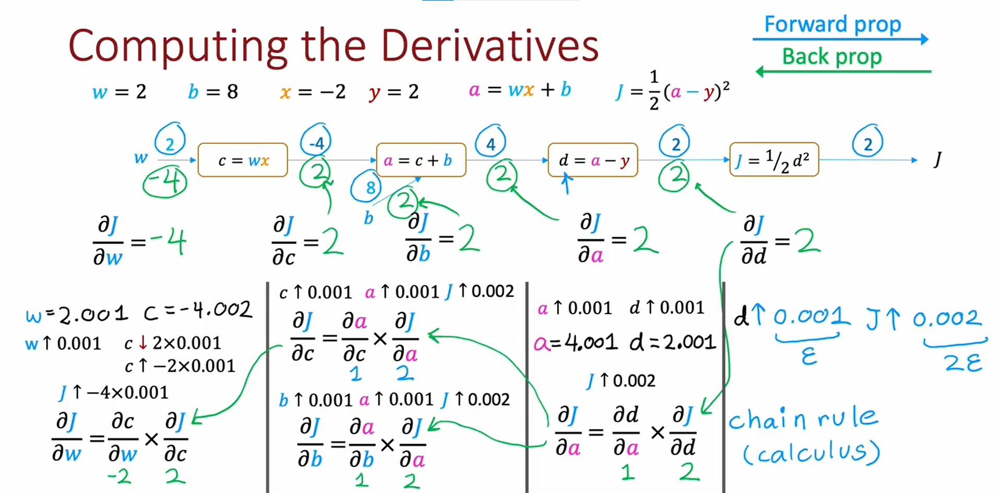

## Tensorflow implementation

假设我们要辨别手写数字0和1。

我们构建的神经网络如下图所示。



我们首先给出代码，然后逐步解释其中的细节。

```Python
import tensorflow as tf
from tensorflow.keras import Sequential
from tensorflow.keras.layers import Dense
from tensorflow.keras.losses import BinaryCrossentropy


model = Sequential([
	Dense(units=25, activation='sigmoid'),
	Dense(units=15, activation='sigmoid'),
	Dense(units=1, activation='sigmoid')
])

model.compile(loss=BinaryCrossentropy())

model.fit(X, Y, epochs=100)
```

这里我们引入`BinaryCrossentropy()`函数（二元分类交叉熵）作为loss function参与model的compile过程。
这个函数就是之前对于二元分类问题定义的损失函数loss function
$$\mathcal{L}(f_{\vec{w},b}(\vec{x}^{(i)}),y^{(i)})=
-y^{(i)} * \log(f_{\vec{w},b}(\vec{x}^{(i)})) -(1-y^{(i)}) * \log(1 - f_{\vec{w},b}(\vec{x}^{(i)}))$$

“交叉熵”

对于回归问题Regression(predicting numbers and not categories)，通常使用平方误差函数。其在Tensorflow中可以用`MeanSquaredError()`

```Python
from tensorflow.keras.losses import MeanSquaredError

model.compile(loss=MeanSquaredError())
```

在`fit`函数中，我们指定`epochs=100`，即想要运行100步梯度下降算法



在梯度下降算法中，最主要的一点就是计算偏导项。在Tensorflow中，我们使用**反向传播**(back-propagation)算法进行偏导项的计算。

## Activation function 激活函数

### Alternatives to the sigmoid activation

神经网络中，除了Sigmoid函数，还有一个常用的激活函数
$$
g(z) = \max(0, z) = 
\left
\{
\begin{aligned} 
& 0 & \text{if}\ \ z < 0 \\ 
& z & \text{if}\ \ z \geq 0
\end{aligned} 
\right.
$$

这个激活函数被命名为**ReLU**函数，是rectified linear unit（线性整流函数）的缩写。

也有**线性激活函数**（其实相当于没有用任何激活函数）：
$$g(z) = z$$

### How to choose different activation functions

Choosing $g(z)$ for output layer（现在先讨论最后一层输出层的激活函数）
- 如果要处理输出为0或1的**二元分类问题**，选择 **Sigmoid函数**
- 如果要处理回归问题，要预测**输出是正还是负**，选择 **线性激活函数**
- 如果要处理回归问题，但是**输出的值是非负数**，选择 **ReLU函数**

对于中间的隐藏层，**ReLU函数**是迄今为止神经网络中最常见的选择，除非二元分类问题才会用到**Sigmoid函数**，但即使是二元分类问题隐藏层也是用**ReLU**更多。

*因为Sigmoid函数在$z$很大和$z$很小时都会变化很缓慢，导致Cost function在进行梯度下降时效率很低，而ReLU函数只在$z<0$时变化缓慢，所以在进行梯度下降时速度会更快*

### Why do we need activation function?

激活函数的作用是**非线性输出**，如果没有激活函数，所有的神经元做的只是线性变换，则只能应对线性回归模型，且整个神经网络与只用一个神经元本质上没有区别（因为矩阵乘法）。

Don't use linear activation function in hidden layers (using ReLU activation function should do just fine) !!!

## Softmax

### Multi-class 多分类问题

多分类问题指分类问题可以有两个以上的输出标签，而不仅仅是0或1。例如，分辨数字（0到9，而不仅仅是0和1）。

Softmax Regression 是logistic regression的推广，它可以用来解决多分类问题，划分两个以上的类别的决策边界。

### Softmax algorithm

回顾二元分类问题时，我们采用logistic regression
$$
\begin{align*}
z & = \vec{w} \cdot \vec{x} + b \\
a & = g(z) = \frac{1}{1 + e^{-z}} = \mathcal{P}(y = 1 | \vec{x})
\end{align*}
$$
这里如果看作二元分类，输出为0或1，上面的$a$还可以写为
$$
\begin{align*}
a_1 & = g(z) = \frac{1}{1 + e^{-z}} = \mathcal{P}(y = 1 | \vec{x}) \\ 
a_2 & = 1 - a_1 = \mathcal{P}(y = 0 | \vec{x})
\end{align*}
$$

如果现在是四元分类问题，输出值有$y=1, 2, 3, 4$，则使用Softmax算法
$$
\begin{align*}
z_1 & = \vec{w}_1 \cdot \vec{x} + b_1 \\
z_2 & = \vec{w}_2 \cdot \vec{x} + b_2 \\
z_3 & = \vec{w}_3 \cdot \vec{x} + b_3 \\
z_4 & = \vec{w}_4 \cdot \vec{x} + b_4 \\
a_1 & = \frac{e^{z_1}}{e^{z_1} + e^{z_2} + e^{z_3} + e^{z_4}} = \mathcal{P}(y = 1 | \vec{x}) \\
a_2 & = \frac{e^{z_2}}{e^{z_1} + e^{z_2} + e^{z_3} + e^{z_4}} = \mathcal{P}(y = 2 | \vec{x}) \\
a_3 & = \frac{e^{z_3}}{e^{z_1} + e^{z_2} + e^{z_3} + e^{z_4}} = \mathcal{P}(y = 3 | \vec{x}) \\
a_4 & = \frac{e^{z_4}}{e^{z_1} + e^{z_2} + e^{z_3} + e^{z_4}} = \mathcal{P}(y = 4 | \vec{x})
\end{align*}
$$

推广到$N$分类问题（输出值有$y = 1, 2, 3, 4, \dots, N$）
$$
\begin{align*}
z_j & = \vec{w}_j \cdot \vec{x} + b_j & \text{for}\ \ j=1\ \text{to}\ N \\
a_j & = \frac{e^{z_j}}{\sum_{k=1}^{N} e^{z_k}} = \mathcal{P}(y = j | \vec{x}) & \text{for}\ \ j=1\ \text{to}\ N
\end{align*}
$$

这里有$2N$个参数 $\vec{w}_1, \vec{w}_2, \dots, \vec{w}_N,\  b_1, b_2, \dots, b_N$

*注：这里的$\vec{w}_1$是一个向量，而不是$w$的某个分量，这里$w$也不是一个向量，而可以由$\vec{w}_1, \vec{w}_2, \dots, \vec{w}_N$并成一个矩阵*

*注意这里的$a_1$不仅仅是$z_1$的函数，而是$z_1, z_2, \dots, z_N$的函数*

回忆logistic regression的loss function定义为
$$
\begin{align*}
\mathcal{L}(f_{\vec{w},b}(\vec{x}^{(i)}),y^{(i)}) & = -y * \log(a_1) - (1-y) * \log(1 - a_1) \\
& =
\left
\{
\begin{aligned} 
& -\log(f_{\vec{w},b}(\vec{x}^{(i)})) & \text{if}\ \ y^{(i)} = 1 \\ 
& -\log(1 - f_{\vec{w},b}(\vec{x}^{(i)})) & \text{if}\ \ y^{(i)} = 0 \\
\end{aligned} 
\right. \\
& =
\left
\{
\begin{aligned} 
& -\log(a_1) & \text{if}\ \ y = 1 \\ 
& -\log(a_2) & \text{if}\ \ y = 0 \\
\end{aligned} 
\right. 
\end{align*}
$$

则Softmax的loss function也可以定义为
$$
\mathcal{L}(a_1, a_2, \dots, a_N, y) =
\left
\{
\begin{aligned} 
& -\log(a_1) & \text{if}\ \ y = 1 \\ 
& -\log(a_2) & \text{if}\ \ y = 2 \\
& -\log(a_3) & \text{if}\ \ y = 3 \\
& \qquad \dots \\
& -\log(a_N) & \text{if}\ \ y = N
\end{aligned} 
\right. 
$$

### Neural Network with Softmax output

如果我们进行$N$分类问题，相较于二元分类问题输出层使用一个神经元，并使用sigmoid激活函数，现在我们改用有$N$个神经元的输出层，并使用Softmax输出，这个输出层又叫做Softmax层。



下面在Tensorflow上实现这个神经网络

```Python
import tensorflow as tf
from tensorflow.keras import Sequential
from tensorflow.keras.layers import Dense
from tensorflow.keras.losses import SparseCategoricalCrossentropy

# Specify the model f_{w,b}(x)
model = Sequential([
	Dense(units=25, activation='relu')
	Dense(units=15, activation='relu')
	Dense(units=10, activation='softmax')
])

# Specify loss and cost L(f_{w,b}(x), y)
model.compile(loss=SparseCategoricalCrossentropy())

# Train on data to minimize J(w,b)
model.fit(X, Y, epochs=100)
```

对于多分类问题，我们使用`SparseCategoricalCrossentropy()`作为loss function。category表明这是一个分类问题，sparse表明$y$只能取$N$个值之一（还记得二元分类问题中使用logistic regression，我们用的loss function是`BinaryCrossentropy()`函数）

*注：上面这段代码不要用在真实编写神经网络上，因为有更好的代码版本，下面会接触到。*

### Improved implementation of Softmax

上面的代码版本会产生较大的数值浮点误差



如上图所示，在logistic regression中，如果不使用$a$作为中间值，而是直接代入loss function（也可以认为选择了线性激活函数而非Sigmoid函数，并改造了loss function的形式，在代码中即对应`loss=BinaryCrossEntropy(from_logits=True)`），最终tensorflow会给出一个更加精确的结果。

在Softmax regression中，同理可以直接写入loss function中而不使用中间值



其改造代码如下

```Python
import tensorflow as tf
from tensorflow.keras import Sequential
from tensorflow.keras.layers import Dense
from tensorflow.keras.losses import SparseCategoricalCrossentropy

# Specify the model f_{w,b}(x)
model = Sequential([
	Dense(units=25, activation='relu')
	Dense(units=15, activation='relu')
	Dense(units=10, activation='linear')
])

# Specify loss and cost L(f_{w,b}(x), y)
model.compile(loss=SparseCategoricalCrossentropy(from_logits=True))

# Train on data to minimize J(w,b)
model.fit(X, Y, epochs=100)

# predict
logits = model(X)
f_x = tf.nn.softmax(logits)
```

由于loss function直接代入的是$z$的值，而非$a=g(z)$的值，最后输出的也只是$z$而非$g(z)$即我们想要的概率，所以要多加最后一段，使其能够预测概率。

### Multi-label Classification 多标签分类问题

multi-label classification 与 multi-class classification 不同，后者是指输出值有多个的分类问题，如分辨数字0~9；
前者是多标签分类问题，典型例子是给一张图片，判断图上Is there a car? Is there a bus? Is there a pedestrian?，输入一张图片，有多个标签（是否有车、是否有行人等等），即对应的$y$是一个多标签组成的向量。

如何解决多标签分类问题？

一种方法是独立看每一个标签，将整个问题拆分成多个完全独立的机器学习问题。

或者，还有一种方法自然是构建一个有多个输出的神经网络。



*注：这里使用Sigmoid激活函数而不是Softmax激活函数，是因为本质上这是三个二元分类问题，而非一个多元分类问题*

## Advanced Optimization —— Adam algorithm

除了梯度下降算法，还有一些优化算法用于最小化成本函数。

其中一个是 “Adam” algorithm。

其本质是在梯度下降进展顺利时（直接向最小值前进），增大学习率$\alpha$，使得最小化的过程更快；而当梯度下降进展不顺利时（如左右横跳着下降），就减小学习率$\alpha$。



Adam算法可以自动调整学习率，“Adam”代表 Adaptive Moment estimation

Adam算法并没有使用单一的全局学习率$\alpha$，而是对模型的每一个参数使用不同的学习率

Adam算法的tensorflow实现如下

```Python
import tensorflow as tf
from tensorflow.keras import Sequential
from tensorflow.keras.layers import Dense
from tensorflow.keras.losses import SparseCategoricalCrossentropy
from tensorflow.keras.optimizers import Adam # Adam algorithm

# Specify the model f_{w,b}(x)
model = Sequential([
	Dense(units=25, activation='sigmoid')
	Dense(units=15, activation='sigmoid')
	Dense(units=10, activation='linear')
])

# Specify loss and cost L(f_{w,b}(x), y)
model.compile(optimizer=Adam(learning_rate=1e-3)
			  loss=SparseCategoricalCrossentropy(from_logits=True))

# Train on data to minimize J(w,b)
model.fit(X, Y, epochs=100)

# predict
logits = model(X)
f_x = tf.nn.softmax(logits)
```

这里设置Adam算法的初始学习率为 $\alpha=1 \times 10^{-3}$

## Additional Layer Types

到目前为止所有的层都是dense layer类型，其中层中的每个神经元都得到它输入上一层的所有激活（Each neuron output is a function of all the activation outputs of the previous layer）。

下面介绍一个其它类型的神经网络层 —— 卷积层 Convolutional layer

Each Neuron only looks at part of the previous layer's inputs.

Why?
- Faster computation
- Need less training data (less prone to overfitting)

如果一个神经网络中有多个卷积层，这个神经网络也可以成为**卷积神经网络**(Convolutional Neural Network)



## Derivative —— Back propagation

使用Sympy包计算导数

```Python
import sympy

J, w = sympy.symbols('J,w')
J = w**2
dJ_dw = sympy.diff(J,w) # calculate the derivative
dJ_dw.subs([(w,2)]) # calculate the derivative of J(w) at w=2
```

### Computation Graph



相比于前向传播是从左到右的计算，计算导数时选择从右到左计算，所以也叫反向传播。



Backprop is an efficient way to compute derivatives. Why?

If $N$ nodes and $P$ parameters, compute derivatives in roughly $N + P$ steps rather than $N \times P$ steps.