some advice on how to build machine learning systems


## Evaluating and choosing models

### Evaluating a model

将数据划分为两部分：**训练集**(training set)和**测试集**(test set)

一般training set可以取到70%，test set可以取到30%，或者80%-20%的比例。

用 $m_\text{train}$ 表示训练集的样本数量，用 $m_\text{test}$ 表示测试集的样本数量

用 $x^{(i)}$ 表示第$i$个训练集样本（$i = 1, 2, \dots, m_\text{train}$），用 $x_\text{test}^{(i)}$ 表示第$i$个测试集样本（$i = 1, 2, \dots, m_\text{test}$）

1. Train/Test procedure for linear regression (with squared error cost)
- Fit parameters by minimizing cost function $J(\vec{w},b)$
$$
\min_{\vec{w},b} J(\vec{w},b) = \min_{\vec{w},b} [\frac{1}{2m_\text{train}}\sum_{i=1}^{m_\text{train}}(f_{\vec{w},b}(\vec{x}^{(i)}) - y^{(i)})^2 + \frac{\lambda}{2m_\text{train}}\sum_{j=1}^{n}w_j^2]
$$
- Compute test error:
$$J_\text{test}(\vec{w},b) = \frac{1}{2m_\text{test}}\sum_{i=1}^{m_\text{test}}(f_{\vec{w},b}(\vec{x}^{(i)}_\text{test}) - y^{(i)}_\text{test})^2$$
- Compute training error:
$$J_\text{train}(\vec{w},b) = \frac{1}{2m_\text{train}}\sum_{i=1}^{m_\text{train}}(f_{\vec{w},b}(\vec{x}^{(i)}_\text{train}) - y^{(i)}_\text{train})^2$$

对于overfitting的model
- $J_\text{train}(\vec{w},b)$ will be very low
- $J_\text{test}(\vec{w},b)$ will be high

在出现这种情况时，就需要对model进行调整

2. Train/Test procedure for classification problem
- Fit parameters by minimizing cost function $J(\vec{w},b)$, E.g.,
$$
J(\vec{w},b) = -\frac{1}{m}\sum_{i=1}^{m}[y^{(i)} * \log(f_{\vec{w},b}(\vec{x}^{(i)})) + (1 - y^{(i)}) * \log(1 - f_{\vec{w},b}(\vec{x}^{(i)}))] + \frac{\lambda}{2m}\sum_{j=1}^{n}w_j^2
$$
- Compute test error:
$$J_\text{test}(\vec{w},b) = -\frac{1}{m_\text{test}}\sum_{i=1}^{m_\text{test}}[y^{(i)}_\text{test} * \log(f_{\vec{w},b}(\vec{x}^{(i)}_\text{test})) + (1 - y^{(i)}_\text{test}) * \log(1 - f_{\vec{w},b}(\vec{x}^{(i)}_\text{test}))]$$
- Compute training error:
$$J_\text{train}(\vec{w},b) = -\frac{1}{m_\text{train}}\sum_{i=1}^{m_\text{train}}[y^{(i)}_\text{train} * \log(f_{\vec{w},b}(\vec{x}^{(i)}_\text{train})) + (1 - y^{(i)}_\text{train}) * \log(1 - f_{\vec{w},b}(\vec{x}^{(i)}_\text{train}))]$$

评估model好坏的方法与上面一致。

对于classification问题，还有一种评估的方法，就是计算 the fraction of the test set and the fraction of the train set that the algorithm has misclassified.
$$
\hat{y} =
\left
\{
\begin{aligned} 
& 1 & \text{if}\ \ f_{\vec{w},b}(\vec{x}^{(i)}) \geq 0.5 \\ 
& 0 & \text{if}\ \ f_{\vec{w},b}(\vec{x}^{(i)}) < 0.5
\end{aligned} 
\right. 
$$

Then count $\hat{y} \neq y$

$J_\text{test}(\vec{w},b)$ is the fraction of the test set that has been misclassified.

$J_\text{train}(\vec{w},b)$ is the fraction of the training set that has been misclassified.

### Model selection and training / cross validation / test sets

Once parameters $\vec{w}, b$ are fit to the training set, the training error $J_\text{train}(\vec{w},b)$ is likely lower than the actual generalization error.

$J_\text{test}(\vec{w},b)$ is better estimate of how well the model will generalize to new data than $J_\text{train}(\vec{w},b)$.

The problem is that $J_\text{test}(\vec{w},b)$ is likely to be an optimistic estimate of generalization error.


因为测试集也只是整个数据集的一小部分，所以测试集给出的最优解也会产生误差，此时需要采用一个更加合理的方法。

因为选择的model，比如多项式的阶数$d$，和$\vec{w}, b$一样也是一个需要学习的参数，这个参数$d$原本是靠test set找到的，无法再用test set来评估$d$的好坏，所以容易出现overfit。
此时需要引入一个新的子集。

将整个数据集分为三部分：**训练集**(training set)、**交叉验证集**(cross-validation set)、**测试集**(test set)


交叉验证集 是指一个额外的数据集，用于检查不同模型的有效性和真实性。

*交叉验证集有时候也叫做**验证集**(validation set)或者**开发集**(development set or dev set for short)*

- Training error
$$J_\text{train}(\vec{w},b) = \frac{1}{2m_\text{train}}\sum_{i=1}^{m_\text{train}}(f_{\vec{w},b}(\vec{x}^{(i)}) - y^{(i)})^2$$
- Cross validation error
$$J_\text{cv}(\vec{w},b) = \frac{1}{2m_\text{cv}}\sum_{i=1}^{m_\text{cv}}(f_{\vec{w},b}(\vec{x}^{(i)}_\text{cv}) - y^{(i)}_\text{cv})^2$$
- Test error
$$J_\text{test}(\vec{w},b) = \frac{1}{2m_\text{test}}\sum_{i=1}^{m_\text{test}}(f_{\vec{w},b}(\vec{x}^{(i)}_\text{test}) - y^{(i)}_\text{test})^2$$


在有了交叉验证集后，对于不同的模型，首先用训练集得到最优的参数，然后分别带入交叉验证集计算Cost function，比较不同的模型，选择有着最低的交叉验证误差的model。

最后，如果要estimate the generalization error of how well this model will do on new data，即评估这个模型的泛化能力，此时就需要选择测试集进行此操作。

*可以理解为多分出来了一个训练集来训练新的参数，在这里就是和model有关的多项式的阶数$d$*

在选择神经网络的结构时同理，可以用Cross validation set来进行neural network architecture的选择。

总结：先训练集对不同的模型训练出最优参数，然后验证集使用这些参数，挑出有最小的交叉验证误差的模型作为最优的模型，最后测试集用训练集给出的参数具体地评估该模型的泛化能力。
 
*好比三个人参加比赛，训练集就是训练三个人的比赛能力到最优，验证集就是赛前模拟测试决定最佳人选去参加比赛，测试集就是正式参加比赛量化能力值*

## Bias and variance

### Diagnosing bias and variance

high bias 高偏差 -- underfitting:
- $J_\text{train}$ is high
- $J_\text{cv}$ is high
high variance 高方差 -- overfitting:
- $J_\text{train}$ is low
- $J_\text{cv}$ is high
just right:
- $J_\text{train}$ is low
- $J_\text{cv}$ is low


有时也会出现 high bias and high variance 的情况，此时
- $J_\text{train}$ will be high
- $J_\text{cv} \gg J_\text{train}$

### Regularization and bias / variance


Choosing the regularization parameter $\lambda$


### Establishing a baseline level of performance

What is the level of error you can reasonably hope to get to?
- Human level performance 人类的水平
- Competing algorithms performance 其他算法的表现
- Guess based on experience 基于以往经验的估计

有时model的Training error和Cross validation error可能较高，但是这并不能够说明这个model不够好，而是要与baseline level进行比较才能得出

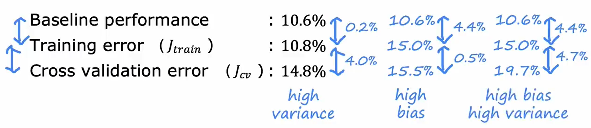

### Learning curves

对于绘制学习曲线，我们会发现，当训练集的样本数量$m_\text{train}$增大时，$J_\text{cv}(\vec{w},b)$会下降，而$J_\text{train}(\vec{w},b)$会上升（*注：这是在拟合模型$f_{\vec{w},b}(\vec{x})$确定的情况下*）

这是因为样本数量小时，容易出现overfitting，$J_\text{train}(\vec{w},b)$此时会很小。

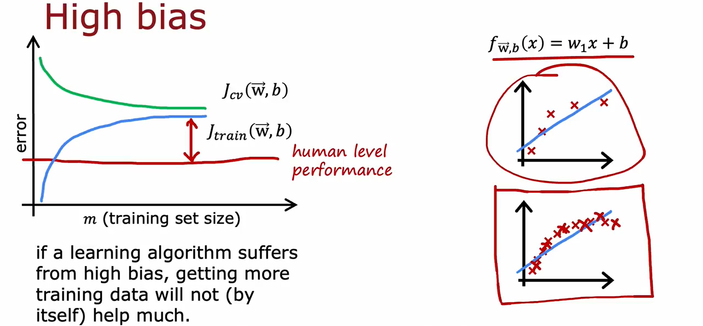

对于 High bias 的情况，此时要做的应该是考虑改进模型

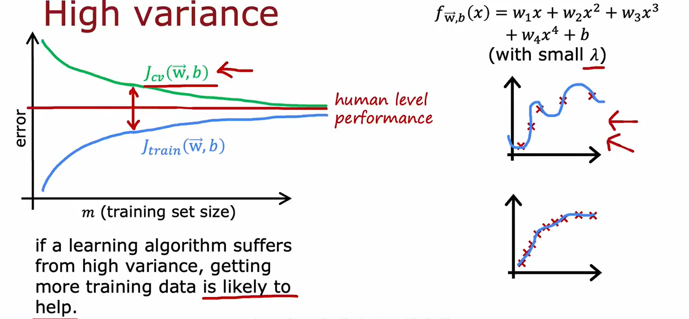

对于 High variance 的情况，此时要做的应该是考虑增大训练集的规模，或者改进模型

### Bias / Variance and neural networks

the bias-variance tradeoff

balance the complexity that is the degree of polynomial

大型的神经网络总是具有低偏差（虽然很有可能过拟合）

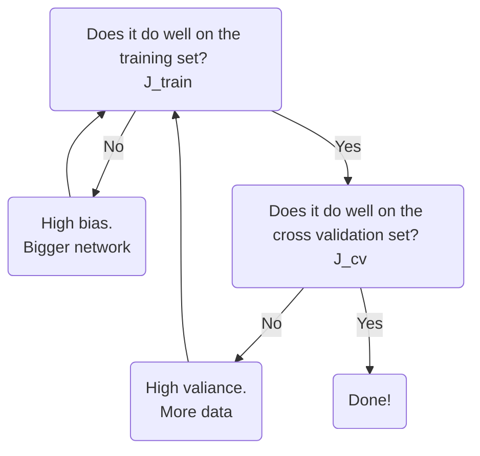

这里的限制一般有两个：Bigger network意味着更多的算力以及更长的处理时间；More data有时也没有非常容易获取。

A large neural network will usually do as well or better than a smaller one so long as regularization is chosen appropriately.

神经网络的正则化
$$J(\vec{w},b) = \frac{1}{m}\sum_{i=1}^{m}\mathcal{L}(f(\vec{x}^{(i)}),y^{(i)}) + \frac{\lambda}{2m}\sum_{\text{all weights}\ w}(w^2)$$

- Unregularized MNIST model
```Python
layer_1 = Dense(units=25, activation="relu")
layer_2 = Dense(units=15, activation="relu")
layer_3 = Dense(units=1, activation="sigmoid")
model = Sequential([layer_1, layer_2, layer_3])
```
- Regularized MNIST model
```Python
layer_1 = Dense(units=25, activation="relu", kernel_regularizer=L2(0.01))
layer_2 = Dense(units=15, activation="relu", kernel_regularizer=L2(0.01))
layer_3 = Dense(units=1, activation="sigmoid", kernel_regularizer=L2(0.01))
model = Sequential([layer_1, layer_2, layer_3])
```

其中`kernel_regularizer=L2(0.01)`即为加入正则化，这里设定了正则化参数$\lambda = 0.01$

*注：`L1`表示参数绝对值，`L2`表示参数平方，`L1L2`表示这两种方法都用，这里由公式，显然是采用`L2`*

## Machine learning development process

### Iterative loop of ML development

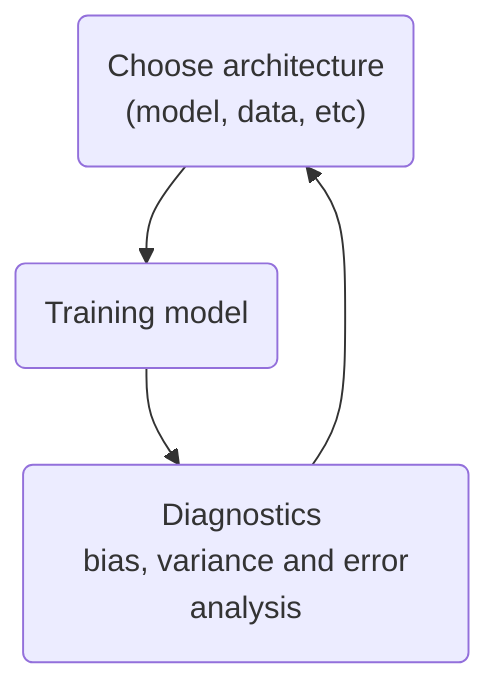

以构建一个垃圾邮件分类器为例

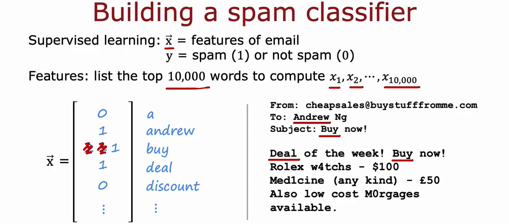
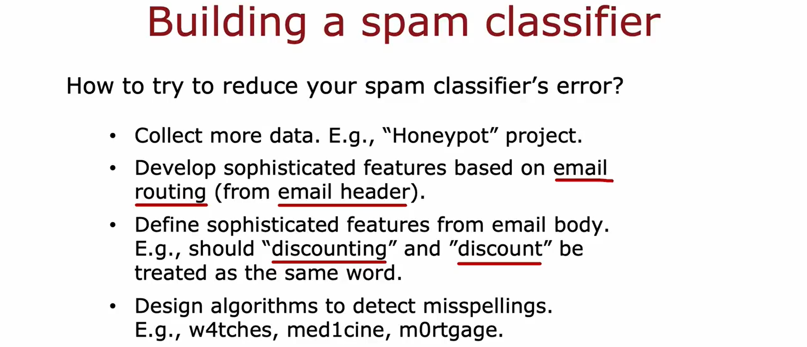

### Error Analysis

除了bias和variance这两个方面来评估模型，error analysis也是一种有效的评估手段。

将cross-validation set中的misclassified的样本**按照共同的特征进行分类**，如在上述“垃圾邮件分类器”项目中，可以分类为：拼写错误的有多少？邮件地址不正常的有多少？想要窃取密码的有多少？... （这里misclassified可以认为是应当是垃圾邮件系统却没有识别出来），然后先**着手改善那些占大头的部分**（比如选取更多有着钓鱼邮件地址的垃圾邮件，对神经网络进行训练），而分配给占小头的部分较低的优先级（注意一封邮件可以同时具备上述多个特征，可以都计算在内）。

如果交叉验证集较大，misclassified的样本数可能较多，这时可以从中随机挑选出**部分样本**组成一个子集，然后提取它们的共同特征。

总结来说，error analysis做的事就是focusing attention on the more promising things to try.

### Adding data

增加数据主要有两种方式。

1. data augmentation 数据增强

modifying an existing training example to create a new training example.

比如对于分辨数字，可以将数据集调整如下。比如对数字1的图片，可以旋转1，放大或缩小1，改变整张图片的颜色，改变整张图片的对比度等等，将图片1放入网格中并随机扭曲网格改变1的形状，但是输出标签仍然是1。这样就增加了数据集的大小。

注意：Distortion introduced should be representation of the type of noise/distortions in the test set. Usually does not help to add purely random/meaningless noise to your data.

2. data synthesis 数据合成

using artificial data inputs to create a brand new training example.

比如数字识别，可以利用计算机系统中的不同字体，通过调整背景，创造出大量有用的含有数字的图片，以便计算机进行识别。

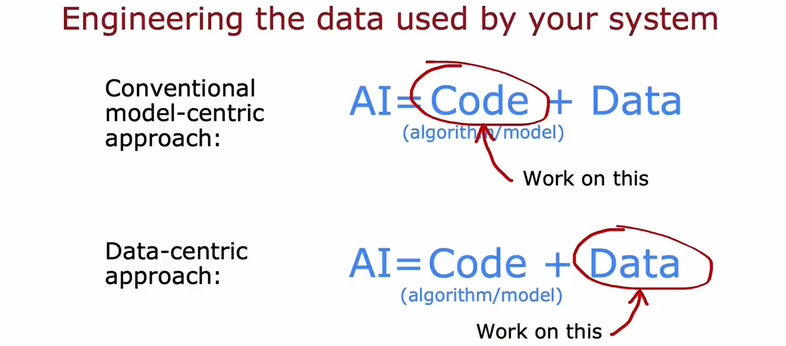

### Transfer learning 迁移学习

using data from a different task

如果一些应用程序没有那么多数据，而且也很难获得更多数据，此时**迁移学习**提出可以从几乎不相关的任务中获取数据。

比如识别数字0~9，但是没有足够的数字图片。此时可以拿一个训练好的可以分辨其他物品（比如猫、狗、车、人等1000类事务）的神经网络，直接继承中间层除了最后一层输出层的所有参数，而最后一层输出层设置为有10个值的参数向量，来分辨0~9，此时只需要训练最后一层的参数即可，也可以将前边的参数值作为初始值训练所有参数，此时收敛也会很快。

迁移学习的想法是希望将已有的神经网络的前几层的参数传递给性的神经网络，使得新神经网络已经学会了初步完成一些任务，从一个更优的初始位置进行进一步训练以完成预期要达到的目标。

其中，训练已有的神经网络并将其参数传递到新的神经网络称为**监督预训练**(supervised pretraining)，而在新的神经网络上训练参数称为**微调**(Fine tuning)。

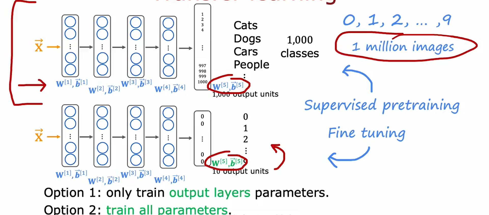

这是因为对于不同但是相近的任务，神经网络的前几层所做的事是差不多的。比如已有的神经网络拥有分辨猫、狗、车、人等1000类事务，它的第一层可能是检测边缘，第二层可能是检测转角，第三层可能是检测曲线，第四层可能是检测基本的形状等等，这在分辨数字的神经网络中也是一样的操作，所以可以借鉴已有的神经网络所训练好的参数。

注意：已有的神经网络不是随意选择的，需要与新的神经网络有相同的input type，需要任务最好相近，比如都是计算机视觉中的分辨事务等等。

Transfer learning summary
1. Download neural network parameters pretrained on a large dataset with same input type (e.g., images, audio, text) as your application (or train your own).
2. Further train (fine tune) the network on your own data.

### Full cycle of a machine learning project

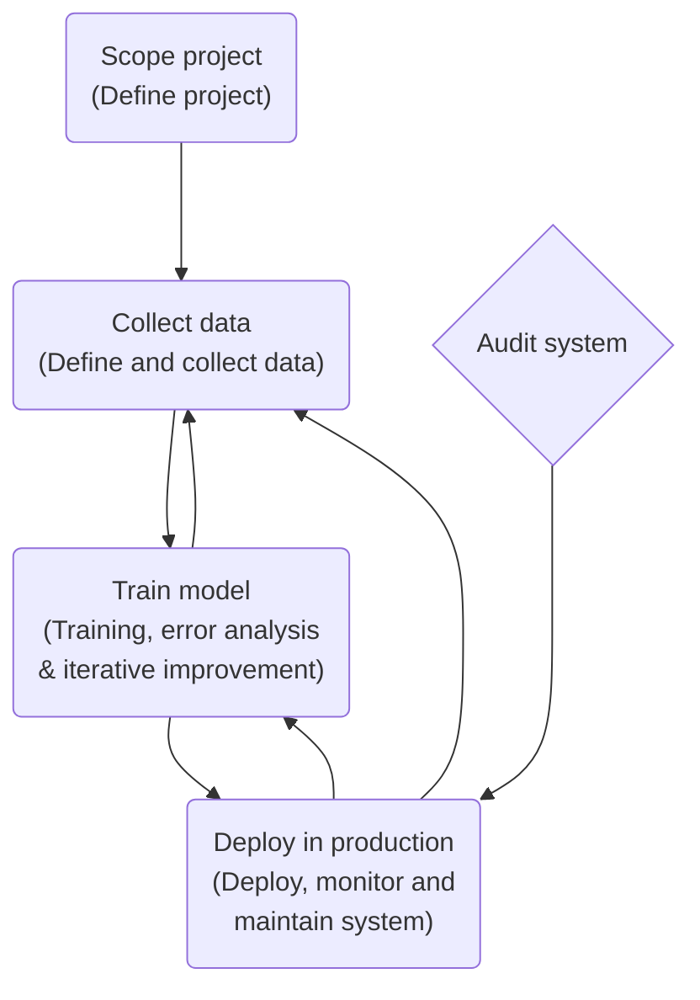

Deployment 生产环境中部署你的神经网络模型

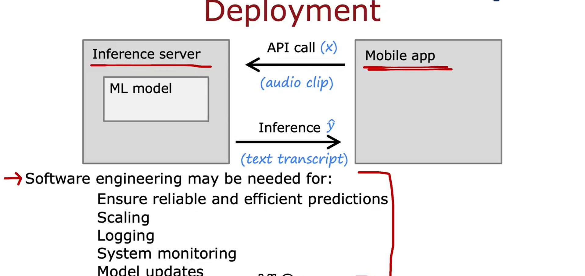

## Skewed datasets 倾斜数据集

倾斜数据集：数据不平衡，比如检测一种罕见疾病，这种疾病只会在$0.5\%$的人身上出现，则整个数据集中$99.5\%$的样本标签为$y=0$，而只有$0.5\%$的样本标签为$y=1$，数据分布极其不均衡。而且会产生高准确率的神经网络（比如正确率$96.2\%$）反而不如直接输出$y=0$来得有效，但是我们显然不会用后者方式进行疾病的诊断。

### Error metrics for skewed datasets

A common pair of metrics is **Precision/Recall**

采用**混淆矩阵**(Confusion matrix)：$2\times 2$ 的矩阵，横向轴表示Actual class（分别为1,0），纵向轴表示Predicted class（分别为1,0）。则$M_{11}$表示预测值和真实值都为1的一共有多少个，依此类推得到$M_{12}, M_{21}, M_{22}$。

对这个$2 \times 2$矩阵的4个位置进行命名：
- $M_{11}$: True positive
- $M_{22}$: True negative
- $M_{12}$: False positive
- $M_{21}$: False negative

| | 1 | 0 |
|:---:|:---:|:---:|
| 1 |True positive|False positive|
| 0 |False negative|True negative|

还以罕见病为例。

$y=1$ in presence of rare class we want to detect.

Confusion matrix为

| | 1 | 0 |
|:---:|:---:|:---:|
| 1 | 15 | 5 |
| 0 | 10 | 70 |

两个有用的指标：

1. **Precision** 精确率: of all patients where we predicted $y = 1$, what fraction actually have the rare disease?
$$\text{Precision} = \frac{\text{True positives}}{\text{predicted positive}} = \frac{\text{True positives}}{\text{True positives + False positives}} = \frac{15}{15 + 5} = 0.75$$

2. Recall 召回率: of all patients that usually have the rare disease, what fraction did we correctly detect as having it?
$$\text{Recall} = \frac{\text{True positives}}{\text{actual positives}} = \frac{\text{True positives}}{\text{True positives + False negatives}} = \frac{15}{15 + 10} = 0.6$$

*在信息检索领域，精确率和召回率又被称为**查准率**和**查全率***

一个好的学习算法不仅要有高的准确率(accuracy)，也要有高的精确率(precision)和召回率(recall)。

high precision 表示如果预测出一个患者患有这种罕见疾病，则这个患者大概率确实患病。
high recall 表示如果一个患者患有这种罕见疾病，则算法大概率能够准确预测出患者有这种病。

precision: 你认为的该类样本，有多少是准确的；
recall: 该类样本有多少被找出来了

### Trading off precision and recall

以 Logistic Regression 为例
- We raise the thresholds when we want to predict $y = 1$ (rare disease) only if **very confident**. 比如治疗对身体伤害很大或者费用很昂贵，此时只有在十分确定样本患病时才输出$y = 1$，宁可不治也不错治。**Raising the thresholds will result in higher precision but lower recall**（比如之前设置的阈值是$0.5$，即我们有$50\%$的把握猜对，而现在调整为$0.7$，即我们有$70\%$的把握猜对，把握更大了，猜对的可能性更高，则precision会更高；而在真正的total actual positive的样本中，由于阈值提高了，则认为是true positive的会减少，即recall会更低）. 
- We lower the thresholds when we want to **avoid missing too many cases** of rare disease (when in doubt predict $y = 1$). 比如治疗对身体伤害不大或者费用很便宜，但是不治疗会造成严重的后果，所以要尽量应治尽治，宁可错治也不能不治。**Lowering the thresholds will result in lower precision but higher recall**.

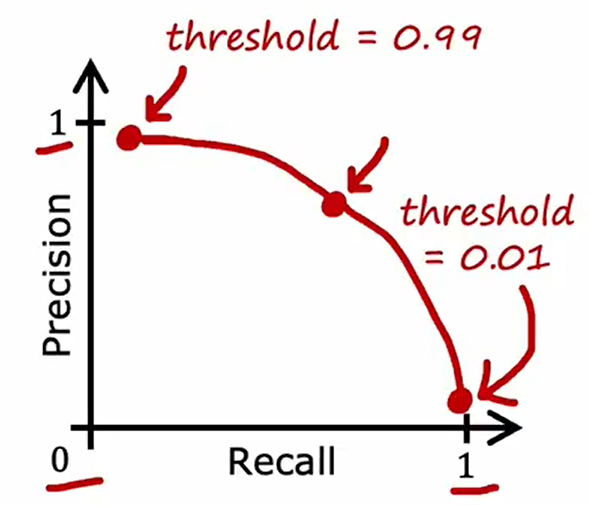

**F1 score**

If you want to automatically trade-off precision and recall rather than have to do so yourself, there is another metric called the **F1 score** that is sometimes used to automatically **combine precision and recall** to help you pick the best value or best trade-off between the two.

$$
\begin{align*}
\frac{1}{\text{F1 Score}} &= \frac{1}{2}\times(\frac{1}{\text{Precision}} + \frac{1}{\text{Recall}}) \\\\
\Longrightarrow \qquad \text{F1 Score} &= 2\times \frac{\text{Precision} \times \text{Recall}}{\text{Precision} + \text{Recall}}
\end{align*}
$$

F1 score 越高，说明算法越好