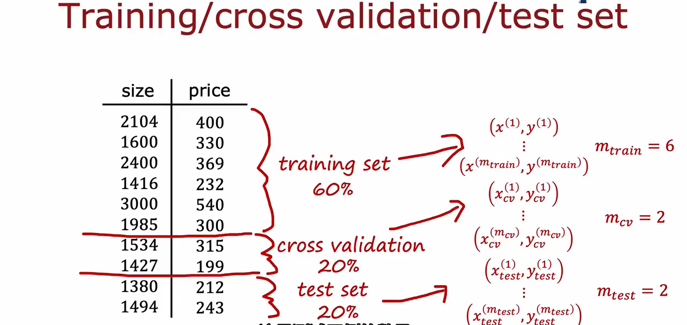

some advice on how to build machine learning systems


## Evaluating and choosing models

### Evaluating a model

将数据划分为两部分：**训练集**(training set)和**测试集**(test set)

一般training set可以取到70%，test set可以取到30%，或者80%-20%的比例。

用 $m_\text{train}$ 表示训练集的样本数量，用 $m_\text{test}$ 表示测试集的样本数量

用 $x^{(i)}$ 表示第$i$个训练集样本（$i = 1, 2, \dots, m_\text{train}$），用 $x_\text{test}^{(i)}$ 表示第$i$个测试集样本（$i = 1, 2, \dots, m_\text{test}$）

1. Train/Test procedure for linear regression (with squared error cost)
- Fit parameters by minimizing cost function $J(\vec{w},b)$
$$
\min_{\vec{w},b} J(\vec{w},b) = \min_{\vec{w},b} [\frac{1}{2m_\text{train}}\sum_{i=1}^{m_\text{train}}(f_{\vec{w},b}(\vec{x}^{(i)}) - y^{(i)})^2 + \frac{\lambda}{2m_\text{train}}\sum_{j=1}^{n}w_j^2]
$$
- Compute test error:
$$J_\text{test}(\vec{w},b) = \frac{1}{2m_\text{test}}\sum_{i=1}^{m_\text{test}}(f_{\vec{w},b}(\vec{x}^{(i)}_\text{test}) - y^{(i)}_\text{test})^2$$
- Compute training error:
$$J_\text{train}(\vec{w},b) = \frac{1}{2m_\text{train}}\sum_{i=1}^{m_\text{train}}(f_{\vec{w},b}(\vec{x}^{(i)}_\text{train}) - y^{(i)}_\text{train})^2$$

对于overfitting的model
- $J_\text{train}(\vec{w},b)$ will be very low
- $J_\text{test}(\vec{w},b)$ will be high

在出现这种情况时，就需要对model进行调整

2. Train/Test procedure for classification problem
- Fit parameters by minimizing cost function $J(\vec{w},b)$, E.g.,
$$
J(\vec{w},b) = -\frac{1}{m}\sum_{i=1}^{m}[y^{(i)} * \log(f_{\vec{w},b}(\vec{x}^{(i)})) + (1 - y^{(i)}) * \log(1 - f_{\vec{w},b}(\vec{x}^{(i)}))] + \frac{\lambda}{2m}\sum_{j=1}^{n}w_j^2
$$
- Compute test error:
$$J_\text{test}(\vec{w},b) = -\frac{1}{m_\text{test}}\sum_{i=1}^{m_\text{test}}[y^{(i)}_\text{test} * \log(f_{\vec{w},b}(\vec{x}^{(i)}_\text{test})) + (1 - y^{(i)}_\text{test}) * \log(1 - f_{\vec{w},b}(\vec{x}^{(i)}_\text{test}))]$$
- Compute training error:
$$J_\text{train}(\vec{w},b) = -\frac{1}{m_\text{train}}\sum_{i=1}^{m_\text{train}}[y^{(i)}_\text{train} * \log(f_{\vec{w},b}(\vec{x}^{(i)}_\text{train})) + (1 - y^{(i)}_\text{train}) * \log(1 - f_{\vec{w},b}(\vec{x}^{(i)}_\text{train}))]$$

评估model好坏的方法与上面一致。

对于classification问题，还有一种评估的方法，就是计算 the fraction of the test set and the fraction of the train set that the algorithm has misclassified.
$$
\hat{y} =
\left
\{
\begin{aligned} 
& 1 & \text{if}\ \ f_{\vec{w},b}(\vec{x}^{(i)}) \geq 0.5 \\ 
& 0 & \text{if}\ \ f_{\vec{w},b}(\vec{x}^{(i)}) < 0.5
\end{aligned} 
\right. 
$$

Then count $\hat{y} \neq y$

$J_\text{test}(\vec{w},b)$ is the fraction of the test set that has been misclassified.

$J_\text{train}(\vec{w},b)$ is the fraction of the training set that has been misclassified.

### Model selection and training / cross validation / test sets

Once parameters $\vec{w}, b$ are fit to the training set, the training error $J_\text{train}(\vec{w},b)$ is likely lower than the actual generalization error.

$J_\text{test}(\vec{w},b)$ is better estimate of how well the model will generalize to new data than $J_\text{train}(\vec{w},b)$.

The problem is that $J_\text{test}(\vec{w},b)$ is likely to be an optimistic estimate of generalization error.


因为测试集也只是整个数据集的一小部分，所以测试集给出的最优解也会产生误差，此时需要采用一个更加合理的方法。

因为选择的model，比如多项式的阶数$d$，和$\vec{w}, b$一样也是一个需要学习的参数，这个参数$d$原本是靠test set找到的，无法再用test set来评估$d$的好坏，所以容易出现overfit。
此时需要引入一个新的子集。

将整个数据集分为三部分：**训练集**(training set)、**交叉验证集**(cross-validation set)、**测试集**(test set)



交叉验证集 是指一个额外的数据集，用于检查不同模型的有效性和真实性。

*交叉验证集有时候也叫做**验证集**(validation set)或者**开发集**(development set or dev set for short)*

- Training error
$$J_\text{train}(\vec{w},b) = \frac{1}{2m_\text{train}}\sum_{i=1}^{m_\text{train}}(f_{\vec{w},b}(\vec{x}^{(i)}) - y^{(i)})^2$$
- Cross validation error
$$J_\text{cv}(\vec{w},b) = \frac{1}{2m_\text{cv}}\sum_{i=1}^{m_\text{cv}}(f_{\vec{w},b}(\vec{x}^{(i)}_\text{cv}) - y^{(i)}_\text{cv})^2$$
- Test error
$$J_\text{test}(\vec{w},b) = \frac{1}{2m_\text{test}}\sum_{i=1}^{m_\text{test}}(f_{\vec{w},b}(\vec{x}^{(i)}_\text{test}) - y^{(i)}_\text{test})^2$$


在有了交叉验证集后，对于不同的模型，首先用训练集得到最优的参数，然后分别带入交叉验证集计算Cost function，比较不同的模型，选择有着最低的交叉验证误差的model。

最后，如果要estimate the generalization error of how well this model will do on new data，即评估这个模型的泛化能力，此时就需要选择测试集进行此操作。

*可以理解为多分出来了一个训练集来训练新的参数，在这里就是和model有关的多项式的阶数$d$*

在选择神经网络的结构时同理，可以用Cross validation set来进行neural network architecture的选择。

总结：先训练集对不同的模型训练出最优参数，然后验证集使用这些参数，挑出有最小的交叉验证误差的模型作为最优的模型，最后测试集用训练集给出的参数具体地评估该模型的泛化能力。
 
*好比三个人参加比赛，训练集就是训练三个人的比赛能力到最优，验证集就是赛前模拟测试决定最佳人选去参加比赛，测试集就是正式参加比赛量化能力值*

## Bias and variance

### Diagnosing bias and variance

high bias 高偏差 -- underfitting:
- $J_\text{train}$ is high
- $J_\text{cv}$ is high
high variance 高方差 -- overfitting:
- $J_\text{train}$ is low
- $J_\text{cv}$ is high
just right:
- $J_\text{train}$ is low
- $J_\text{cv}$ is low


有时也会出现 high bias and high variance 的情况，此时
- $J_\text{train}$ will be high
- $J_\text{cv} \gg J_\text{train}$

### Regularization and bias / variance


Choosing the regularization parameter $\lambda$


### Establishing a baseline level of performance

What is the level of error you can reasonably hope to get to?
- Human level performance 人类的水平
- Competing algorithms performance 其他算法的表现
- Guess based on experience 基于以往经验的估计

有时model的Training error和Cross validation error可能较高，但是这并不能够说明这个model不够好，而是要与baseline level进行比较才能得出


### Learning curves

对于绘制学习曲线，我们会发现，当训练集的样本数量$m_\text{train}$增大时，$J_\text{cv}(\vec{w},b)$会下降，而$J_\text{train}(\vec{w},b)$会上升（*注：这是在拟合模型$f_{\vec{w},b}(\vec{x})$确定的情况下*）

这是因为样本数量小时，容易出现overfitting，$J_\text{train}(\vec{w},b)$此时会很小。


对于 High bias 的情况，此时要做的应该是考虑改进模型


对于 High variance 的情况，此时要做的应该是考虑增大训练集的规模，或者改进模型

### Bias / Variance and neural networks

the bias-variance tradeoff

balance the complexity that is the degree of polynomial

大型的神经网络总是具有低偏差（虽然很有可能过拟合）


这里的限制一般有两个：Bigger network意味着更多的算力以及更长的处理时间；More data有时也没有非常容易获取。

A large neural network will usually do as well or better than a smaller one so long as regularization is chosen appropriately.

神经网络的正则化
$$J(\vec{w},b) = \frac{1}{m}\sum_{i=1}^{m}\mathcal{L}(f(\vec{x}^{(i)}),y^{(i)}) + \frac{\lambda}{2m}\sum_{\text{all weights}\ w}(w^2)$$

- Unregularized MNIST model
```Python
layer_1 = Dense(units=25, activation="relu")
layer_2 = Dense(units=15, activation="relu")
layer_3 = Dense(units=1, activation="sigmoid")
model = Sequential([layer_1, layer_2, layer_3])
```
- Regularized MNIST model
```Python
layer_1 = Dense(units=25, activation="relu", kernel_regularizer=L2(0.01))
layer_2 = Dense(units=15, activation="relu", kernel_regularizer=L2(0.01))
layer_3 = Dense(units=1, activation="sigmoid", kernel_regularizer=L2(0.01))
model = Sequential([layer_1, layer_2, layer_3])
```

其中`kernel_regularizer=L2(0.01)`即为加入正则化，这里设定了正则化参数$\lambda = 0.01$

*注：`L1`表示参数绝对值，`L2`表示参数平方，`L1L2`表示这两种方法都用，这里由公式，显然是采用`L2`*

## Machine learning development process

### Iterative loop of ML development


以构建一个垃圾邮件分类器为例


### Error Analysis

除了bias和variance这两个方面来评估模型，error analysis也是一种有效的评估手段。

将cross-validation set中的misclassified的样本**按照共同的特征进行分类**，如在上述“垃圾邮件分类器”项目中，可以分类为：拼写错误的有多少？邮件地址不正常的有多少？想要窃取密码的有多少？... （这里misclassified可以认为是应当是垃圾邮件系统却没有识别出来），然后先**着手改善那些占大头的部分**（比如选取更多有着钓鱼邮件地址的垃圾邮件，对神经网络进行训练），而分配给占小头的部分较低的优先级（注意一封邮件可以同时具备上述多个特征，可以都计算在内）。

如果交叉验证集较大，misclassified的样本数可能较多，这时可以从中随机挑选出**部分样本**组成一个子集，然后提取它们的共同特征。

总结来说，error analysis做的事就是focusing attention on the more promising things to try.