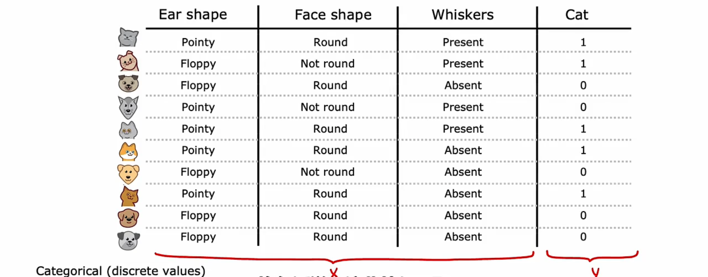
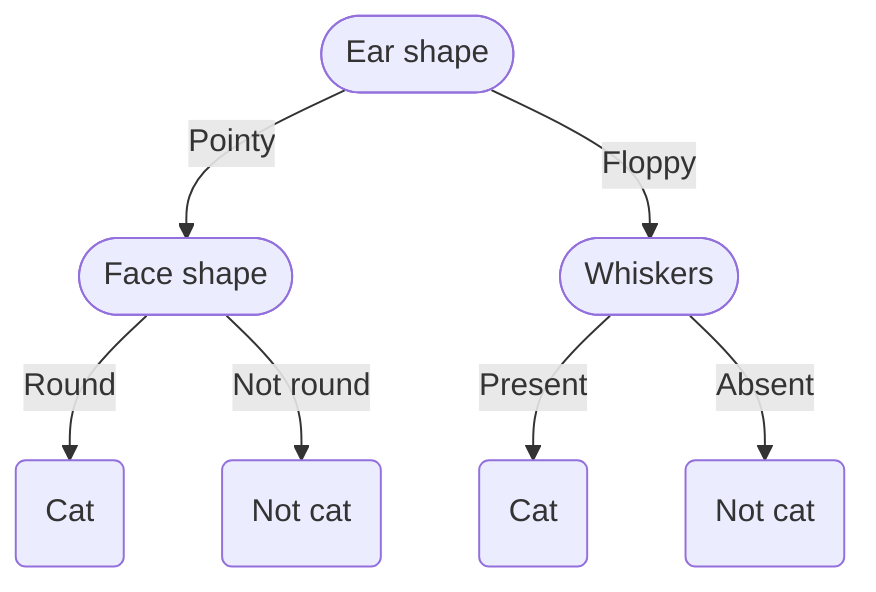
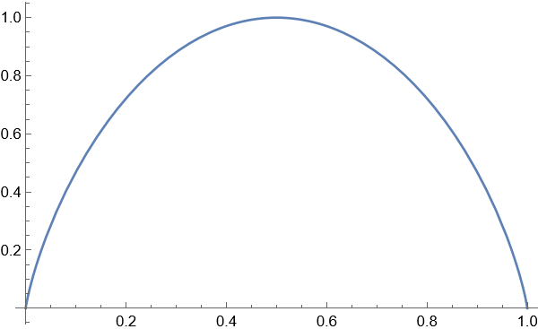
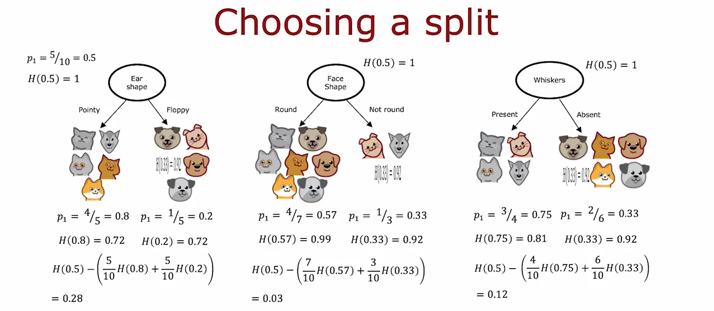

## Decision trees model

以 cat classification 为例（判断一个东西是不是猫）：



特征只取几个离散值（如耳朵形状只有pointy和floppy两类）

从表中可以绘制这个例子的**决策树**(Decision Tree)如下



*上面的所有的椭圆节点称为**决策节点**(Decision nodes)*

## Learning Process

*the overall process of what you need to do to build a decision tree*

1. Decide what feature to use at the root node

For example, the "Ear Shape" in the Cat Classification. 
We split the training examples according to the value of the ear shape feature.

2. Focus just on the left part / left branch of the decision tree to decide what nodes to put over there. In particular, what feature that we want to split on or what feature do we want to use next.

for example, the "Face shape" for the left branch

3. repeat a similar process on the right part / right branch

for example, the "Whiskers" for the right branch


- Decision 1: How to choose what feature to split on at each node?

Maximize purity (or minimize impurity) 即尽量朝着左子树全部是cat而右子树没有cat的目标迈进

- Decision 2: When do you stop splitting?

When a node is 100% one class; 

When splitting a node will result in the tree exceeding a maximum depth (this maximum depth is a parameter that you could say) 
*The reason why we limit the depth of the decision tree is to make sure for us the tree doesn't get too big and unwieldy and make sure the tree is less prone to overfitting.*; 

When improvements in purity score are below a threshold; 

When number of examples in a node is below a threshold.

## Decision tree learning

### Measuring purity -- entropy 熵

纯度

如果这些examples都是猫或者都不是猫，那它是非常pure的，但是如果它介于这两者之间，如何量化它的纯度？—— **entropy 熵**

entropy: 衡量一组数据不纯程度的指标

例如，有一个数据集，其内有三只猫和三只狗。我们用熵来衡量这组数据的purity，过程如下： 
$$p_1 = \text{fraction of examples that are cats} = \frac{3}{6} = 0.5$$

用概率 $p_1$ 来定义熵 $H(p_1)$  
$$H(p_1) = − p_1*\log_2(p_1) − (1 − p_1)*\log_2(1 − p_1)$$

或者也可以定义狗的概率 $p_0 = 1 - p_1$，则熵可以写为 
$$H = − p_1*\log_2(p_1) − p_0*\log_2(p_0)$$



50%:50%时，数据纯度最低，熵为1；而全是猫或者全不是猫时，数据纯度最高，熵为0

### Choosing a split: Information Gain 信息增益

在构建决策树时，我们决定在节点上拆分哪个特征的方式是基于选择该特征能够使得熵最小，即数据纯度最高

Information gain 信息增益：用于描述熵的减小



在分别计算完左右子树的熵时，对其进行加权平均，然后用根节点（未分裂时的节点）的熵减去该加权平均熵，就得到了**信息增益**(information gain)，选择信息增益最大的特征作为分裂节点的方式

计算information gain的方式可以总结如下： 
$$
\begin{align*}
\text{calculate} & \qquad p_1^{\text{left}}, p_1^{\text{right}}\ \ \text{and}\ \ p_1^{\text{root}} \\
\text{calculate} & \qquad w^{\text{left}}, w^{\text{right}}\ \ \text{and}\ \ w^{\text{root}} \ \ \\
& \qquad (w^{\text{left}}, w^{\text{right}}, w^{\text{root}} \ \text{are the number of the 3 nodes})\\
\text{Information gain} &= H(p_1^{\text{root}}) - (w^{\text{left}}*H(p_1^{\text{left}}) + w^{\text{right}}*H(p_1^{\text{right}}))
\end{align*} 
$$

### Putting it together

构建 Decision tree 的完整过程
- Start with all examples at the root node
- Calculate information gain for all possible features, and pick the one with the highest information gain
- Split dataset according to selected feature, and create left and right branches of the tree
- Keep repeating splitting process until stopping criteria is met (recursive splitting 递归) : 
	- When a node is $100\%$ one class
	- When splitting a node will result in the tree exceeding a maximum depth
	- Information gain from additional splits is less than threshold
	- When number of examples in a node is below a threshold

最大深度(maximum depth)的选择有点像拟合更高阶的多项式或者训练更大的神经网络。它让决策树学习更加复杂的模型。但是也会有过拟合的风险。
可以使用如 cross validation 的方法选择最大深度等等参数的值

### One-hot encoding 独热编码

Using one-hot encoding of categorical features

目前的例子中，每个特征只选择两个可能值中的一个。但是特征显然可以有两个以上的离散值供选择，可以使用 one-hot 编码来解决这个问题

在上面的例子中，我们对于有三个离散值的 Ear shape 的特征，选择创建三个新的特征：Pointy ears, Floppy ears, Oval ears。

## Tree ensembles 树集成

### Using multiple decision trees

使用单个决策树的缺点之一是该决策树可能对数据中的微小变化高度敏感，更加robust的方法是构建多个决策树，称之为**树集成**(tree ensemble)

Trees are highly sensitive to small changes of the data.

这些决策树每一个都是分类的一种合理方法，如果有一个想要分类的新测试示例，那么要做的就是在新示例上运行这些决策树并让它们一起投票决定它是否是最终预测。

### Sampling with replacement 有放回抽样

构建多个随机训练集，这些训练集都与我们的原始训练集略有不同（采用有放回抽样的方式，比如猫狗共10只组成的训练集，就用有放回抽样的形式选出10个随机样本组成新的数据集）

### Random forest algorithm 随机森林算法

有放回抽样构建树集成的pseudo-code如下：
```
Given training set of size m
For b from 1 to B:
	Use sampling with replacement to create a new training set of size m
	Train a decision tree on the new dataset
Let the B-num trees vote to decide the classification of the new example
```

*注：构建决策树的数量 `B` 可以选择大约在 100 个左右（建议使用 64 到 228 中的任何一个值）*

这种构建决策树的方式有时也叫做 Bagged decision tree

但是，即使使用这种带有替换过程的采样，有时最终还是会在根节点以及初始的几个节点处使用相同的拆分，而到最后几个叶子节点才会出现略有不同的拆分方式。

所以对算法进行修改，以进一步尝试随机化每一个特征的选择 —— Randomizing the feature choice

At each node, when choosing a feature to use to split, if $n$ features are available, pick a random subset of $k < n$ features and allow the algorithm to only choose from that subset of features.

即：不从所有特征中选择信息增益最高的那个，而是从 $n$ 个特征中随机选择 $k$ 个特征，从这 $k$ 个特征中算法计算出信息增益最高的那个，这样可以使得选择的特征不至于趋同。

当 $n$ 很大时，一个可行的选择是 
$$k = \sqrt{n}$$