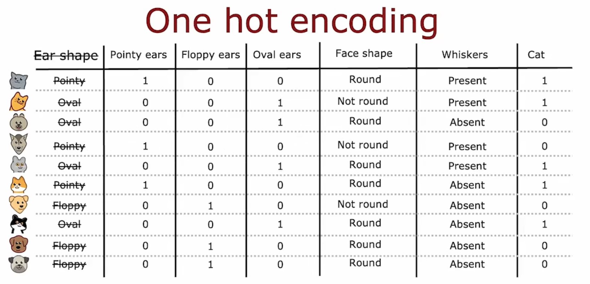
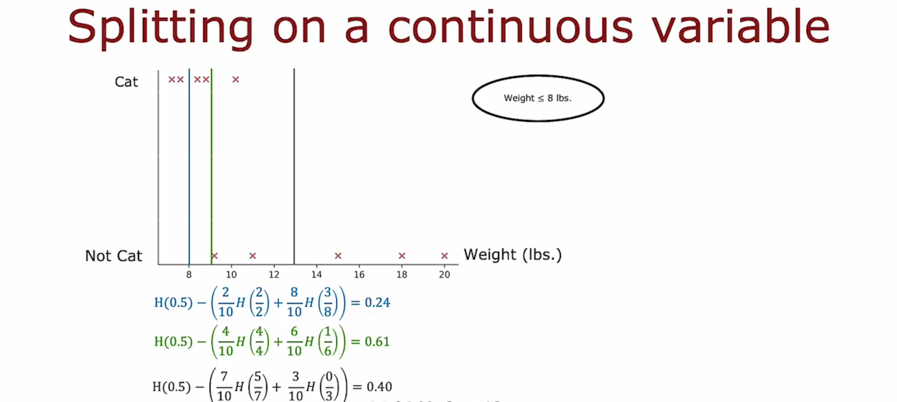
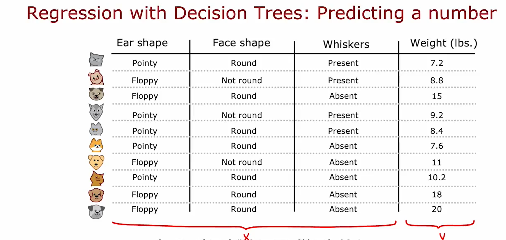
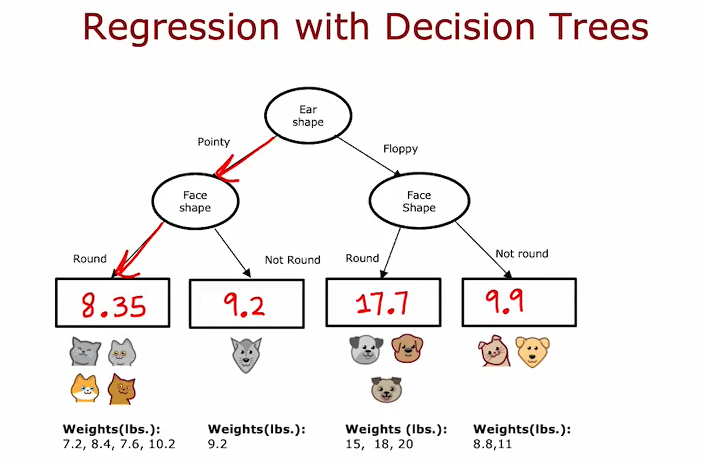
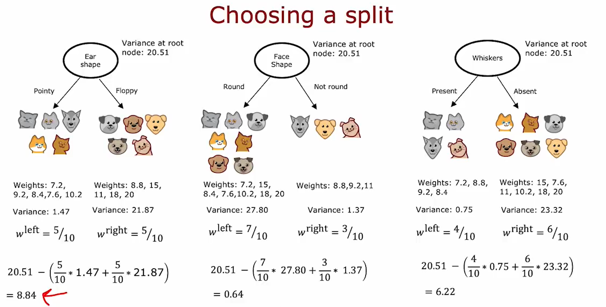

## Decision trees model

以 cat classification 为例（判断一个东西是不是猫）：


特征只取几个离散值（如耳朵形状只有pointy和floppy两类）

从表中可以绘制这个例子的**决策树**(Decision Tree)如下


*上面的所有的椭圆节点称为**决策节点**(Decision nodes)*

## Learning Process

*the overall process of what you need to do to build a decision tree*

1. Decide what feature to use at the root node

For example, the "Ear Shape" in the Cat Classification. 
We split the training examples according to the value of the ear shape feature.

2. Focus just on the left part / left branch of the decision tree to decide what nodes to put over there. In particular, what feature that we want to split on or what feature do we want to use next.

for example, the "Face shape" for the left branch

3. repeat a similar process on the right part / right branch

for example, the "Whiskers" for the right branch


- Decision 1: How to choose what feature to split on at each node?

Maximize purity (or minimize impurity) 即尽量朝着左子树全部是cat而右子树没有cat的目标迈进

- Decision 2: When do you stop splitting?

When a node is 100% one class; 

When splitting a node will result in the tree exceeding a maximum depth (this maximum depth is a parameter that you could say) 
*The reason why we limit the depth of the decision tree is to make sure for us the tree doesn't get too big and unwieldy and make sure the tree is less prone to overfitting.*; 

When improvements in purity score are below a threshold; 

When number of examples in a node is below a threshold.

## Decision tree learning

### Measuring purity -- entropy 熵

纯度

如果这些examples都是猫或者都不是猫，那它是非常pure的，但是如果它介于这两者之间，如何量化它的纯度？—— **entropy 熵**

entropy: 衡量一组数据不纯程度的指标

例如，有一个数据集，其内有三只猫和三只狗。我们用熵来衡量这组数据的purity，过程如下： 
$$p_1 = \text{fraction of examples that are cats} = \frac{3}{6} = 0.5$$

用概率 $p_1$ 来定义熵 $H(p_1)$  
$$H(p_1) = − p_1*\log_2(p_1) − (1 − p_1)*\log_2(1 − p_1)$$

或者也可以定义狗的概率 $p_0 = 1 - p_1$，则熵可以写为 
$$H = − p_1*\log_2(p_1) − p_0*\log_2(p_0)$$


50%:50%时，数据纯度最低，熵为1；而全是猫或者全不是猫时，数据纯度最高，熵为0

### Choosing a split: Information Gain 信息增益

在构建决策树时，我们决定在节点上拆分哪个特征的方式是基于选择该特征能够使得熵最小，即数据纯度最高

Information gain 信息增益：用于描述熵的减小


在分别计算完左右子树的熵时，对其进行加权平均，然后用根节点（未分裂时的节点）的熵减去该加权平均熵，就得到了**信息增益**(information gain)，选择**信息增益最大**的特征作为分裂节点的方式

计算information gain的方式可以总结如下： 
$$
\begin{align*}
\text{calculate} & \qquad p_1^{\text{left}}, p_1^{\text{right}}\ \ \text{and}\ \ p_1^{\text{root}} \\
\text{calculate} & \qquad w^{\text{left}}, w^{\text{right}}\ \ \text{and}\ \ w^{\text{root}} \ \ \\
& \qquad (w^{\text{left}}, w^{\text{right}}, w^{\text{root}} \ \text{are the number of the 3 nodes})\\
\text{Information gain} &= H(p_1^{\text{root}}) - (w^{\text{left}}*H(p_1^{\text{left}}) + w^{\text{right}}*H(p_1^{\text{right}}))
\end{align*} 
$$

### Putting it together

构建 Decision tree 的完整过程
- Start with all examples at the root node
- Calculate information gain for all possible features, and pick the one with the highest information gain
- Split dataset according to selected feature, and create left and right branches of the tree
- Keep repeating splitting process until stopping criteria is met (recursive splitting 递归) : 
	- When a node is $100\%$ one class
	- When splitting a node will result in the tree exceeding a maximum depth
	- Information gain from additional splits is less than threshold
	- When number of examples in a node is below a threshold

最大深度(maximum depth)的选择有点像拟合更高阶的多项式或者训练更大的神经网络。它让决策树学习更加复杂的模型。但是也会有过拟合的风险。
可以使用如 cross validation 的方法选择最大深度等等参数的值

### One-hot encoding 独热编码

Using one-hot encoding of categorical features

目前的例子中，每个特征只选择两个可能值中的一个。但是特征显然可以有两个以上的离散值供选择，可以使用 one-hot 编码来解决这个问题

如果一个特征可以取 $k$ 个可能的值，那我们将通过**创建 $k$ 个只能取值$0$或$1$的二元特征**来取代它。

由于新创建的这组二元特征中只有一个取到1，其余都是0，所以命名为 **one-hot 编码**



*在上面的例子中，我们对于有三个离散值的 Ear shape 的特征，选择创建三个新的特征：Pointy ears, Floppy ears, Oval ears。*

注意，用one-hot编码对分类特征进行编码的想法对于训练神经网络也同样适用，而不只限于训练决策树模型

### Continuous valued features

之前特征的可选值都是离散的值，现在我们来考虑特征的值可以连续取值

例如，在 cat classification 中，加入 weight 特征。

这里，我们**用 $n$ 来分割 weight 特征**（分为 $\text{weight} \leq n$ 和 $\text{weight} > n$ 两类）。
而 $n$ 的取值用 information gain 的方式确定。



可能的 $n$ 的选取值有很多个，一个惯例是对所有值进行排序，对排序后的列表取每两个之间的中间值，组成 $n$ 的可能值列表，最后用 information gain 的方法得到最佳的 $n$ 的值。

### Regression Tree 回归树

之前我们讨论了决策树作为分类算法，现在我们来看决策树在回归算法中的应用。



与之前不同，这里我们用 Ear shape, Face shape, Whiskers 来预测 Weight 特征的值（这是一个连续值，我们要进行数字的预测而非类别的区分。

预测特征值的方法如下：在构建好决策树后，用每一个叶子节点的weights的平均值作为该节点的weight的预测值。



如何构建决策树？我们采用 information gain 的方法来选择拆分哪个节点，不过这里用**方差**(variance)来代替熵 $H(p)$。



$$
\begin{align*}
\text{calculate} & \qquad (\sigma^2)^{\text{left}}, (\sigma^2)^{\text{right}}\ \ \text{and}\ \ (\sigma^2)^{\text{root}} \\
\text{calculate} & \qquad w^{\text{left}}, w^{\text{right}}\ \ \text{and}\ \ w^{\text{root}} \ \ \\
& \qquad (w^{\text{left}}, w^{\text{right}}, w^{\text{root}} \ \text{are the number of the 3 nodes})\\
\text{Information gain} &= (\sigma^2)^{\text{root}} - (w^{\text{left}}*(\sigma^2)^{\text{left}} + w^{\text{right}}*(\sigma^2)^{\text{right}})
\end{align*} 
$$

## Tree ensembles 树集成

### Using multiple decision trees

使用单个决策树的缺点之一是该决策树可能对数据中的微小变化高度敏感，更加robust的方法是构建多个决策树，称之为**树集成**(tree ensemble)

Trees are highly sensitive to small changes of the data.

这些决策树每一个都是分类的一种合理方法，如果有一个想要分类的新测试示例，那么要做的就是在新示例上运行这些决策树并**让它们一起投票决定它是否是最终预测**。

### Sampling with replacement 有放回抽样

构建多个随机训练集，这些训练集都与我们的原始训练集略有不同（采用有放回抽样的方式，比如猫狗共10只组成的训练集，就用有放回抽样的形式选出10个随机样本组成新的数据集）

### Random forest algorithm 随机森林算法

有放回抽样构建树集成的pseudo-code如下：
```
Given training set of size m
For b from 1 to B:
	Use sampling with replacement to create a new training set of size m
	Train a decision tree on the new dataset
Let the B-num trees vote to decide the classification of the new example
```

*注：构建决策树的数量 `B` 可以选择大约在 100 个左右（建议使用 64 到 228 中的任何一个值）*

这种构建决策树的方式有时也叫做 Bagged decision tree

但是，即使使用这种带有替换过程的采样，有时最终还是会在根节点以及初始的几个节点处使用相同的拆分，而到最后几个叶子节点才会出现略有不同的拆分方式。

所以对算法进行修改，以进一步尝试随机化每一个特征的选择 —— Randomizing the feature choice

At each node, when choosing a feature to use to split, if $n$ features are available, pick a random subset of $k < n$ features and allow the algorithm to only choose from that subset of features.

即：不从所有特征中选择信息增益最高的那个，而是**从 $n$ 个特征中随机选择 $k$ 个特征**，从这 $k$ 个特征中算法计算出信息增益最高的那个，这样可以使得选择的特征不至于趋同。

当 $n$ 很大时，一个可行的选择是 
$$k = \sqrt{n}$$

### XGBoost 极致梯度提升

在随机选择（有放回抽样）构成新的训练集时，对于之前预测错误的样本，进行更高概率的采样，即在新构建的训练集中尽可能地包含较多的之前预测错误的数据样本，然后进行训练，可以更加有效地训练决策树。

术语中叫做 **刻意练习**(Deliberate practice)

引入 Deliberate practice 后的修改伪代码如下

```
Given training set of size m
For b from 1 to B:
	Use sampling with replacement to create a new training set of size m
		But instead of picking examples with equal (1/m) probability, make it more likely to pick examples that the previously trained trees misclassify
	Train a decision tree on the new dataset
Let the B-num trees vote to decide the classification of the new example
```

对于错误样本的选择，提高多少概率是一个复杂的数学问题，一个有效的方法是 **XGBoost** (eXtreme Gradient Boosting 极致梯度提升)
- Open source implementation of boosted trees
- Fast efficient implementation
- Good choice of default splitting criteria and criteria for when to stop splitting
- Built in regularization to prevent overfitting
- Highly competitive algorithm for machine learning competitions (eg: Kaggle competitions)\

使用 XGBoost

- Classification
```Python
from xgboost import XGBClassifier

model = XGBClassifier()

model.fit(X_train, y_train)
y_pred = model.predict(X_test)
```

- Regression
```Python
from xgboost import XGBRegressor

model = XGBRegressor()

model.fit(X_train, y_train)
y_pred = model.predict(X_test)
```

## When to use decision trees

Decision Trees vs Neural Networks

1. Decision Trees and Tree ensembles
- Works well on tabular (structured) data 对于表格化数据很好用
- Not recommended for unstructured data (images, audio, text) 对于图片、音视频、文本类数据不好用
- Very fast to train
- Small decision trees may be human interpretable

2. Neural Networks
- Works well on all types of data, including tabular (structured) and unstructured data
- May be slower than a decision tree
- Works with transfer learning
- When building a system of multiple models working together, it might be easier to string together multiple neural networks than multiple decision trees
