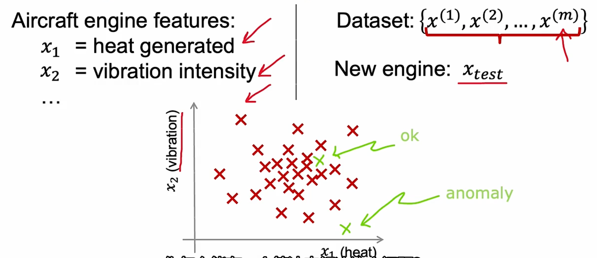
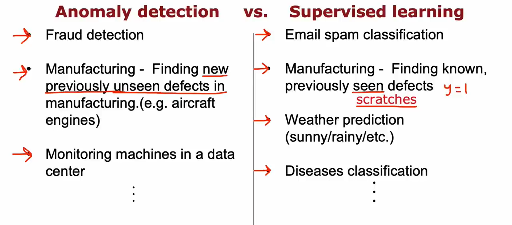
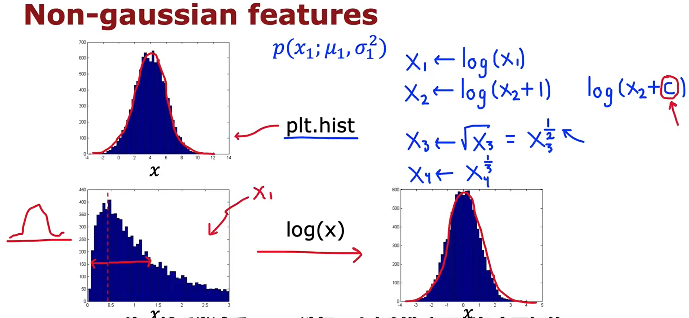
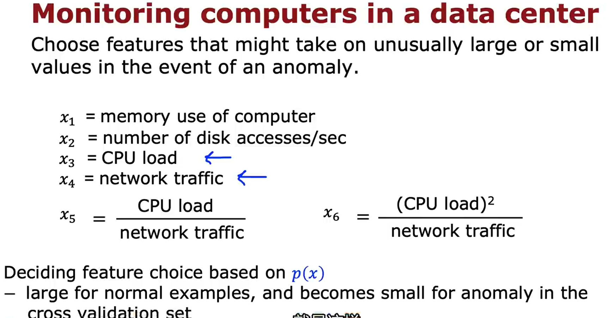

- Unsupervised Learning
	- Clustering 聚类算法
	- Anomaly detection 异常检测

## Clustering 聚类算法

在 supervised learning 中，我们有一个包含 input features $x$ 和 the labels $y$ 的数据集； 
然而，在 unsupervised learning 中，我们得到的数据集只有 $x$ ，而没有目标标签 $y$ 。

Clustering means looking at the dataset $\{x^{(1)}, x^{(2)}, x^{(3)}, \cdots, x^{(m)}\}$ and trying to see if it can be grouped into clusters. 

Clustering 算法的相关应用
- Grouping similar news
- Market segmentation
- DNA analysis
- Astronomical analysis

### K-means K-均值算法

直观理解 K-means 做了什么（以数据集中有两个cluster为例）
1. 随机猜测两个簇的中心（又称为簇质心，cluster centroids）分别在哪里 
2. 猜测完质心的坐标后，遍历所有的样本数据点，检测每一个样本数据点更加接近哪个质心并进行标记
3. 将样本数据点分配给距离它最近的质心，最终形成两个簇
4. 分别查看两个簇中所有的数据点并对它们分别取均值操作，得到两个坐标，这就是两个簇的新的质心位置，将原来的簇质心移动到新的位置
5. 重复步骤 2-4，不断更新数据点的标记（也即更新簇），并不断调整簇质心的位置，直至簇和质心不再变化。

伪代码如下：
```
Randomly initialize K cluster centroids mu_1, mu_2, ... , mu_K
Repeat{
	# Assign points to cluster centroids
	for i = 1 to m: # m as the number of examples
		c_i := index (from 1 to K) of cluster centroid closest to x_i # x_i as the i_th example
	# Move cluster centroids
	for k = 1 to K:
		mu_k := average (mean) of points assigned to cluster k
}
```

如果在某一轮分给一个簇质心的点的个数为0，一个通常的做法是消除这个簇，将簇的总数从 $k$ 个减少为 $k-1$ 个。

#### K-means optimization objective

The K-means algorithm is also optimizing a special cost function.

- $c^{(i)}$ $=$ index of cluster ($1, 2, \cdots, K$) to which example $x^{(i)}$ is currently assigned 
- $\mu_k$ $=$ cluster centroid $k$

Combine two of these:
- $\mu_{c^{(i)}}$ $=$ cluster centroid of cluster to which example $x^{(i)}$ has been assigned 
$$
\begin{gather}
&& &x^{(i)} &\longrightarrow &c^{(i)} &\longrightarrow &\mu_{c^{(i)}} &&\\
&& &\text{example} &\longrightarrow &\text{cluster} &\longrightarrow &\text{cluster centroid} && \\
\end{gather}
$$

Cost function of K-means algorithm
$$
J(c^{(1)}, c^{(2)}, \cdots, c^{(m)}; \mu_1, \mu_2, \cdots, \mu_K) = \frac{1}{m}\sum_{i=1}^{m}||x^{(i)} - \mu_{c^{(i)}}||^2
$$ 
即每个数据点到其簇质心的平均距离。

K-means 算法的本质就是在寻找 $\mathop{\rm{min}}\limits_{c^{(1)}, c^{(2)}, \cdots, c^{(m)};\atop \mu_1, \mu_2, \cdots, \mu_K} J(c^{(1)}, c^{(2)}, \cdots, c^{(m)}; \mu_1, \mu_2, \cdots, \mu_K)$

Cost function $J(c^{(1)}, c^{(2)}, \cdots, c^{(m)}; \mu_1, \mu_2, \cdots, \mu_K)$ 有时也叫做**失真函数**(Distortion function)。

Cost function 是否处于下降是检验K-means算法是否收敛的一个好方法。

#### Initializing K-means

在初始时，如何猜测簇质心的位置十分重要，它决定了算法的计算时间和收敛速度。

- Choose $K < m$ 这样才能形成簇
- Randomly pick $K$ training examples
- Set $\mu_1, \mu_2, \cdots, \mu_K$ equal to these $K$ examples 即将$K$个随机选出的样本点作为初始化的簇质心

有时$K$个簇质心的初始化选择可能导致K-means算法收敛到局部最小值，而无法得到最终的结果。
这时一个解决办法就是多次初始化簇的质心并运行K-means算法，比较得出是否找到全局最小值还是仍然找的是局部最小值。

伪代码如下：
```
# Random Initialization

For i = 1 to T # T as number of times you want K-means algorithm to run; T = 50 ~ 1000
{
	Randomly initialize K-means.
	Run K-means. Get c_1, c_2, ... , c_m; mu_1, mu_2, ... , mu_K
	Compute cost function (distortion) J
}
Pick set of clusters that gave lowest cost J
```

#### Choosing the number of Clusters

**Elbow method**: 
选取不同的 $k$ 的值（即不同的cluster的数量），绘制 Cost function 关于 $k$ 的函数。一般来说随着选取的 cluster 的数量的增多，Cost function 会下降，选取下降速率开始明显变缓的点作为我们要的 $k$ 的值（形象地认为这类似“肘部”的形状，故称为 ellbow method）

Evaluate K-means based on a metric for how well it performs for that later purpose.

## Anomaly Detection 异常检测算法

异常检测算法查看未标记的正常事件数据集，从而学会检测或发出危险信号如果有异常事件。
### Preparation
#### Finding unusual events -- Density estimation 密度估计

例如：检测新的飞机引擎是否正常，通过之前 $m$ 架飞机的引擎的参数 $\{x_1, x_2\}$ 进行判断



**Density estimation** 密度估计 （在 Fraud Detection 中频繁使用）：
1. $x^{(i)} =$ Features of user $i$'s activities
2. Build Model $p(x)$ from data
3. Identify unusual users by checking which have $p(x) < \varepsilon$

*即根据已有数据建立一个模型评估好事件的概率，当置信度过低时认为是异常事件并抛出预警*

该检测通常用于金融分析假账户欺诈交易、网站判定是否是机器人的CAPTCHA等等

#### Gaussian (Normal) Distribution 高斯分布

均值 $\mu$ ；方差 $\sigma^2$ （或者说 $\sigma$ 为标准差） 
$$p(x) = \frac{1}{\sqrt{2\pi}\sigma}e^{{-\frac{(x-\mu)^2}{2\sigma^2}}}$$

给定一个数据集 $\{x^{(1)}, x^{(2)}, \cdots , x^{(m)}\}$ ，则计算 $\mu$ 和 $\sigma^2$ 如下： 
$$
\begin{align*}
\mu &= \frac{1}{m}\sum_{i=1}^{m} x^{(i)} \\
\sigma^2 &= \frac{1}{m}\sum_{i=1}^{m} (x^{(i)} - \mu)^2
\end{align*}
$$

### Anomaly Detection Algorithm

考虑一个训练集 $\{x^{(1)}, x^{(2)}, \cdots , x^{(m)}\}$ ，其中每个 $x^{(i)}$ 有 $n$ 个特征。

建立概率模型 $p(\vec{x})$ ，其中 $\vec{x}$ 为 $n$ 维向量： $\vec{x} = [x_1, x_2, \cdots, x_n]^T$ ，
认为这 $n$ 个分量统计上互相独立 $p(\vec{x}) = p(x_1) \times p(x_2) \times \cdots \times p(x_n)$ 。

对于每一个 $p(x_i)$ ，用 Gaussian Distribution 去估计它 $p(x_i) = p(x_i; \mu_i, \sigma^2_i)$ 

则算法的最终步骤如下：
1. Choose $n$ features $x_i$ that you think might be indicative of anomalous examples.
2. Fit parameters $\mu_1, \mu_2, \cdots , \mu_n ; \sigma^2_1, \sigma^2_2, \cdots, \sigma^2_n$ 
$$\begin{align*}
\mu_j &= \frac{1}{m}\sum_{i=1}^{m} x^{(i)}_j \\
\sigma^2_j &= \frac{1}{m}\sum_{i=1}^{m} (x^{(i)}_j - \mu_j)^2
\end{align*}$$ 
3. Given a new example $x$, compute $p(x)$: 
$$
p(x) = \prod_{j=1}^{n} p(x_j; \mu_j, \sigma^2_j) = \prod_{j=1}^{n}\frac{1}{\sqrt{2\pi}\sigma_j}\exp\left(-\frac{(x_j - \mu_j)^2}{2\sigma^2_j}\right)
$$

4. Anomaly if $p(x) < \varepsilon$

### Developing and evaluating an anomaly detection system

Assume $y=0$ if normal, $y=1$ if anomalous

Training set: $\{x^{(1)}, x^{(2)}, \cdots , x^{(m)}\}$ (assume normal examples / not anomalous, namely $y^{(i)} = 0, i=1,2 \cdots m$) 全部好的数据，当然不小心涵盖一两个异常数据也没有关系

评估 Anomaly Detection 系统： 

创建 Cross validation set: $(x_{cv}^{(1)}, y_{cv}^{(1)}), (x_{cv}^{(2)}, y_{cv}^{(2)}), \cdots, (x_{cv}^{(m_{cv})}, y_{cv}^{(m_{cv})})$ 
创建 Test set: $(x_{test}^{(1)}, y_{test}^{(1)}), (x_{test}^{(2)}, y_{test}^{(2)}), \cdots, (x_{test}^{(m_{test})}, y_{test}^{(m_{test})})$ 
注意交叉验证集和测试集中需要包含一些 anomalous examples，一般来说异常数据要比正常数据的数量小得多

在交叉验证集上调整参数 $\varepsilon$ ，使得算法更加可靠，然后再在测试集上测试

或者，也可以不使用测试集，全部合并到交叉验证集中完成验证和测试的任务

### Anomaly detection vs. supervised learning

在之前的异常检测中，我们可以认为 training set 实际上有输出标签 $y=0$，加上验证集和测试集中带有的标签，似乎可以认为这是一个带输出的 supervised learning 的问题。那为什么还需要用 unsupervised learning 的 anomaly detection呢？现在来讨论什么时候用异常检测，什么时候用监督学习。

适用 Anomaly Detection ：
1. 很少 positive examples ($y=1$) 和大量 negative examples ($y=0$) 
2. Many different "types" of anomalies. Hard for any algorithm to learn from positive examples what the anomalies look like; future anomalies may look nothing like any of the anomalous examples we have seen so far. 算法无法预测未来的异常值应该什么样
适用 Supervised Learning ：
1. positive examples 和 negative examples 的数目都很多
2. Enough positive examples for algorithms to get a sense of what positive examples are like, future positive examples likely to be similar to ones in training set. 算法可以预测未来的异常值应该什么样

Examples:


*Anomaly detection tries to find brand new positive examples that may be unlike anything you have seen before. Whereas supervised learning looks at your positive examples and tries to decide if a future example is similar to the positive examples that you've already seen.*

### Choosing what features to use

仔细选择特征对于异常检测比对于监督学习来说更加重要

1. Non-gaussian features 
一个方法是保证选择的特征的数据是Gauss分布的，对于 Non-gaussian features ，可以更改它使其更加符合 Gaussian Distribution ，比如对于特征 $x_i$ ，构造 $\log(x_i + C)$ 、 $\sqrt{x_i}$ 等等



2. Error analysis for anomaly detection 
在异常检测中，我们想要 $p(x) \geq \varepsilon$ large for normal examples $x$ 以及 $p(x) < \varepsilon$ small for anomalous examples $x$ 。但是我们常常遇到的情况是 p(x) is comparable (say, both large) for normal and anomalous examples。此时可以进行的方法是新增一个特征 $x_{n+1}$ ，在这个特征下 $p(x_{n+1}^{(i)})$ 很小导致 $p(x^{(i)})$ 很小，使得算法能够分辨出这个异常值。这个特征可以是新发现的一个角度，也可以是从之前的特征组合起来发现可以用于异常检测的新特征。

Example: Monitoring computers in a date center 


