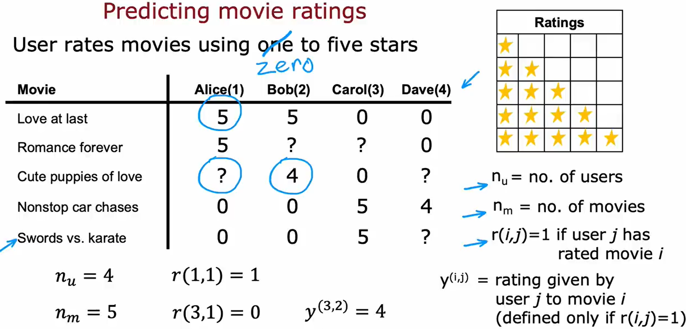
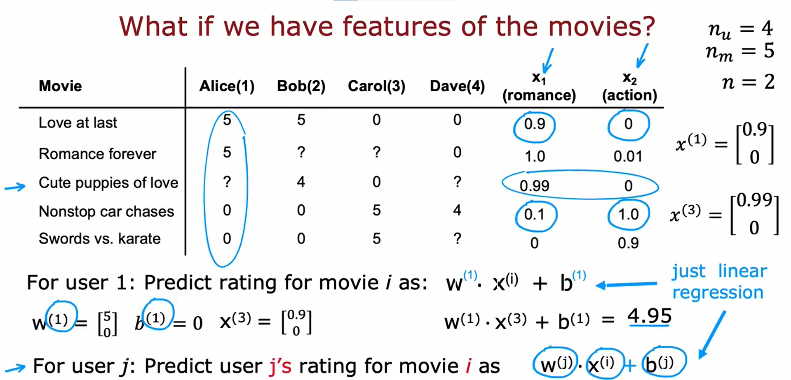
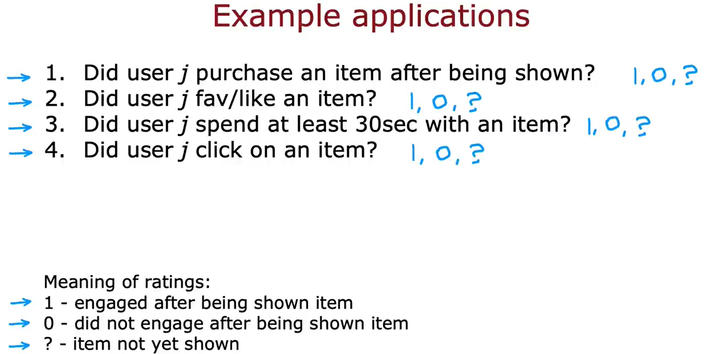
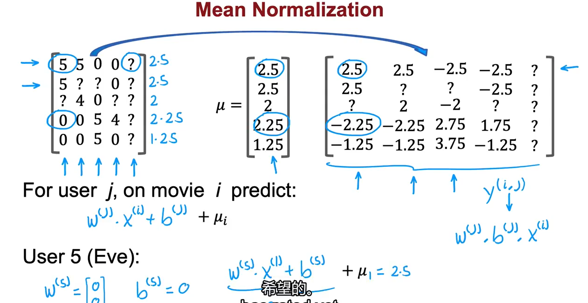
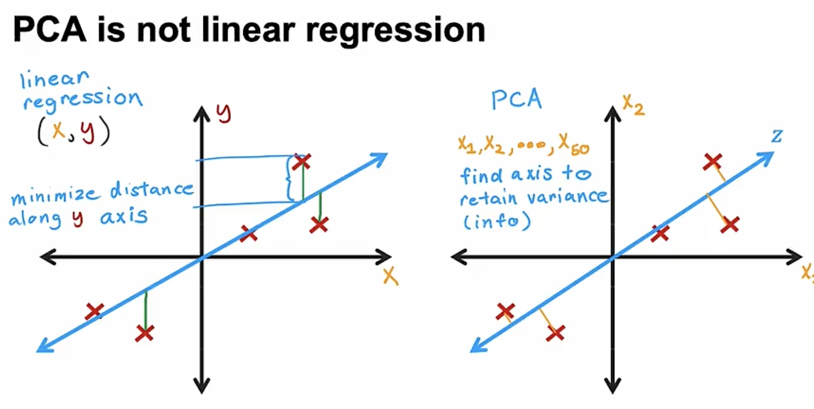

推荐系统 Recommender systems 用于搜索引擎、网站推荐算法、购物平台、社交平台等等。

例如：predicting movie ratings


### Collaborative filtering 协同过滤

#### Use per-item features

如果我们拥有每个 item 的特征，我们如何开发一个 recommender system？（例如，对于前面的 predicting movie ratings 的例子，假设我们已经知道每部电影的标签，比如 Love at last 有 90% 与 romance 相关，而与 action 完全不相关）


可以使用一个 Linear Regression Model。 
下面给这个 Linear Regression 模型制定 Cost function ：
Notation:
- $r(i, j) = 1$ if user $j$ has rated movie $i$ ($0$ otherwise）
- $y^{(i,j)} =$ rating given by user $j$ on movie $i$ (if defined)
- $\vec{w}^{(j)}$, $b^{(j)} =$ parameters for user $j$
- $x^{(i)} =$ feature vector for movie $i$
- $m^{(j)} =$ number of movies rated by user $j$ 
For user $j$ and movie $i$, predicting rating: $f_j(x^{(i)}) = \vec{w}^{(j)} \cdot x^{(i)} + b^{(j)}$
To learn $\vec{w}^{(j)}$, $b^{(j)}$

对于 user $j$ ，Cost function 如下： 
$$
J_j(\vec{w}^{(j)}, b^{(j)}) = \frac{1}{2m^{(j)}}\sum_{i:r(i,j)=1}\left(\vec{w}^{(j)}\cdot x^{(i)} + b^{(j)} - y^{(i,j)}\right)^2 + \frac{\lambda}{2m^{(j)}}\sum_{k=1}^{n}\left(w_k^{(j)}\right)^2
$$

其中第二项为防止过拟合的正则化参数， $n$ 是 number of features。 这里分母上的 $m^{(j)}$ 对于求极小值不影响，可以忽略。
对 Cost function 求最小值 $\min\limits_{\vec{w}^{(j)}, b^{(j)}}J_j(\vec{w}^{(j)}, b^{(j)})$ ，得到参数 $\vec{w}^{(j)}, b^{(j)}$ 在该模型中的最优解。

对于所有用户（一共 $n_u$ 个），要求得最优参数 $\{\vec{w}^{(1)}, b^{(1)}; \vec{w}^{(2)}, b^{(2)}; \cdots ; \vec{w}^{(n_u)}, b^{(n_u)}\}$ ，其中 $w = \{\vec{w}^{(1)}, \vec{w}^{(2)}, \cdots , \vec{w}^{(n_u)}\}$ ， $b = \{b^{(1)}, b^{(2)}, \cdots , b^{(n_u)}\}$： 
$$
\begin{align*}
J(w, b) &= \sum_{j=1}^{n_u} J_j(\vec{w}^{(j)}, b^{(j)}) \\ 
&= \frac{1}{2}\sum_{j=1}^{n_u}\sum_{i:r(i,j)=1}\left(\vec{w}^{(j)}\cdot x^{(i)} + b^{(j)} - y^{(i,j)}\right)^2 + \frac{\lambda}{2}\sum_{j=1}^{n_u}\sum_{k=1}^{n}\left(w_k^{(j)}\right)^2
\end{align*}
$$

#### Collaborative filtering algorithm

下面我们来看如果事先不知道 items 的特征，如何用**协同过滤算法**从数据中学习或得出这些特征 $\{x_1, x_2, \cdots , x_n\}$ 进行构建 Recommender System （假设我们此时知道偏好参数 $\{\vec{w}^{(1)}, b^{(1)}; \vec{w}^{(2)}, b^{(2)}; \cdots ; \vec{w}^{(n_u)}, b^{(n_u)}\}$ ）。

*与之前不同的是，之前是知道特征训练偏好参数，现在是知道偏好参数训练特征*

在典型的 Linear Regression 应用中，对一个 item 只会有一个数据，而在 Collaborative filtering 中，每一个 item （例如这里的 movie）对应多个数据（这里为多个用户对 movie 的评分），这就是可以尝试猜测这些 features 的原因。

Cost function: 
Given $\vec{w}^{(1)}, b^{(1)}; \vec{w}^{(2)}, b^{(2)}; \cdots \vec{w}^{(n_u)}, b^{(n_u)}$ 
To learn $x^{(i)}$ : 
$$
J_i(x^{(i)}) = \frac{1}{2}\sum_{j:r(i,j)=1}\left(\vec{w}^{(j)}\cdot x^{(i)} + b^{(j)} - y^{(i,j)}\right)^2 + \frac{\lambda}{2}\sum_{k=1}^{n}\left(x_k^{(i)}\right)^2
$$ 
To learn all the features $x^{(1)}, x^{(2)}, \cdots , x^{(n_m)}$ : 
$$
\begin{align*}
J(x^{(1)}, \cdots , x^{(n_m)}) &= \sum_{i=1}^{n_m}J_i(x^{(i)}) \\
& = \frac{1}{2}\sum_{i=1}^{n_m}\sum_{j:r(i,j)=1}\left(\vec{w}^{(j)}\cdot x^{(i)} + b^{(j)} - y^{(i,j)}\right)^2 + \frac{\lambda}{2}\sum_{i=1}^{n_m}\sum_{k=1}^{n}\left(x_k^{(i)}\right)^2
\end{align*}
$$ 
但是，现在是假设已知训练好的偏好参数，但我们实际上没有掌握这些参数，需要在前一小节中通过 Cost function 计算才能得到。 
下面我们来看 Collaborative filtering 如何协同工作的。

现在我们知道了两种情况下的 Cost function ： 
Cost function to learn $\vec{w}^{(1)}, b^{(1)}; \vec{w}^{(2)}, b^{(2)}; \cdots \vec{w}^{(n_u)}, b^{(n_u)}$ : 
$$
J(w, b) = \frac{1}{2}\sum_{j=1}^{n_u}\sum_{i:r(i,j)=1}\left(\vec{w}^{(j)}\cdot x^{(i)} + b^{(j)} - y^{(i,j)}\right)^2 + \frac{\lambda}{2}\sum_{j=1}^{n_u}\sum_{k=1}^{n}\left(w_k^{(j)}\right)^2
$$

Cost function to learn $x^{(1)}, x^{(2)}, \cdots , x^{(n_m)}$ : 
$$
J(x^{(1)}, \cdots , x^{(n_m)}) = \frac{1}{2}\sum_{i=1}^{n_m}\sum_{j:r(i,j)=1}\left(\vec{w}^{(j)}\cdot x^{(i)} + b^{(j)} - y^{(i,j)}\right)^2 + \frac{\lambda}{2}\sum_{i=1}^{n_m}\sum_{k=1}^{n}\left(x_k^{(i)}\right)^2
$$

两个 Cost function 的第一项只是求和顺序不同，但是会给出相同的结果。所以我们将两个 Cost function 放在一起，构造一个新的 Cost function $J(w,b;x)$ ：
$$
\frac{1}{2}\sum_{(i,j):r(i,j)=1}\left(\vec{w}^{(j)}\cdot x^{(i)} + b^{(j)} - y^{(i,j)}\right)^2 + \frac{\lambda}{2}\sum_{j=1}^{n_u}\sum_{k=1}^{n}\left(w_k^{(j)}\right)^2 + \frac{\lambda}{2}\sum_{i=1}^{n_m}\sum_{k=1}^{n}\left(x_k^{(i)}\right)^2
$$

通过最小化 Cost function $\min\limits_{w^{(1)}, \cdots, w^{(n_u)}; b^{(1)}, \cdots, b^{(n_u)} \atop x^{(1)}, \cdots, x^{(n_m)}} J(w,b;x)$ 取得最优的偏好参数 $w, b$ 和特征 $x$ 。

使用 Gradient Descent 进行最小化过程。
$$
\begin{align*}
w_i^{(j)} &\leftarrow w_i^{(j)}-\alpha*\frac{\partial}{\partial w_i^{(j)}}J(w,b;x) \\
b^{(j)} &\leftarrow b^{(j)}-\alpha*\frac{\partial}{\partial b^{(j)}}J(w,b;x) \\ 
x^{(j)}_k &\leftarrow x^{(j)}_k-\alpha*\frac{\partial}{\partial x^{(j)}_k}J(w,b;x)
\end{align*}
$$

#### Binary labels 二元标签

Recommender system 或 Collaborative filtering 通常给的选项不是 1~5 评级或推荐度，它们通常会给出是否推荐、是否喜欢给用户选择，这称为**二进制标签** (Binary labels)。

对于二元分类，我们不用 Linear Regression，而会使用 Logistic Regression。

二值标签有以下例子：


Previously: Predict $y^{(i,j)}$ as $w^{(j)} \cdot x^{(i)} + b^{(j)}$ 
For binary labels: Predict that the probability of $y^{(i,j)} = 1$ is given by 
$$f_j(x^{(i)}) = g(w^{(j)} \cdot x^{(i)} + b^{(j)}) = \frac{1}{1 + e^{-\left(w^{(j)} \cdot x^{(i)} + b^{(j)}\right)}}$$

Loss for Binary labels $y^{(i,j)}$ ：
$$
\mathcal{L}(f_j(x^{(i)}), y^{(i,j)}) = -y^{(i,j)}*\log\left(f_j(x^{(i)})\right) - \left(1 - y^{(i,j)}\right) * \log\left(1 - f_j(x^{(i)})\right)
$$

Cost function: 
$$
J(w,b;x) = \sum_{(i,j):r(i,j)=1}\mathcal{L}(f_j(x^{(i)}), y^{(i,j)})
$$

#### Mean normalization 均值归一化

将已评分的数据作为矩阵，每行做平均提取出每个电影目前的平均分作为均值，形成均值向量 $\mu$ ，然后将所有的分数做均值化处理（即减去均值）再做预测，预测出的 $y^{(i,j)}$ 再加上均值 $\mu_i$ 即可



#### TensorFlow implementation for Collaborative filtering 

```Python
w = tf.Variable(initial_set)
``` 

`tf.Variable()` 告诉 TensorFlow `w` 是一个我们想要优化的参数，并且设置它的初始值为 `initial_set`

TensorFlow 可以自动进行梯度下降，这被称为 "Auto Diff" 或者 "Auto Grad"

```Python
for iter in range(iteration):
	# Use Tensorflow's Gradient type to record the steps
	# used to compute the cost J, to enable auto differentiation
	with tf.GradientTape() as tape:
		fwb = w * x
		costJ = (fwb - y) ** 2

	# Use the gradient tape to calculate the gradients
	# of the cost with respect to the parameter w
	[dJdw] = tape.gradient(costJ, [w])

	# Run one step of gradient descent by updating 
	# the value of w to reduce the cost
	w.assign_add(-alpha * dJdw) # tf.variables require special function to modify
```

Adam Optimization algorithm 实现 Collaborative filtering:

```Python
# Instantiate an optimizer.
optimizer = keras.optimizers.Adam(learing_rate=1e-1)

iterations = 2000
for iter in range(iterations):
	# Use Tensorflow's GradientTape
	# to record the operations used to compute the cost
	with tf.GradientTape() as tape:
		# Compute the cost (forward pass is included in cost)
		cost_value = cofiCostFuncV(X, W, b, Ynorm, R, num_users, num_movies, lambda) # function to compute the cost which we need to implement ourselves

	# Use the gradient tape to automatically retrieve 
	# the gradients of the trainanle variables 
	# with respect to the loss
	grads = tape.gradient(cost_value, [X, W, b])

	# Run one step of gradient descent by updating 
	# the value of variables to minimize the loss.
	optimizer.apply_gradients(zip(grads, [X, W, b]))
```

#### Finding related items

The features $x^{(i)}$ of item $i$ are quite hard to interpret. 
To find other items related to it, find item $k$ with $x^{(k)}$ similar to $x^{(i)}$ 
i.e. with smallest distance $\sum\limits_{l=1}^{n}\left(x^{(k)}_l - x^{(i)}_l\right)^2$ 认为 $\{x_1, x_2, \cdots , x_n\}$ 特征空间中两个点距离越近越相似

Collaborative filtering 的限制
1. Cold start problem. How to
- rank new items that few users have rated?
- show something reasonable to new users who have rated few items?
2. Use side information about items or users:
- Item: Genre, movie stars, studio, ...
- User: Demographics (age, gender, location), expressed preferences, ...

### Content-based filtering 基于内容过滤

#### Collaborative filtering v.s. Content-based filtering

- Collaborative filtering 协同过滤：
根据 rating of users who gave similar ratings as you 给你推荐特定的 items
- Content-based filtering 基于内容过滤：
根据 features of user 和 features of items 的特征找到好的匹配项，并将符合的 item 推荐给你

#### Deep learning for content-based filtering 

之前说是否将某一个 item 推荐给某一个 user 是通过对两者的特征计算它们匹配的程度。那么如何 learn to match: 
假设要推荐电影给你。对于 user $j$ 有 feature 向量 $x_u^{(j)}$ ，向量中的每一个分量代表对 user 分析出的一个特征的值。同样的，对于 movie $i$ 有 feature 向量 $x_m^{(i)}$ 。*注意 $x_u^{(j)}$ 和 $x_m^{(i)}$ 的长度可以完全不同，两者完全无关。*

Predicting rating of user $j$ on movie $i$ as 
$$v_u^{(j)} \cdot v_m^{(i)}$$

其中可以认为 $v_u^{(j)}$ 就是 $w^{(j)}$ ，$v_m^{(i)}$ 就是 $x^{(i)}$ ，前式与 $w^{(j)} \cdot x^{(i)} + b^{(j)}$ 无本质区别，只是我们去掉了对于 Content-based filtering 没有影响的 $b^{(j)}$ 项。

这里用 feature of user $x_u^{(j)}$ 设计或计算出 $v_u^{(j)}$ 向量，用 features of movie $x_m^{(i)}$ 设计或计算出 $v_m^{(i)}$ 向量，两个向量点积的值可以用于衡量 user $j$ 对于 movie $i$ 的喜爱程度。*注意虽然 $x_u^{(j)}$ 和 $x_m^{(i)}$ 的长度可以完全不同，但是根据两个向量构造出来的 $v_u^{(j)}$ 和 $v_m^{(i)}$ 向量必须长度一致且高度相关。*

那么如何通过 $x_u^{(j)}, x_m^{(i)}$ 设计或计算出 $v_u^{(j)}, v_m^{(i)}$ 向量？

Neural Network architecture
1. User network 用户网络： $x_u^{(j)}$ 作为输入，经过神经网络后输出 $v_u^{(j)}$ ，最后一层的神经元的数量就是我们要得到的向量 $v_u^{(j)}$ 的长度。
2. Movie network: 同理， $x_m^{(i)}$ 作为输入，经过神经网络后输出 $v_m^{(i)}$ ，最后一层的神经元的数量就是我们要得到的向量 $v_m^{(i)}$ 的长度。
- *为保证两个输出向量的长度相等，需要两个神经网络的最后一层的神经元的数量相等。*

这里我们用的是用户对于电影的喜爱程度的评级，分为0～5分评价。如果是 喜欢/不喜欢 的二进制标签 (Binary Labels)，可以用 Sigmoid function 进行预测：
$$g(v_u^{(j)} \cdot v_m^{(i)})$$
给出用户喜欢该电影的概率 (probability that $y^{(i,j)} = 1$)

或者也可以将这两个 Neural Network 合并起来，即 User network 和 Movie network 的输出作为最后一层的输入，增加一个点积层，点积结果作为输出。

Cost function 
$$J = \sum_{(i,j):r(i,j)=1}\left(v_u^{(j)} \cdot v_m^{(i)} - y^{(i,j)}\right)^2 + \text{NN regulation term}$$

To find movies similar to movie $i$ : $||v_m^{(k)} - v_m^{(i)}||^2$ small （两点距离衡量相似程度）

#### Recommending from a large catalogue

如果要从成千上万的 items 中挑选出少数推荐或展现给用户，对于每一个 item 构建一个 neural network 的计算开销太过庞大，下面我们对这个算法进行优化，使其能够更加有效地达到效果。

Lost Scale Recommended system 
Two step: Retrieval & Ranking
1. Retrieval 检索 
- Generate large list of plausible item candidate 生成大量可能的候选项目
	- 例如：
		1. 对于该用户所看的最近的10部电影，生成相似的10部电影作为候选项目
		2. 对于最多次观看的3个类别/体裁，各生成10个电影作为候选项目添加到已有的列表中
		3. 将该国家、地区最受喜爱的20部电影作为候选推荐项目，再次添加到已有的列表中
- Combine retrieved items into list, removing duplicates and items already watched or purchased. 从列表中删除重复项或已观看或购买的项目
2. Ranking 排名
- Take list retrieved and rank using learned model 将候选列表中的项目通过之前的 neural network 输出喜爱程度并排名后展现给用户
- Display ranked items to user

如果构建网站时已经为所有 movies 构建好了 Movie network 并通过 $x_m^{(i)}$ 得到了 $v_m^{(i)}$ ，则在 Ranking 时不需要重复计算了，而只需要针对特定的用户 user $j$ 计算 $v_u^{(j)}$ 即可，进一步减小了计算量。

*检索时给出更多项目加入列表会获得 better performance but slower recommendations ，此时最好的方法就是事先试验出哪种检索方法的效果最好*

#### TensorFlow implementation for Content-based filtering

```Python
# Create the user network and item network
user_NN = tf.keras.models.Sequential([
	tf.keras.layers.Dense(units=256, activation='relu'),
	tf.keras.layers.Dense(units=128, activation='relu'),
	tf.keras.layers.Dense(units=32)
])
item_NN = tf.keras.models.Sequential([
	tf.keras.layers.Dense(units=256, activation='relu'),
	tf.keras.layers.Dense(units=128, activation='relu'),
	tf.keras.layers.Dense(units=32)
])

# Create the user input and point to the base network
input_user = tf.keras.layers.Input(shape=(num_user_features))
vu = user_NN(input_user)
vu = tf.linalg.l2_normalize(vu, axis=1)
# Create the item input and point to the base network
input_item = tf.keras.layers.Input(shape=(num_item_features))
vm = user_NN(input_item)
vm = tf.linalg.l2_normalize(vm, axis=1)

# Measure the similarity of the two vector outputs
output = tf.keras.layers.Dot(axes=1)([vu, vm])

# Specify the inputs and output of the model
model = Model([input_user, input_item], output)

# Specify the cost function
cost_fn = tf.keras.losses.MeanSquaredError()
```

### Principal Component Analysis (PCA) 主成分分析

常用于可视化数据：将多维特征降到2～3维，使得可以进行数据的可视化

#### Reducing the number of features

找到一个或多个新的轴 z，使得可以用更少的数字来反映特征

*reduce 50 "dimensional" data to 2D data*

#### PCA Algorithm

预处理：
1. 将特征归一化使得平均值为0
2. 如果特征采用非常不同的比例，执行特征缩放

主成分轴：将数据投影到该轴进行降维时，形成的新的数据具有最大的方差

投影在数学上就是该数据点的向量点乘主成分轴的单位向量，将点积作为投影轴上的新的值。

如果要找多个轴，如找 2 个轴画 2D 可视化图，或者找 3 个轴画 3D 可视化图，则第一个轴总是选择主成分轴，第二个轴与**第一个轴垂直**，在以轴 1 为法向量的垂直平面内找到该平面内的主成分轴，第三个轴**与第一、二个轴垂直**。

注意：PCA is not Linear regression.



Reconstruction: 对于新的数据，需要能够大致还原到原来的初始值。通过乘上单位向量的分量，可以得到原数据点的投影点在原多维空间中的坐标，这称为 reconstruction 过程。

#### Scikit-learn implementation for PCA

用 Scikit-learn 库实现
```Python
from sklearn.decomposition import PCA
```

预处理：特征缩放（与均值归一化）（ scikit-learn 库的 PCA model 中的 `fit` 方法自动执行均值的归一化过程，所以我们只需要进行 feature scaling ）

1. "fit" the data to obtain 2 (or 3) new axes (principal components): 
	- **`fit` method (includes mean normalization)**
2. Optionally examine how much variance is explained by each principal component 可以使了解将数据投影到这些轴上是否有助于保留原始数据集中的大部分信息：
	- **`explained_variance_ratio_` method**
3. Transform (project) the data onto the new axes 将数据投影到新主成分轴：
	- **`transform` method**

例如，对于一个二维数据集
```Python
X = np.array([[1, 1], [2, 1], [3, 2], 
			  [-1, -1], [-2, -1], [-3, -2]])
```
我们要找到它的一个主成分轴，将数据压成一维的：
```Python
pca_1 = PCA(n_components=1) # 1 principal component
pca_1.fit(X)
print(pca_1.explained_variance_ratio_) # array([0.992]), which means it captures 99.2% variable information

X_trans_1 = pca_1.transform(X)
X_reduce_1 = pca.inverse_transform(X_trans_1)
print(X_trans_1)
# array([
#	[ 1.38340578],
#   [ 2.22189802],
#   [ 3.6053038 ],
#   [-1.38340578],
#   [-2.22189802],
#   [-3.6053038 ]])
```

如果要找两个主成分轴也可以：
```Python
pca_2 = PCA(n_components=2) # 2 principal components
pca_2.fit(X)
print(pca_2.explained_variance_ratio_) # array([0.992, 0,008]), which means the first and the second principal component axis capture 99.2% and 0.8% variable information respectively

X_trans_2 = pca_2.transform(X)
X_reduce_2 = pca.inverse_transform(X_trans_2)
```

可以发现，对于二维数据，两个主成分轴包含了 100% 的全部信息，此时 reconstruction 过程可以完全还原初始数据点。

*除了特征的可视化之外，PCA方法还广泛应用于数据压缩（减少占用空间和传输成本）、加速监督学习模型的训练*

### Ethical use of recommender systems

Recommender systems 有时也会对社会造成损害，在构建时需要慎重为之，考虑其可能带来的道德问题。