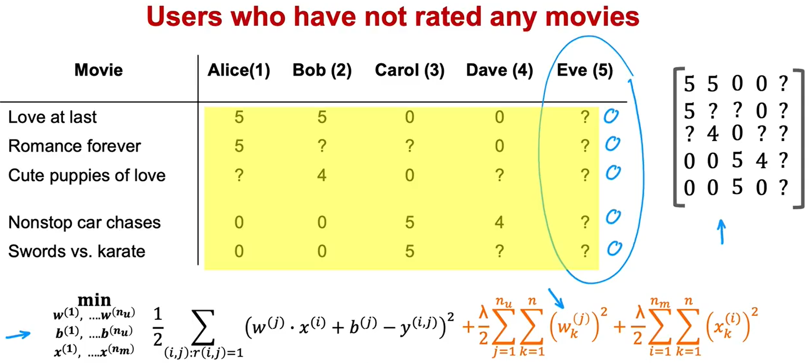

推荐系统 Recommender systems 用于搜索引擎、网站推荐算法、购物平台、社交平台等等。

例如：predicting movie ratings


### Collaborative filtering 协同过滤

#### Use per-item features

如果我们拥有每个 item 的特征，我们如何开发一个 recommender system？（例如，对于前面的 predicting movie ratings 的例子，假设我们已经知道每部电影的标签，比如 Love at last 有 90% 与 romance 相关，而与 action 完全不相关）


可以使用一个 Linear Regression Model。 
下面给这个 Linear Regression 模型制定 Cost function ：
Notation:
- $r(i, j) = 1$ if user $j$ has rated movie $i$ ($0$ otherwise）
- $y^{(i,j)} =$ rating given by user $j$ on movie $i$ (if defined)
- $\vec{w}^{(j)}$, $b^{(j)} =$ parameters for user $j$
- $x^{(i)} =$ feature vector for movie $i$
- $m^{(j)} =$ number of movies rated by user $j$ 
For user $j$ and movie $i$, predicting rating: $f_j(x^{(i)}) = \vec{w}^{(j)} \cdot x^{(i)} + b^{(j)}$
To learn $\vec{w}^{(j)}$, $b^{(j)}$

对于 user $j$ ，Cost function 如下： 
$$
J_j(\vec{w}^{(j)}, b^{(j)}) = \frac{1}{2m^{(j)}}\sum_{i:r(i,j)=1}\left(\vec{w}^{(j)}\cdot x^{(i)} + b^{(j)} - y^{(i,j)}\right)^2 + \frac{\lambda}{2m^{(j)}}\sum_{k=1}^{n}\left(w_k^{(j)}\right)^2
$$

其中第二项为防止过拟合的正则化参数， $n$ 是 number of features。 这里分母上的 $m^{(j)}$ 对于求极小值不影响，可以忽略。
对 Cost function 求最小值 $\min\limits_{\vec{w}^{(j)}, b^{(j)}}J_j(\vec{w}^{(j)}, b^{(j)})$ ，得到参数 $\vec{w}^{(j)}, b^{(j)}$ 在该模型中的最优解。

对于所有用户（一共 $n_u$ 个），要求得最优参数 $\{\vec{w}^{(1)}, b^{(1)}; \vec{w}^{(2)}, b^{(2)}; \cdots \vec{w}^{(n_u)}, b^{(n_u)}\}$ ，其中 $w = \{\vec{w}^{(1)}, \vec{w}^{(2)}, \cdots , \vec{w}^{(n_u)}\}$ ， $b = \{b^{(1)}, b^{(2)}, \cdots , b^{(n_u)}\}$： 
$$
\begin{align*}
J(w, b) &= \sum_{j=1}^{n_u} J_j(\vec{w}^{(j)}, b^{(j)}) \\ 
&= \frac{1}{2}\sum_{j=1}^{n_u}\sum_{i:r(i,j)=1}\left(\vec{w}^{(j)}\cdot x^{(i)} + b^{(j)} - y^{(i,j)}\right)^2 + \frac{\lambda}{2}\sum_{j=1}^{n_u}\sum_{k=1}^{n}\left(w_k^{(j)}\right)^2
\end{align*}
$$

#### Collaborative filtering algorithm

下面我们来看如果事先不知道 items 的特征，如何用**协同过滤算法**从数据中学习或得出这些特征 $\{x_1, x_2, \cdots , x_n\}$ 进行构建 Recommender System。

*与之前不同的是，之前是知道特征训练偏好参数，现在是知道偏好参数训练特征*

在典型的 Linear Regression 应用中，对一个 item 只会有一个数据，而在 Collaborative filtering 中，每一个 item （例如这里的 movie）对应多个数据（这里为多个用户对 movie 的评分），这就是可以尝试猜测这些 features 的原因。

Cost function: 
Given $\vec{w}^{(1)}, b^{(1)}; \vec{w}^{(2)}, b^{(2)}; \cdots \vec{w}^{(n_u)}, b^{(n_u)}$ 
To learn $x^{(i)}$ : 
$$
J_i(x^{(i)}) = \frac{1}{2}\sum_{j:r(i,j)=1}\left(\vec{w}^{(j)}\cdot x^{(i)} + b^{(j)} - y^{(i,j)}\right)^2 + \frac{\lambda}{2}\sum_{k=1}^{n}\left(x_k^{(i)}\right)^2
$$ 
To learn all the features $x^{(1)}, x^{(2)}, \cdots , x^{(n_m)}$ : 
$$
\begin{align*}
J(x^{(1)}, \cdots , x^{(n_m)}) &= \sum_{i=1}^{n_m}J_i(x^{(i)}) \\
& = \frac{1}{2}\sum_{i=1}^{n_m}\sum_{j:r(i,j)=1}\left(\vec{w}^{(j)}\cdot x^{(i)} + b^{(j)} - y^{(i,j)}\right)^2 + \frac{\lambda}{2}\sum_{i=1}^{n_m}\sum_{k=1}^{n}\left(x_k^{(i)}\right)^2
\end{align*}
$$ 
但是，现在是假设已知训练好的偏好参数，但我们实际上没有掌握这些参数，需要在前一小节中通过 Cost function 计算才能得到。 
下面我们来看 Collaborative filtering 如何协同工作的。

现在我们知道了两种情况下的 Cost function ： 
Cost function to learn $\vec{w}^{(1)}, b^{(1)}; \vec{w}^{(2)}, b^{(2)}; \cdots \vec{w}^{(n_u)}, b^{(n_u)}$ : 
$$
J(w, b) = \frac{1}{2}\sum_{j=1}^{n_u}\sum_{i:r(i,j)=1}\left(\vec{w}^{(j)}\cdot x^{(i)} + b^{(j)} - y^{(i,j)}\right)^2 + \frac{\lambda}{2}\sum_{j=1}^{n_u}\sum_{k=1}^{n}\left(w_k^{(j)}\right)^2
$$

Cost function to learn $x^{(1)}, x^{(2)}, \cdots , x^{(n_m)}$ : 
$$
J(x^{(1)}, \cdots , x^{(n_m)}) = \frac{1}{2}\sum_{i=1}^{n_m}\sum_{j:r(i,j)=1}\left(\vec{w}^{(j)}\cdot x^{(i)} + b^{(j)} - y^{(i,j)}\right)^2 + \frac{\lambda}{2}\sum_{i=1}^{n_m}\sum_{k=1}^{n}\left(x_k^{(i)}\right)^2
$$

两个 Cost function 的第一项只是求和顺序不同，但是会给出相同的结果。所以我们将两个 Cost function 放在一起，构造一个新的 Cost function $J(w,b;x)$ ：
$$
\frac{1}{2}\sum_{(i,j):r(i,j)=1}\left(\vec{w}^{(j)}\cdot x^{(i)} + b^{(j)} - y^{(i,j)}\right)^2 + \frac{\lambda}{2}\sum_{j=1}^{n_u}\sum_{k=1}^{n}\left(w_k^{(j)}\right)^2 + \frac{\lambda}{2}\sum_{i=1}^{n_m}\sum_{k=1}^{n}\left(x_k^{(i)}\right)^2
$$

通过最小化 Cost function $\min\limits_{w^{(1)}, \cdots, w^{(n_u)}; b^{(1)}, \cdots, b^{(n_u)} \atop x^{(1)}, \cdots, x^{(n_m)}} J(w,b;x)$ 取得最优的偏好参数 $w, b$ 和特征 $x$ 。

使用 Gradient Descent 进行最小化过程。
$$
\begin{align*}
w_i^{(j)} &\leftarrow w_i^{(j)}-\alpha*\frac{\partial}{\partial w_i^{(j)}}J(w,b;x) \\
b^{(j)} &\leftarrow b^{(j)}-\alpha*\frac{\partial}{\partial b^{(j)}}J(w,b;x) \\ 
x^{(j)}_k &\leftarrow x^{(j)}_k-\alpha*\frac{\partial}{\partial x^{(j)}_k}J(w,b;x)
\end{align*}
$$

#### Binary labels 二元标签

Recommender system 或 Collaborative filtering 通常给的选项不是 1~5 评级或推荐度，它们通常会给出是否推荐、是否喜欢给用户选择，这称为**二进制标签** (Binary labels)。

对于二元分类，我们不用 Linear Regression，而会使用 Logistic Regression。

二值标签有以下例子：


Previously: Predict $y^{(i,j)}$ as $w^{(j)} \cdot x^{(i)} + b^{(j)}$ 
For binary labels: Predict that the probability of $y^{(i,j)} = 1$ is given by 
$$f_j(x^{(i)}) = g(w^{(j)} \cdot x^{(i)} + b^{(j)}) = \frac{1}{1 + e^{-\left(w^{(j)} \cdot x^{(i)} + b^{(j)}\right)}}$$

Loss for Binary labels $y^{(i,j)}$ ：
$$
\mathcal{L}(f_j(x^{(i)}), y^{(i,j)}) = -y^{(i,j)}*\log\left(f_j(x^{(i)})\right) - \left(1 - y^{(i,j)}\right) * \log\left(1 - f_j(x^{(i)})\right)
$$

Cost function: 
$$
J(w,b;x) = \sum_{(i,j):r(i,j)=1}\mathcal{L}(f_j(x^{(i)}), y^{(i,j)})
$$

#### Mean normalization 均值归一化

将已评分的数据作为矩阵，每行做平均提取出每个电影目前的平均分作为均值，形成均值向量 $\mu$ ，然后将所有的分数做均值化处理（即减去均值）再做预测，预测出的 $y^{(i,j)}$ 再加上均值 $\mu_i$ 即可



#### Tensorflow implementation for Collaborative filtering 

```Python
w = tf.Variable(initial_set)
``` 

`tf.Variable()` 告诉 tensorflow `w` 是一个我们想要优化的参数，并且设置它的初始值为 `initial_set`

tensorflow 可以自动进行梯度下降，这被称为 "Auto Diff" 或者 "Auto Grad"

```Python
for iter in range(iteration):
	# Use Tensorflow's Gradient type to record the steps
	# used to compute the cost J, to enable auto differentiation
	with tf.GradientTape() as tape:
		fwb = w * x
		costJ = (fwb - y) ** 2

	# Use the gradient tape to calculate the gradients
	# of the cost with respect to the parameter w
	[dJdw] = tape.gradient(costJ, [w])

	# Run one step of gradient descent by updating 
	# the value of w to reduce the cost
	w.assign_add(-alpha * dJdw) # tf.variables require special function to modify
```

Adam Optimization algorithm 实现 Collaborative filtering:

```Python
# Instantiate an optimizer.
optimizer = keras.optimizers.Adam(learing_rate=1e-1)

iterations = 2000
for iter in range(iterations):
	# Use Tensorflow's GradientTape
	# to record the operations used to compute the cost
	with tf.GradientTape() as tape:
		# Compute the cost (forward pass is included in cost)
		cost_value = cofiCostFuncV(X, W, b, Ynorm, R, num_users, num_movies, lambda) # function to compute the cost which we need to implement ourselves

	# Use the gradient tape to automatically retrieve 
	# the gradients of the trainanle variables 
	# with respect to the loss
	grads = tape.gradient(cost_value, [X, W, b])

	# Run one step of gradient descent by updating 
	# the value of variables to minimize the loss.
	optimizer.apply_gradients(zip(grads, [X, W, b]))
```

#### Finding related items

The features $x^{(i)}$ of item $i$ are quite hard to interpret. 
To find other items related to it, find item $k$ with $x^{(k)}$ similar to $x^{(i)}$ 
i.e. with smallest distance $\sum\limits_{l=1}^{n}\left(x^{(k)}_l - x^{(i)}_l\right)^2$ 认为 $\{x_1, x_2, \cdots , x_n\}$ 特征空间中两个点距离越近越相似


Collaborative filtering 的限制
1. Cold start problem. How to
- rank new items that few users have rated?
- show something reasonable to new users who have rated few items?
2. Use side information about items or users:
- Item: Genre, movie stars, studio, ...
- User: Demographics (age, gender, location), expressed preferences, ...

### Content-based filtering 基于内容过滤

#### Collaborative filtering v.s. Content-based filtering

