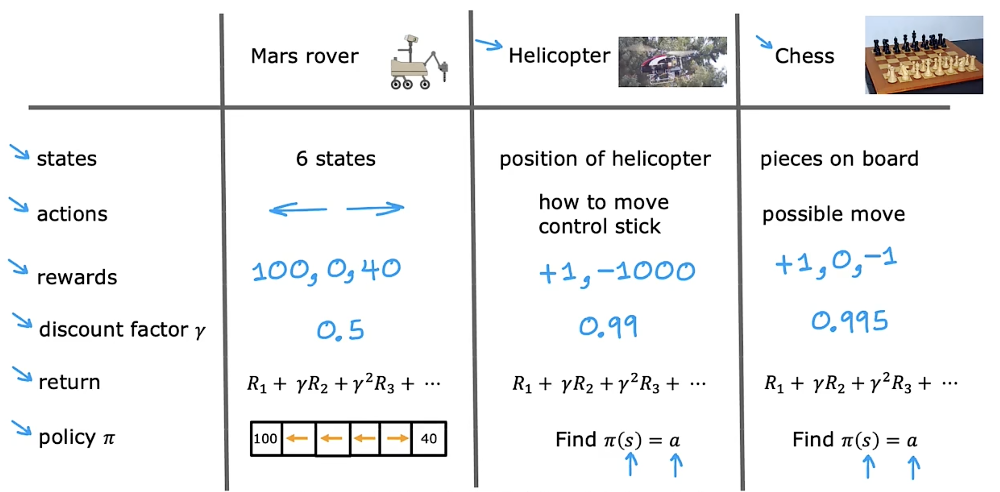
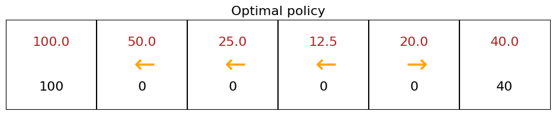
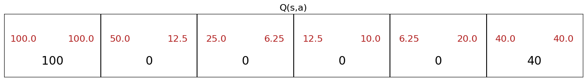

## What is reinforcement learning 强化学习

- state $s$     -- 对应于 supervised learning 中的 $x$
- action $a$   -- 对应于 supervised learning 中的 $y$

Reinforcement learning 的任务就是找到一个 function ，将状态 $s$ 映射到动作 $a$

对于许多步才能达到理想状态的训练过程，其每一步怎么做能达到最优解是模棱两可的，对此 Supervised learning 不再适用。

强化学习的思想是对于机器做出的有利的动作，相应进行一定的**奖励**（其关键输入是 reward function ）笼统地告诉机器什么时候做得好、什么时候做得不好，而不干涉机器每一步具体的行为是什么，类似于训练狗的过程。
- tell what to do   $\checkmark$
- tell how to do it $\times$

Reward function
- positive reward: doing well
- negative reward: doing poorly

## Key Concepts
### Example: Mars rover

不使用机器人、机器狗等过于复杂的事例，我们这里来看 火星探测车 的例子。在这个例子中，火星探测车可以处于 6 个位置中的任何一个。火星车的位置在 reinforcement learning 中称为 **状态**(state)，这里自然分别称为 状态 1～6。

认为探测车在 state 4，state 1 处有一个高价值的可研究物，state 6 处也有一个可研究物，但是价值没有 state 1 处的高。科学家自然希望探测车前往 state 1 处进行研究，虽然 state 1 的位置更远。我们通过 reward function 反映 state 1 更有价值。设置 state 1 为 100 ， state 6  为 40 ，其余由于没有研究物均设置为 0。每一步探测车均可以完成向左或向右的两个动作之一，最终探测车会达到 state 1 或者 state 6，在 reinforcement learning 中，我们也称为 terminal state 终止状态。

总之，在每个时间间隔，探测车处于某一个状态 $s$ ，它可以选择一个动作 $a$ ，还享有该状态对应的奖励 $R(s)$ ，并且由于这个动作，它将会来到下一个状态 $s'$ ，可以用以下表示：
$$\left(s, a, R(s), s'\right)$$
例如探测车从 state 4 左移至 state 3 ，由于 state 4 的奖励为 0，此时的时间间隔内，探测车可以表示为 $(4, \leftarrow, 0, 3)$ 。
这四个要素是 reinforcement learning 中的核心要素，它是算法决定如何行动时所要查看的最关键的信息。

### The Return in reinforcement learning 回报

Return 被定义为每一步的状态对应的 Reward 的加权和，其权重被称为**折扣因子**(Discount factor)（一般是一个小于 1 的数）的步数次方。
如探测车从 state 4 开始，经过 3、2 最后到达 state 1，设置折扣因子为 0.9，则 Return 可以设置为 $\text{Return} = 0 + (0.9) * 0 + (0.9)^2 * 0 + (0.9)^3 * 100 = 72.9$

Return 的一般公式表示为
$$\text{Return} = R_1 + \gamma R_2 + \gamma^2 R_3 + \cdots + \gamma^n R_n$$
这里 $n$ 表示 terminal state ， $\gamma$ 表示 Discount factor 。Discount factor 的引入，使得机器在考虑获得奖励的同时要考虑时间成本，越早获得奖励会导致总回报值越高。

### Making decisions: Policies in reinforcement learning

在 reinforcement learning 中，我们的目标是提出一个称为 $\pi$ 的策略函数 (Policy function) ，其作用是将任何状态 $s$ 作为输入并将其映射到它希望我们采取的某个动作 $a$ ，这个 Policy 使得 return 最大化。
$$\pi(s) = a$$

总结：


事实上，这种强化学习的训练过程称为 Markov Decision Process (MDP, 马尔可夫决策过程) 。
在 Markov 过程中，未来的状态中取决于当前的状态，而与当下时间点之前的状态无关。

## State-action value function 状态-动作价值函数

### Definition

State-action value function $Q(s, a)$ 等于 $\text{Return}$ （ state $s$ 处，执行一次 $a$ ，并在执行动作 $a$ 之后的每一个动作都是最优动作，都使得 return 最大化）

*State-action value function 也称为 $Q$-function*

从 state $s$ 到 terminal state 可以选择很多路径，相应产生很多的 $\text{Return}$ ，而 state $s$ 处的最佳的 $\text{Return}$ 就是 $\max_\limits{a}Q(s, a)$ ，此时的动作 $a$ 就是最优动作，即 $\pi(s) = a$
$$\text{The best possible Return}(s) = \max_{a} Q(s, a)$$

*有时也称最优的 $Q(s, a)$ 为 $Q^* (s)$*

*注：上面两段讲的是两个不同的事情。前者是固定 $s$ 和 $a$ 之后后续取最优解的 $\text{Return}$ 作为 $Q(s, a)$ ；后者是取固定状态 $s$ 时做不同的动作 $a$ 的情况下最大的 $Q$ 值，认为是 $Q^*(s) = \max_\limits{a}Q(s, a)$，也是该状态 $s$ 下最佳的 Return 。这是两个不同的 Return*
### Example

火星探测车
```Python
num_states = 6
num_actions = 2

terminal_left_reward = 100
terminal_right_reward = 40
each_midstep_reward = 0

# Discount factor
gamma = 0.5

# Probability of going in the wrong direction
misstep_prob = 0
```



### Bellman Equation

Bellman 方程 可以帮助计算 $Q(s, a)$ 

Notation:
- $s$ : current state
- $R(s)$ : reward of current state
- $a$ : current action
- $s'$ : state you get to after taking action $a$
- $a'$ : action you might take in state $s'$ 
- $\gamma$ : discount factor

Bellman 方程 给出： 
$$Q(s, a) = R(s) + \gamma * \max_{a'} Q(s', a')$$
其中第一项 $R(s)$ 也称为 immediate reward （即时奖励），表示 Reward you get right away ；第二项 $\max_\limits{a'} Q(s', a')$ 表示 Return from behaving optimally starting from state $s'$ 。也可以理解为
$$
\begin{aligned}
\text{Return} &= R_1 + \gamma R_2 + \gamma^2 R_3 + \cdots + \text{(until terminal state)} \\
&= R_1 + \gamma \left[ R_2 + \gamma R_3 + \gamma^2 R_4 + \cdots + \text{(until terminal state)} \right]
\end{aligned}
$$

显然可得，对于 terminal state ，没有 state $s'$ ，则 Bellman Equation 变为：
$$Q(s_\text{ts}, a) = R(s_\text{ts})$$

通过 Bellman Equation ，可以用递归的方式计算出所有的 $Q(s, a)$ 。

### Random (stochastic) environment

在真实环境中，总会有随机事件使得机器按照下一步动作执行的概率不为 100%。例如火星探测车的动作是向左移动，但是它会有 10% 的概率滑倒或向右移动，即按照规定动作向左移动的概率为 90% 。

在 随机强化学习 (stochastic reinforcement learning) 中，我们不再对于 maximize the return 感兴趣，因为此时的 $\text{Return}$ 是一个随机数，我们感兴趣的是 maximize the average of the sum of discounted rewards。
$$
\begin{aligned}
\text{Return} &= Average\left\{R_1 + \gamma R_2 + \gamma^2 R_3 + \cdots + \text{(until terminal state)}\right\} \\
&= E\left[R_1 + \gamma R_2 + \gamma^2 R_3 + \cdots + \text{(until terminal state)}\right]
\end{aligned}
$$
就平均值而言，指的是尝试很多次得到很多不同的 Reward 序列，对这些不同序列的 Rewards 的加权和取平均，得到的值就是预期的 $\text{Return}$ （即 return 的期望）。

在 stochastic reinforcement learning 中，Bellman Equation 表示为
$$Q(s, a) = R(s) + \gamma * E\left[\max_{a'} Q(s', a')\right]$$
$E$ 表示数学期望 the expected return。

对应的上面的 [Example](Week%2010%20Reinforcement%20learning.md#Example) 中的 `misstep_prob` 的值，在 stochastic reinforcement learning 中，该值不为 0

## Continuous State Spaces

### Example

之前的火星探测车的例子中只有 state 1～6 的 6 个状态，状态值是离散的，但是现实状态中机器可以处于大量连续值中的任何一个。

对于在一个平地上运动的汽车，它的状态可以表示为
$$s = (x, y, \theta, \dot{x}, \dot{y}, \dot{\theta})^T$$
对于一架空中飞行的直升机，它的状态可以表示为
$$s = (x, y, z, \theta, \phi, \beta, \dot{x}, \dot{y}, \dot{z}, \dot{\theta}, \dot{\phi}, \dot{\beta})^T$$
这些值任何一个都是连续变量。

下面考虑一个具体的例子，月球登陆器。
假设二维的垂直平面，$x$ 是横向距离，$y$ 是距月面高度，登陆器需要最终停止在 $x$ 的一段范围内。认为登陆器有主引擎 (main engine) 向下喷射，左右两个引擎分别使登陆器向右、左方向运动。其状态 $s$ 可以表示为
$$s = (x, y, \dot{x}, \dot{y}, \theta, \dot{\theta}, l, r)^T$$
其中 $l, r$ 是取 0 或 1 的二进制值，刻画登陆器的左/右脚是否着地。
Reward function 如下：
- Getting to landing pad -- $x = 100 \text{-} 140$ .
- Additional reward for moving toward/away from pad.
- Crash: -100
- Soft landing: +100
- Leg grounded: +10
- Fire main engine: -0.3 (to save the energy)
- Fire side thruster: -0.03 (to save the energy)
### State-action value function

Deep Reinforcement Learning 的核心是输入 current state $s$ 和 current action $a$ 进入神经网络并计算或估计 $Q(s, a)$ 

特别地，对于月球登陆器，在 state $s$ 处，我们要计算 $Q(s, \text{nothing}), Q(s, \text{main}), Q(s, \text{left}), Q(s, \text{right})$ 。输入有 8 个 state 和 4 个 action 共长度为 12 的向量 $[s, a]$（*这里 action 的 4 个动作可以使用 one-hot 编码，如 nothing 为 $[1,0,0,0]$、main 为 $[0,1,0,0]$ 等*），经过 64、64 的隐藏层后，到达 units 为 1 的输出层，并输出 $Q(s,a)$ 。最后选择使得 $Q(s, a)$ 最大的 action $a$ ，就是我们想要的动作。

那么如何训练神经网络？我们使用 Bellman Equation 用于创建包含大量输入输出的训练集，然后使用 supervised learning 进行训练。
- 输入 $x = [s, a]$
- 输出 $y \left(= Q(s, a) \right)= R(s) + \gamma * \max_\limits{a'} Q(s', a')$ 
在监督学习中，我们使用函数 $f$ 来训练神经网络，通过大量的实例（使登陆器在空间中自由活动），得到大量的元组数据 $\{(s^{(1)}, a^{(1)}, R(s^{(1)}), s'^{(1)}), (s^{(2)}, a^{(2)}, R(s^{(2)}), s'^{(2)}), (s^{(3)}, a^{(3)}, R(s^{(3)}), s'^{(3)}), \cdots \}$ ，每一个元组都足以创建一个训练实例 $(x^{(i)}, y^{(i)})$ ，其中
- $x^{(i)} = \left[s^{(i)}, a^{(i)}\right]$
- $y^{(i)} = R(s^{(i)}) + \gamma * \max_\limits{a'} Q(s'^{(i)}, a')$

这里在构造数据集时， $y^{(i)}$ 中已经包含了 $Q(s'^{(i)}, a')$ ，而我们要得到的就是所有状态和动作下的 $Q$-function 值，似乎陷入了循环论证的逻辑怪圈。
为解决这个问题，我们可以**先随机猜测**所有的 $Q(s, a)$ ，并在训练神经网络的过程中**逐步迭代** $Q(s, a)$，**同步更新** $y$ 和 $Q(s, a)$ ，直至达到最好的估计。

### Learning Algorithm -- DQN (Deep Q-Network)

对于月球登陆器，其强化学习算法的伪代码如下：
```
Initialize the neural network randomly as guess of Q(s, a)
Repeat{
	Take actions in the lunar lander. Get (s, a, R(s), s')
	Store 10,000 most recent (s, a, R(s), s') tuples
	Train neural network: 
	{
		Creating training set of 10,000 examples using x = (s, a) and y = R(s) + Gamma * max{Q(s', a')}
		Train Q_new such that Q_new(s, a) <- y
	}
	Set Q = Q_new
}
```

虽然使用更多的实例训练结果会更好，但是味么确保我们不会使用过多的计算机内存，我们只存储在 MTP 中最新的 10,000 个实例，这也称为 **Replay Buffer**

### Algorithm refinement: Improved neural network architecture

通过改进神经网络的架构，可以使得上面的算法更加高效

在之前的神经网络中，每当我们处于某一个状态 $s$ ，由于有 4 个动作，我们必须分别进行 4 次推理得到 4 个 $Q(s, a)$ 的值，以便从最大的 $Q(s, a)$ 中推出最优的动作 $a$ ，非常低效。
我们加以改进，训练单个神经网络同时输出这 4 个值。

构造一个神经网络，输入是 state $s = [x, y, \theta, \dot{x}, \dot{y}, \dot{\theta}, l, r]^T$ 的长度为 8 的向量，经过两个 64、64 的隐藏层后，进入 units 为 4 的输出层，输出四个数，即为 $\left[Q(s, \text{nothing}), Q(s, \text{main}), Q(s, \text{left}), Q(s, \text{right})\right]$ 。最后选择使得 $Q(s, a)$ 最大的 action $a$ ，就是我们想要的动作。

### Algorithm refinement: $\varepsilon$ - greedy policy $\varepsilon$-贪婪策略

在之前的神经网络中，我们在重复训练神经网络的时候，选择不同的动作进行创建训练实例，这些动作我们此时还不知道它是否是能最大化 $Q(s, a)$ 的最优解，所以是完全随机选取的。可以通过有意地选取对训练更加有用的动作，使得训练过程更加高效，这种方法称为 **$\varepsilon$-贪婪策略** ( $\varepsilon$ - greedy policy )

How to choose actions $a$ while still learning?
In state $s$ :
- Option 1: Pick the action $a$ that maximizes $Q(s, a)$
- Option 2: 
	- With probability $0.95$ , pick the action $a$ that maximizes $Q(s, a)$ <- Greedy "Exploitation"
	- With probability $0.05$ , pick an action $a$ randomly <- "Exploration"
通常我们选择 Option 2 的方案，这是为了确保某些初始化的神经网络参数组能够跳出局部最优解，从而不会使得接下来的 $Q(s, a)$ 的迭代过程完全停滞在某个我们不想要的值上。Option 2 就是我们所说的 $\varepsilon$ - greedy policy ，这里 $\varepsilon$ 取的值为 $0.05$ ，是一个可以自己设置的超参数，用于优化神经网络的准确性与训练效率 (Exploitation - Exploration tradeoff) 。

一般的策略是：在初始情况下将 $\varepsilon$ 设置的大一点（甚至会很大，如初始直接设置为 $1.0$ ），然后随着 $Q(s, a)$ 在训练过程中迭代得越来越好，逐渐减小 $\varepsilon$ 的值。

### Algorithm refinement: Mini-batch and soft update 小批量和软更新

#### 1. Mini-batch 小批量 

*Mini-batch 不仅适用于加速 reinforcement learning ，也同样适用于加速训练 supervised learning 模型。*

首先来看 Mini-batch 在 supervised learning 中的运用。
回忆我们有 
$$
J(w, b) = \frac{1}{2m} \sum_{i=1}^{m} \left( f_{w,b}(x^{(i)}) - y^{(i)} \right)^2
$$
训练时采用 Gradient descent 更新神经网络的参数：
repeat {
$$
\begin{aligned}
w &= w - \alpha * \frac{\partial}{\partial w} \frac{1}{2m} \sum_{i=1}^{m} \left( f_{w,b}(x^{(i)}) - y^{(i)} \right)^2 \\ 
b &= b - \alpha * \frac{\partial}{\partial b} \frac{1}{2m} \sum_{i=1}^{m} \left( f_{w,b}(x^{(i)}) - y^{(i)} \right)^2
\end{aligned}
$$
} ，
但是在**数据集非常大**的情况下，如 $m = 100,000,000$ ，此时传统的 Gradient descent 在每一步计算时都要计算上亿个数的平均值，速度会非常慢。
mini-batch 的想法是在每次迭代的循环过程中不使用全部的一亿个训练示例，而是**选择数据集的一个小子集**，例如 $m' = 1000$ ，用这个小子集进行 Gradient Descent 从而更新参数 
repeat {
$$
\begin{aligned}
w &= w - \alpha * \frac{\partial}{\partial w} \frac{1}{2m'} \sum_{i=1}^{m'} \left( f_{w,b}(x^{(i)}) - y^{(i)} \right)^2 \\ 
b &= b - \alpha * \frac{\partial}{\partial b} \frac{1}{2m'} \sum_{i=1}^{m'} \left( f_{w,b}(x^{(i)}) - y^{(i)} \right)^2
\end{aligned}
$$
} 
然后在下一次 Gradient descent 时选择另外一个小子集进行训练。

回到 reinforcement learning 中 Mini-batch 的应用。
我们之前创建数据集时选择机器最近的 10,000 次动作构成元组 (Replay buffer) ，然后在训练神经网络的时候将这 10,000 个元祖全部输入进去来创建 $(x, y)$ 训练示例。但是 Mini-batch 的想法是，在每一次循环中，可以只选择这些元组中的 1000 个来创建训练实例用来训练神经网络

#### 2. Soft update

soft update 可以帮助使得 reinforcement learning algorithm 更好地收敛到一个好的解决方案。

对于之前 Mini-batch 的做法，一个常出现的情况是由于这一次与前一次输入的训练示例差异很大，都只是一个小子集，新训练出来的 $Q_\text{new}$ 很可能与 $Q$ 相差很大，造成在 $Q_\text{new}$ 赋值给 $Q$ 的时候造成非常大的变化，有时甚至 $Q_\text{new}$ 会差于 $Q$ ，此时的更新会导致神经网络重新变差了。

在原来的 `Set Q = Q_new` 赋值时，其实本质上是做了
```
Set{
	w = w_new
	b = b_new
}
```
soft update 给出不那么激进的更新策略，它给出
```
Set{
	w = 0.01 * w_new + 0.99 * w
	b = 0.01 * b_new + 0.99 * b
}
```
保留大部分原来的神经网络参数，而只对其进行微调。

*注：$w_\text{new}$ 与 $w$ 的比例是一个超参数，可以自己调节（当然对参数 $b$ 也是一样）*

